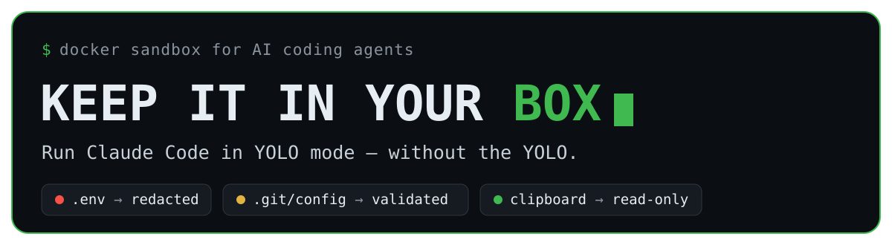
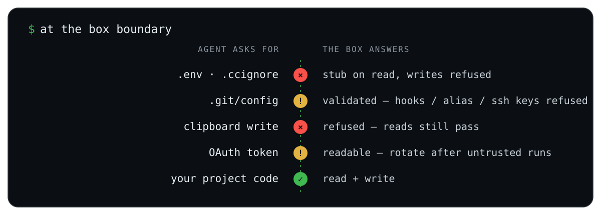
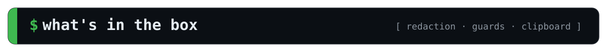
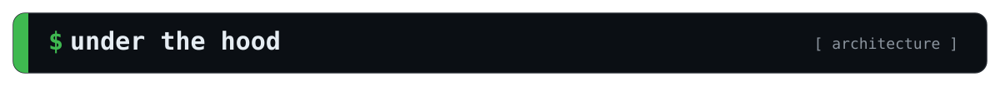
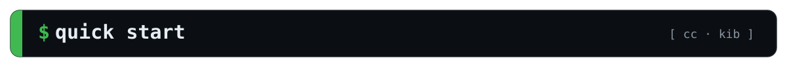

<p align="center">
  
</p>

<p align="center">
  
  
  
  
</p>

<p align="center">
  <b>A Docker sandbox for AI coding agents:</b> FUSE-redacted secrets, guarded host-executed config, a clipboard that only goes one way.
</p>

<p align="center">
  <a href="#box">What's in the box</a> &#183;
  <a href="#compare">How it compares</a> &#183;
  <a href="#hood">Under the hood</a> &#183;
  <a href="#start">Quick start</a> &#183;
  <a href="#accepted-risks">Accepted risks</a>
</p>

---

You want to run an AI coding agent with `--dangerously-skip-permissions` so it stops asking. The problem was never the agent editing your code — that's the job. It's everything *around* the code: your `.env`, your OAuth token, a `.git/config` the host runs on the next commit, a clipboard write that becomes keystrokes at your next paste. Keep It in Your Box puts the agent in a container that can touch the project and nothing that would let it reach back out to the host.

<p align="center">
  
</p>

### Two ways to box an agent

The sharpest comparison is with Docker's brand-new **[Docker Sandboxes](https://www.docker.com/products/docker-sandboxes/) (`sbx`)** — because it makes the *opposite* trade. It wraps the agent in a microVM with a credential broker and deny-by-default egress, but mounts your workspace (including `.env`) readable and leaves `.git/config` for you to review afterwards. `cc` locks down exactly what `sbx` leaves open, and vice versa:

| At the boundary | `cc` (this repo) | Docker Sandboxes (`sbx`) |
|---|---|---|
| Workspace secrets (`.env`) | **Redacted** — stub on read, even for files created after launch | Readable — the git root is mounted into the VM |
| `.git/config` + host-run config | **Validated** — `hooksPath` / `sshCommand` / `alias.*` refused | Left to you — *"review Git hooks / Makefiles / CI after the session"* |
| Clipboard | **Mediated** — reads pass, writes refused | n/a — no host display is exposed |
| Egress | Open — an accepted risk | **Deny-by-default** host proxy |
| Credential | In the box, readable — *rotate after untrusted runs* | **Brokered** — injected on egress, never in the box |
| Kernel isolation | Shared host kernel, `cap-drop=ALL` | **microVM**, own kernel |

Neither is strictly safer — they defend different halves. The [full 7-sandbox matrix is below](#compare).

<h2 id="box"></h2>

- **Secrets are redacted, not just hidden.** A FUSE layer over the project stubs reads and refuses writes to `.env`, `.env.*`, and anything in `.ccignore` — including files created *after* launch, which no bind mount can cover. Committed placeholders (`.env.example`, `.env.sample`, …) stay readable.
- **Host-executed config is guarded.** The real boundary isn't the container — it's what the *host* runs later. `.git/config` is content-validated on write (a new `core.hooksPath`, `core.sshCommand`, `alias.*`, `filter.*.clean`, or `include` is refused; `git remote add` and `push -u` still work). `.vscode/`, `.devcontainer/`, `.envrc`, git hooks and submodule/worktree equivalents are read-through, write-denied. A pre-commit hook keeps redacted files out of history.
- **The clipboard only goes one way.** The host Wayland socket is proxied, not handed over: clipboard *reads* pass (so image paste works), every clipboard *write* is refused — a write is host code execution at your next terminal paste. macOS gets the same asymmetry via a `pbpaste` bridge.
- **Projects can't read each other.** Each project gets its own config dir (`~/.claude-sandbox/<slug>/`) — transcripts, prompt history, jobs and pasted content are private per project. One login token, shared read-only, serves them all.
- **One container per project, shared by every terminal.** Every terminal `docker exec`s into the same long-lived container, so `/resume`, prompt history and background jobs are shared across tabs. It's torn down only when the last session exits.
- **Follows your network.** A lightweight watcher keeps the container's DNS in step with the host across wifi/VPN changes — no host-netns sidecar, works behind a per-connection host firewall.
- **Hardened by default.** `--cap-drop=ALL`, `no-new-privileges`, seccomp, AppArmor, no Docker socket, no host block devices. The default command is `claude --dangerously-skip-permissions` — safe *because* of the box.
- **Linux and macOS.** Two redaction modes behind one interface: a `cap-drop=ALL` FUSE sidecar on Linux, a single-container FUSE mount on macOS (Docker Desktop, OrbStack, or Colima).

### Run it two ways

Both names point at the **same** launcher script — the name is only a mnemonic. `cc` reads as "Claude Code" and launches `claude` by default; `kib` reads as "Keep It in your Box" for everything else.

```bash
cc                     # launch Claude Code in the sandbox
kib bash               # drop into a shell in the sandbox
kib python app.py      # run anything else in the sandbox
```

Run either from any project directory; the project is mounted at the same absolute path it has on the host, and args pass through as the command.

<h2 id="compare"></h2>

Measured against six other agent sandboxes on the controls that decide whether an untrusted repo can reach the host:

| Sandbox | Workspace secrets | Host-exec config | Clipboard | Egress | Credential | Isolation |
|---|:--:|:--:|:--:|:--:|:--:|---|
| **`cc`** (this repo) | ✅ stub-on-read ¹ | ✅ validated | ✅ mediated | ✕ open | ✕ in-box | container, `cap-drop=ALL` |
| [Docker `sbx`](https://www.docker.com/products/docker-sandboxes/) | ✕ `.env` readable | ✕ review-after | — no display | ✅ deny | ✅ brokered | **microVM** |
| [sandbox-runtime](https://github.com/anthropic-experimental/sandbox-runtime) | ◑ sentinel (Linux) | ✕ block | ✕ | ✅ deny | ✅ brokered | bwrap / Seatbelt |
| [fence](https://github.com/fencesandbox/fence) | ◑ emptied ² | ✕ block | ✕ | ✅ deny | ✕ | bwrap / Landlock |
| [yoloAI](https://github.com/kstenerud/yoloai) | ◑ excluded ³ | ◑ neutralized | ✕ | ◑ opt-in | ✅ brokered | runc → Firecracker |
| [cplt](https://github.com/navikt/cplt) | ◑ macOS-only | ◑ macOS-only | ◑ on/off | ◑ opt-in | ✕ | Landlock / Seatbelt |
| [aicontainer](https://github.com/stefanoginella/aicontainer) | ◑ tool-hook | ✕ block | ✕ | ◑ opt-in | ✕ | container + socket proxy |

<sub>✅ enforced · ◑ partial or caveated · ✕ none / exposed · — not applicable.
¹ The only sandbox whose redaction also covers files created *after* launch. ² `/dev/null` mask, but `.env` is `denyWrite`, not `denyRead`, in the shipped template. ³ Files are copied in honouring `.gitignore`, so gitignored secrets never enter — not masked, but not present.</sub>

No project here does everything. `cc` is the only one that **validates `.git/config`** instead of blocking it, and the only one that **mediates the clipboard** rather than granting or withholding it wholesale — and one of the few that redacts secrets *created after launch*. It is deliberately behind the credential-brokering, deny-egress crowd; see [Accepted risks](#accepted-risks) for why. Full matrix, sources, and per-project caveats: [`docs/competitive-review/`](docs/competitive-review/).

<h2 id="hood"></h2>

- **One long-lived container per project**, `sleep infinity` as PID 1; every terminal attaches with `docker exec`, so Claude sees one PID namespace, one `/tmp`, one daemon — shared `/resume`, history and jobs, for free.
- **A FUSE sidecar** (`cap-drop=ALL`, holding the only cap) mounts the redacted project view; the main container mounts *that*. On macOS the same view is served by a single trusted container. Redaction covers files created after launch because it's a live view, not a bind mount.
- **A Wayland proxy sidecar** holds the only real compositor socket, forwarding reads and refusing every write request.
- **Host-side, at every launch:** a `.ccignore` → `.gitignore` + pre-commit sync, a `settings.json` validator that rejects inline `hooks[].command`, and a DNS watcher that follows host network changes.

Every design decision and its rationale lives in [`CLAUDE.md`](CLAUDE.md).

<h2 id="start"></h2>

```bash
git clone https://github.com/amerkay/keep-it-in-your-box.git
cd keep-it-in-your-box

# One-time migration to per-project sessions (required before first launch).
# Dry-run first — it prints every copy / write / delete before you commit.
./migrate-sessions.sh
./migrate-sessions.sh --apply

# Add both aliases to your shell rc, pointing at the absolute path.
# kib = the box launcher (kib bash, kib python …); cc = kib claude (launch Claude Code).
echo "alias kib='$PWD/cc'"        >> ~/.bashrc
echo "alias cc='$PWD/cc claude'"  >> ~/.bashrc
```

The image builds automatically on first run. Then `cd` into any project and run `cc`.

### Requirements

- Docker — Docker Desktop, OrbStack, or Colima on macOS; any engine on Linux.
- A Wayland session for host clipboard / image paste on Linux (optional — absent Wayland just disables paste).
- `git`, `bash`, `perl` (system perl is fine on macOS — no Homebrew dependencies).

### Tests

All test suites live in [`tests/`](tests/). The host-side ones need no image or container:

```bash
./tests/check.sh          # syntax, shellcheck, the bash-3.2/BSD portability contract,
                          #   the cc-portable shim unit tests, and the broker logic tests
./tests/broker-test.py    # credential-broker relay / injection / streaming / placeholder (pure stdlib)
```

[`tests/security-test.sh`](tests/security-test.sh) is the **in-sandbox** regression suite — one
check per control the [audit](docs/SECURITY_AUDIT.md) established. Run it **inside** the box, once
normally and once under `CC_SINGLE_CONTAINER=1` (the macOS topology):

```bash
kib bash -lc ./tests/security-test.sh          # everything
kib bash -lc './tests/security-test.sh --list' # what it covers, run nothing
```

Each check re-attempts a real attack and asserts the refusal, *and* re-attempts the legitimate
operation the guard must not break — a guard that blocks the attack by breaking the workflow has
failed too.

<h2 id="accepted-risks">Accepted risks</h2>

<details>
<summary><b>This is a real boundary, not a perfect one — read before you trust it.</b></summary>

<br>

- **Open egress + a shared credential — unless you turn the broker on.** By default the account OAuth token is readable inside the box and egress is unrestricted, so an injected session could exfiltrate it with no host trigger. **Rotate the token if an untrusted session has run.** The opt-in credential broker closes exactly this: it holds a long-lived token host-side and gives the sandbox a placeholder plus an `ANTHROPIC_BASE_URL` pointed at a `cap-drop=ALL` sidecar, which strips the placeholder and injects the real token on the way out — the win holds even with egress wide open.

  ```bash
  cc --broker-login          # mint + store a token (wraps `claude setup-token`); host-only, mode 600
  cc --broker-status         # is it still accepted? never prints the token
  cc --broker-logout         # remove it
  echo 'broker = on' >> ~/.keep-it-in-your-box/config
  ```

  The brokered credential is deliberately a **static** long-lived token, never `~/.claude-shared/.credentials.json` — Anthropic's subscription refresh tokens are single-use and rotate, so a second process refreshing them logs you out of every other session. Egress itself is still open: a default-deny allowlist conflicts with the sandbox's whole purpose (building untrusted repos that fetch from arbitrary registries).

- **The same broker holds your *other* secrets — a Codex key, and any MCP's token.** The broker isn't limited to a fixed list: it brokers **any** MCP, whether or not we've heard of it. **The easiest path is the one you'd do anyway: take a service's own install line and swap `claude`→`cc`.** A vendor tells you to run `claude mcp add --header "Authorization: Bearer <token>" --transport http foo <url>`; change the first word to `cc` and cc **intercepts it host-side, before anything reaches the box** — peeling the token off, storing it host-only (mode 600), and wiring a header-free broker route. The secret never enters the sandbox; you don't need to learn a new command (this is exactly why `cc` is aliased to `kib claude` — swapping `claude`→`cc` is lossless):

  ```bash
  cc mcp add --header "Authorization: Bearer <token>" --transport http foo <url>
  #  → 🔐 Intercepted an inline MCP credential and brokered it host-side — it never entered the sandbox.
  ```

  (The local/stdio form that ships secrets as `--env` can't be brokered that way, so cc **refuses** it rather than leak — `CC_ALLOW_INLINE_MCP_SECRET=1` is the deliberate override. And if a secret got into a config some *other* way, cc still **warns** on the next launch and offers `cc --mcp-adopt <name>` to migrate it.) You can also declare one directly:

  ```bash
  # remote MCP, static auth header (broker injects it):
  cc --add-mcp linear --url https://mcp.linear.app/sse --header "Authorization: Bearer"
  cc --login linear          # paste the token; stored host-only, never in the box
  # local/hosted MCP whose secret can't be header-injected (runs in its own sidecar):
  cc --add-mcp gsc --run "uvx mcp-search-console" --cred-env GSC_CREDENTIALS_PATH \
     --cred-kind file --env GSC_SKIP_OAUTH=true
  cc --login gsc             # give the path to a service-account JSON key
  cc --login codex           # an OpenAI API key → OPENAI_BASE_URL points at the broker
  cc --status                # list every credential (size/mode only, never contents)
  ```

  **No MCP is built in — only the LLMs are.** DataForSEO (remote, Basic auth) and mcp-gsc (a Google service-account JSON, run in its own sidecar) ship as worked **examples** in [`examples/providers/`](examples/providers/) — copy one into `~/.keep-it-in-your-box/providers.d/` and `cc --login` it; your own MCP works exactly the same way. With the broker on, cc writes a **header-free** broker URL into the session config, so the agent reaches the MCP without ever holding its credential. Brokering an MCP requires `broker = on`. See [`docs/FUTURE_TASKS.md`](docs/FUTURE_TASKS.md) § G1 (C3/C4) and CLAUDE.md "Credential broker".

  **An egress firewall is a "delayed-or-never" task, on purpose.** An allowlist is a speed-bump against the accidental case, never an exfiltration boundary — and the two channels that matter cannot be closed. `api.anthropic.com` must stay open, and it is itself a bidirectional exfil path: anything you expose to the agent is *already* on its way to the API, encodable into its own prompt and tool-call content. `github.com` and the package registries must stay open for the agent to work — and once they are, exfil is trivial (push to your own repo, a gist, a branch name), while the same forges serve arbitrary bad code and prompt-injection payloads *inbound*. So the real fix is the **broker** (remove the thing worth stealing), not a firewall. A filtering proxy would only ever be defence-in-depth against a naive agent, off by default; it buys little over the broker and is not planned work. See [`docs/FUTURE_TASKS.md`](docs/FUTURE_TASKS.md) § G2.
- **`host.docker.internal` is routable** to the host network stack.
- **The project directory is writable**, by design — the agent's job is to edit your code.

The full audit, including the controls that *are* closed, is in [`docs/SECURITY_AUDIT.md`](docs/SECURITY_AUDIT.md).

</details>

## License

No license file yet, so default copyright applies (all rights reserved by the author). If you'd like to use or adapt it, open an issue — a permissive license is likely.
