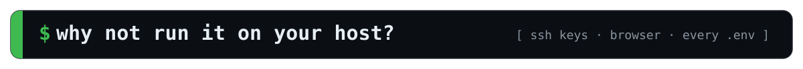
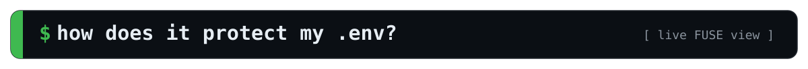
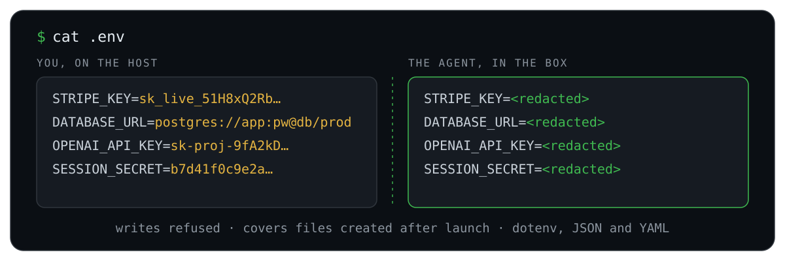
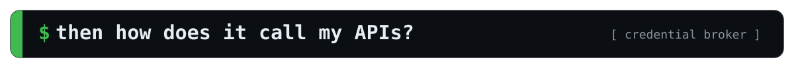
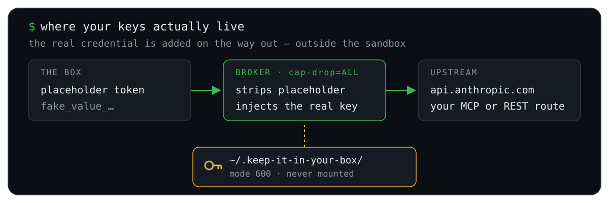
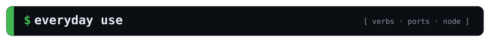
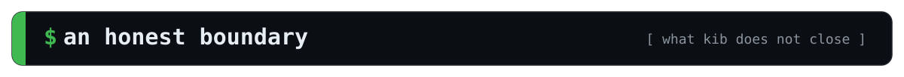

<p align="center">
  
</p>

<p align="center">
  
  
  
  
  
</p>

<p align="center">
  <b>Let the agent off the leash. Keep your secrets, your API keys and your host out of its reach.</b>
</p>

<p align="center">
  <a href="#why-host">Why not your host?</a> &#183;
  <a href="#secrets">Your <code>.env</code></a> &#183;
  <a href="#broker">Your API keys</a> &#183;
  <a href="#start">Quick start</a> &#183;
  <a href="#compare">How it compares</a> &#183;
  <a href="#limits">Honest limits</a>
</p>

<h2 id="why-host"></h2>

`claude --dangerously-skip-permissions` is how everyone actually wants to work: the agent stops asking, you stop babysitting. The problem was never the agent editing your code — that's the job. It's everything *around* your code. On your host, the agent runs as **you**:

- it can read `~/.ssh/id_rsa`, your browser profile, `~/.aws/credentials`, and every `.env` on the disk
- it can write a `.git/config` your host executes at the next commit, or an `.envrc` your shell runs at the next `cd`
- it can put text on your clipboard that becomes **keystrokes** at your next terminal paste

And it reads untrusted text all day — a dependency's README, an issue thread, a scraped page, a CI log. Any one of those can carry an instruction it follows, and the agent has no way to tell that text apart from yours.

**kib puts the agent in a container that can touch your project and nothing that reaches back out.**

<p align="center">
  
</p>

`.git/config` is content-**validated** rather than blocked outright, so `git remote add` and `push -u` still work while a new `core.hooksPath`, `core.sshCommand` or `alias.*` is refused. A guard that stops the attack by breaking your workflow has failed too, which is why `.githooks/`, `.vscode/`, `.devcontainer/` and `.envrc` are read-through and write-denied rather than hidden.

<h2 id="secrets"></h2>

<p align="center">
  
</p>

The file stays where it is; what changes is what comes back when the agent reads it. Your project reaches the box through a FUSE layer, so a read of a secrets file returns the **key names with every value replaced**, and a write to one is refused.

- **Recognised by shape, not by filename.** dotenv, JSON and YAML are identified by actually parsing them, so a project's own `env_vars/env_prod` or `sls_config/env-dev.yml` redacts exactly like `.env` does, which guessing from the filename would miss.
- **Files created *after* launch are covered.** It's a live view, not a bind mount — nothing is enumerated at startup, so a secret written an hour into the session is redacted the same way. No other sandbox in the [comparison below](#compare) does this.
- **You pick the rest.** Anything matched by `.kibignore` joins the set; committed templates stay fully readable (`.env.example`, `.env.sample`, `.env.template`).

So the agent can see that `STRIPE_KEY` exists and still needs a value, and it never has to ask **you** to paste one into the chat.

<h2 id="broker"></h2>

The box never holds the key. A broker on the host holds it and adds it to requests on their way out.

<p align="center">
  
</p>

Your real credentials live host-side, mode 600, in a directory the container never mounts. The box gets a **placeholder** plus a URL pointing at a `cap-drop=ALL` sidecar, which swaps the placeholder for the real credential on the way out. Egress can be wide open and there is still nothing in there worth stealing.

That covers your Claude login by default. For everything else — any MCP server, any REST API — take the vendor's own install line and **change the first word**:

```bash
cc mcp add --header "Authorization: Bearer <token>" --transport http linear https://mcp.linear.app/sse
#  → 🔐 Intercepted an inline MCP credential and brokered it host-side — it never entered the sandbox.
```

`cc` is an alias for `kib claude`, so any `claude …` line works verbatim. kib peels the token off **host-side, before anything reaches the box**, and wires up a header-free route in its place. Or declare one yourself; it prompts for the secret without echoing it:

```bash
kib broker add                        # asks the questions, no flags to memorise
kib broker add gsc --url https://searchconsole.googleapis.com --oauth \
   --scope https://www.googleapis.com/auth/webmasters.readonly \
   --allow-path /webmasters/v3/       # …or spell it out
kib broker status                     # every route; never prints a secret
```

`--oauth` is for services that only issue expiring tokens: the broker runs the exchange and re-mints them itself, so no long-lived key exists anywhere to leak. `--allow-path` pins which paths that credential may reach. No MCP is built in and none is special-cased — yours works the same way ([worked examples](examples/providers/), [full design](docs/design-notes/credential-broker.md)).

<sub>Claude Code's banner will read **"Claude API"**. That's the custom base URL, not metered billing — a `setup-token` credential is subscription OAuth, so usage still counts against your Pro/Max plan ([why](docs/design-notes/credential-broker.md#the-claude-api-banner-is-transport-not-metered-billing)).</sub>

<h2 id="start"></h2>

```bash
git clone https://github.com/amerkay/keep-it-in-your-box.git
cd keep-it-in-your-box

# kib = the launcher (kib exec, kib broker, kib audit …).  cc = kib claude.
echo "alias kib='$PWD/bin/kib'"        >> ~/.bashrc
echo "alias cc='$PWD/bin/kib claude'"  >> ~/.bashrc
```

Now `cd` into any project and run `cc`. The image builds itself on first run, and the first launch offers a one-time login so the broker has a token to work with.

Nothing to set up and nothing to migrate: your `~/.claude` stays exactly as it is, and each project's session is assembled from it per launch and merged back on exit — so a host `claude` and a boxed `cc` share one login, one `--resume` list and one history, while no project's box can see another's.

**Requirements:** Docker (on macOS: [Docker Desktop](https://www.docker.com/products/docker-desktop/) or [OrbStack](https://orbstack.dev), both a `.dmg` — no Homebrew and no Xcode tools; Colima works too but needs both. Any engine on Linux), plus `git`, `bash` and `perl` — system perl is fine, no Homebrew needed. A Wayland session on Linux is optional; without one you just lose clipboard paste.

<h2 id="use"></h2>

```bash
cc                      # launch Claude Code in the sandbox
kib exec bash           # a shell in the sandbox
kib exec python app.py  # run anything else in there
kib broker status       # every brokered route
kib audit               # what would the host execute out of this repo?
kib help                # the full verb table

kib --publish=3000      # reach a dev server in the box at http://127.0.0.1:3000
kib --node-version=20   # this terminal runs Node 20 (18|20|22|24 baked, no download)
```

- **Verbs win over programs.** `kib bash` is an *error*, not a shell — pass-through is explicit, via `kib exec`.
- **Ports are opt-in and loopback-only.** A box publishes nothing by default, so `--publish` is the only route from your browser. Bind the server to `0.0.0.0` inside (`vite --host`, `next dev -H 0.0.0.0`) or the published port has nothing to forward to.
- **Paste images with `Ctrl+V`, not `⌘V`.** The terminal handles `⌘V` itself and sends nothing at all for an image.

<h2 id="compare"></h2>

Measured against six other agent sandboxes, on the controls that decide whether an untrusted repo can reach your host:

| Sandbox | Workspace secrets | Host-exec config | Clipboard | Egress | Credential | Isolation |
|---|:--:|:--:|:--:|:--:|:--:|---|
| **`kib`** (this repo) | ✅ keys-not-values ¹ | ✅ validated | ✅ mediated | ✕ open | ✅ brokered ⁴ | container, `cap-drop=ALL` |
| [Docker `sbx`](https://www.docker.com/products/docker-sandboxes/) | ✕ `.env` readable | ✕ review-after | — no display | ✅ deny | ✅ brokered | **microVM** |
| [sandbox-runtime](https://github.com/anthropic-experimental/sandbox-runtime) | ◑ sentinel (Linux) | ✕ block | ✕ | ✅ deny | ✅ brokered | bwrap / Seatbelt |
| [fence](https://github.com/fencesandbox/fence) | ◑ emptied ² | ✕ block | ✕ | ✅ deny | ✕ | bwrap / Landlock |
| [yoloAI](https://github.com/kstenerud/yoloai) | ◑ excluded ³ | ◑ neutralized | ✕ | ◑ opt-in | ✅ brokered | runc → Firecracker |
| [cplt](https://github.com/navikt/cplt) | ◑ macOS-only | ◑ macOS-only | ◑ on/off | ◑ opt-in | ✕ | Landlock / Seatbelt |
| [aicontainer](https://github.com/stefanoginella/aicontainer) | ◑ tool-hook | ✕ block | ✕ | ◑ opt-in | ✕ | container + socket proxy |

<sub>✅ enforced · ◑ partial or caveated · ✕ none / exposed · — not applicable.
¹ The only sandbox whose redaction also covers files created *after* launch. ² `/dev/null` mask, but `.env` is `denyWrite`, not `denyRead`, in the shipped template. ³ Files are copied in honouring `.gitignore`, so gitignored secrets never enter — not masked, but not present. ⁴ On by default; a launch with no stored token and no interactive login falls back to mounting the real credential, with a warning.</sub>

No project here does everything. `kib` is the only one that **validates `.git/config`** instead of blocking it, and the only one that **mediates the clipboard** rather than granting or withholding it wholesale. Egress is the column it deliberately concedes — [here's why](#limits). Full matrix, sources and per-project caveats: [`docs/competitive-review.md`](docs/competitive-review.md).

<h2 id="hood"></h2>

- **One long-lived container per project**, `sleep infinity` as PID 1. Every terminal `docker exec`s into the same one, so `/resume`, prompt history and background jobs are shared across tabs for free; it's torn down when the last session exits.
- **A FUSE sidecar serves the redacted view**, which the sandbox sees over your project path by mount propagation. Only the sidecar gets `CAP_SYS_ADMIN` and `/dev/fuse` — the sandbox is created without them and has no unredacted path to your project. Same topology on Linux and macOS.
- **A Wayland proxy sidecar holds the only real compositor socket.** Clipboard *reads* pass through, so image paste works; a *write* arrives as plain text with control characters stripped, because verbatim it would be host code execution at your next paste. macOS gets the same filter via its `pbpaste` bridge.
- **Host-side at every launch:** a `settings.json` validator that rejects inline `hooks[].command`, an audit gate that refuses to start a session into a poisoned git config, and — on Linux — a DNS watcher that keeps the container following your wifi and VPN changes.

Every decision and its rationale, including the dead ends, lives in [`docs/design-notes/`](docs/design-notes/README.md).

<h2 id="limits"></h2>

This is a real boundary, but not a perfect one. What kib does **not** close:

- **Egress is open, deliberately.** A default-deny allowlist fights the whole purpose — building untrusted repos that fetch from arbitrary registries — and the two channels that matter can't be closed anyway: `api.anthropic.com` is itself a bidirectional path, and GitHub plus the package registries must stay reachable for the agent to work at all. So the answer is the broker: remove the thing worth stealing, rather than a firewall that only looks like one.
- **Decline the broker login and the real credential is copied in**, with a warning — rotate it if an untrusted session has run that way.
- **`host.docker.internal` is routable** to your host network stack.
- **Your project directory is writable**, by design: editing your code is the agent's job.
- **Shared kernel.** A hardened container (`--cap-drop=ALL`, `no-new-privileges`, seccomp, AppArmor, empty `CapEff`, no Docker socket, no host block devices) — not a microVM.

The full audit, including the controls that **are** closed, is in [`docs/security/audit.md`](docs/security/audit.md).

---

<p align="center">
  <a href="DEVELOP.md">Development</a> &#183;
  <a href="docs/design-notes/README.md">Design notes</a> &#183;
  <a href="docs/competitive-review.md">Competitive review</a> &#183;
  <a href="LICENSE">MIT</a>
</p>
