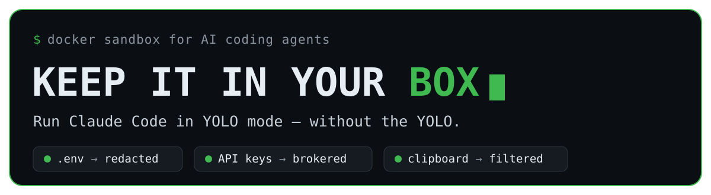
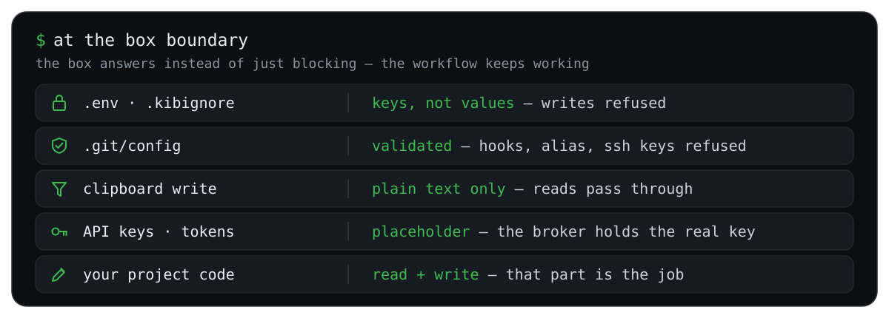
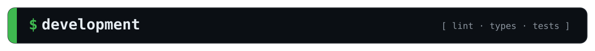

<p align="center">
  
</p>

<p align="center">
  
  
  
  
</p>

<p align="center">
  <b>A Docker sandbox for AI coding agents:</b> FUSE-redacted secrets, guarded host-executed config, a clipboard that only goes one way.
</p>

<p align="center">
  <a href="#box">What's in the box</a> &#183;
  <a href="#compare">How it compares</a> &#183;
  <a href="#hood">Under the hood</a> &#183;
  <a href="#start">Quick start</a> &#183;
  <a href="#dev">Development</a> &#183;
  <a href="#accepted-risks">Accepted risks</a>
</p>

---

You want to run an AI coding agent with `--dangerously-skip-permissions` so it stops asking. The problem was never the agent editing your code — that's the job. It's everything *around* the code: your `.env`, your OAuth token, a `.git/config` the host runs on the next commit, a clipboard write that becomes keystrokes at your next paste. Keep It in Your Box puts the agent in a container that can touch the project and nothing that would let it reach back out to the host.

<p align="center">
  
</p>

### Two ways to box an agent

The sharpest comparison is with Docker's brand-new **[Docker Sandboxes](https://www.docker.com/products/docker-sandboxes/) (`sbx`)** — because it makes the *opposite* trade. It wraps the agent in a microVM with a credential broker and deny-by-default egress, but mounts your workspace (including `.env`) readable and leaves `.git/config` for you to review afterwards. `kib` locks down exactly what `sbx` leaves open, and vice versa:

| At the boundary | `kib` (this repo) | Docker Sandboxes (`sbx`) |
|---|---|---|
| Workspace secrets (`.env`) | **Redacted** — stub on read, even for files created after launch | Readable — the git root is mounted into the VM |
| `.git/config` + host-run config | **Validated** — `hooksPath` / `sshCommand` / `alias.*` refused | Left to you — *"review Git hooks / Makefiles / CI after the session"* |
| Clipboard | **Mediated** — reads pass, writes refused | n/a — no host display is exposed |
| Egress | Open — an accepted risk | **Deny-by-default** host proxy |
| Credential | In the box, readable — *rotate after untrusted runs* | **Brokered** — injected on egress, never in the box |
| Kernel isolation | Shared host kernel, `cap-drop=ALL` | **microVM**, own kernel |

Neither is strictly safer — they defend different halves. The [full 7-sandbox matrix is below](#compare).

<h2 id="box"></h2>

- **Secrets are redacted, not just hidden.** A FUSE layer over the project stubs reads and refuses writes to `.env`, `.env.*`, and anything in `.kibignore` — including files created *after* launch, which no bind mount can cover. Committed placeholders (`.env.example`, `.env.sample`, …) stay readable.
- **Host-executed config is guarded.** The real boundary isn't the container — it's what the *host* runs later. `.git/config` is content-validated on write (a new `core.hooksPath`, `core.sshCommand`, `alias.*`, `filter.*.clean`, or `include` is refused; `git remote add` and `push -u` still work). `.vscode/`, `.devcontainer/`, `.envrc`, git hooks and submodule/worktree equivalents are read-through, write-denied. At launch and teardown an audit gate refuses to start a session into a poisoned config, and names any hidden path git is tracking anyway — without writing a hook into your repo.
- **The clipboard only goes one way.** The host Wayland socket is proxied, not handed over: clipboard *reads* pass (so image paste works), every clipboard *write* is refused — a write is host code execution at your next terminal paste. macOS gets the same asymmetry via a `pbpaste` bridge.
- **Projects can't read each other, and `~/.claude` stays stock.** kib keeps your canonical `~/.claude`/`~/.claude.json` untouched and assembles each container from only *this* project's slice per launch (its transcripts, prompt history and `.claude.json` entry), merging changes back out on exit. So a plain host `claude` and `cc` share one login, one `--resume` list and one history — while no project's box can see another's data.
- **One container per project, shared by every terminal.** Every terminal `docker exec`s into the same long-lived container, so `/resume`, prompt history and background jobs are shared across tabs. It's torn down only when the last session exits.
- **Follows your network.** On Linux a lightweight watcher keeps the container's DNS in step with the host across wifi/VPN changes — no host-netns sidecar, works behind a per-connection host firewall. (Not needed on macOS: the engine VM tracks the host resolver.)
- **Hardened by default.** `--cap-drop=ALL`, `no-new-privileges`, seccomp, AppArmor, no Docker socket, no host block devices. The default command is `claude --dangerously-skip-permissions` — safe *because* of the box.
- **Linux and macOS.** Two redaction modes behind one interface: a `cap-drop=ALL` FUSE sidecar on Linux, a single-container FUSE mount on macOS (Docker Desktop, OrbStack, or Colima).

### Run it two ways

Both names point at the **same** launcher, `bin/kib`. `kib` is the tool; `cc` is an alias for
`kib claude`, so a line you copied from a vendor still works when you swap `claude`→`cc`.

```bash
cc                        # launch Claude Code in the sandbox
kib exec bash             # drop into a shell in the sandbox
kib exec python app.py    # run anything else in the sandbox
kib broker status         # host-side credential management
kib audit                 # what would the host execute out of this repo?
kib help                  # the full verb table
```

Verbs win over programs: `kib bash` is an **error**, not a shell — pass-through is explicit,
via `kib exec`. Run either name from any project directory; the project is mounted at the same
absolute path it has on the host.

<h2 id="compare"></h2>

Measured against six other agent sandboxes on the controls that decide whether an untrusted repo can reach the host:

| Sandbox | Workspace secrets | Host-exec config | Clipboard | Egress | Credential | Isolation |
|---|:--:|:--:|:--:|:--:|:--:|---|
| **`kib`** (this repo) | ✅ stub-on-read ¹ | ✅ validated | ✅ mediated | ✕ open | ✅ brokered ⁴ | container, `cap-drop=ALL` |
| [Docker `sbx`](https://www.docker.com/products/docker-sandboxes/) | ✕ `.env` readable | ✕ review-after | — no display | ✅ deny | ✅ brokered | **microVM** |
| [sandbox-runtime](https://github.com/anthropic-experimental/sandbox-runtime) | ◑ sentinel (Linux) | ✕ block | ✕ | ✅ deny | ✅ brokered | bwrap / Seatbelt |
| [fence](https://github.com/fencesandbox/fence) | ◑ emptied ² | ✕ block | ✕ | ✅ deny | ✕ | bwrap / Landlock |
| [yoloAI](https://github.com/kstenerud/yoloai) | ◑ excluded ³ | ◑ neutralized | ✕ | ◑ opt-in | ✅ brokered | runc → Firecracker |
| [cplt](https://github.com/navikt/cplt) | ◑ macOS-only | ◑ macOS-only | ◑ on/off | ◑ opt-in | ✕ | Landlock / Seatbelt |
| [aicontainer](https://github.com/stefanoginella/aicontainer) | ◑ tool-hook | ✕ block | ✕ | ◑ opt-in | ✕ | container + socket proxy |

<sub>✅ enforced · ◑ partial or caveated · ✕ none / exposed · — not applicable.
¹ The only sandbox whose redaction also covers files created *after* launch. ² `/dev/null` mask, but `.env` is `denyWrite`, not `denyRead`, in the shipped template. ³ Files are copied in honouring `.gitignore`, so gitignored secrets never enter — not masked, but not present. ⁴ On by default; a launch with no stored token and no interactive login falls back to mounting the real credential, with a warning.</sub>

No project here does everything. `kib` is the only one that **validates `.git/config`** instead of blocking it, and the only one that **mediates the clipboard** rather than granting or withholding it wholesale — and one of the few that redacts secrets *created after launch*. Egress is the one column it deliberately concedes; see [Accepted risks](#accepted-risks) for why a default-deny allowlist is the wrong trade here. Full matrix, sources, and per-project caveats: [`docs/competitive-review/`](docs/competitive-review/).

<h2 id="hood"></h2>

- **One long-lived container per project**, `sleep infinity` as PID 1; every terminal attaches with `docker exec`, so Claude sees one PID namespace, one `/tmp`, one daemon — shared `/resume`, history and jobs, for free.
- **A FUSE sidecar** (`cap-drop=ALL`, holding the only cap) mounts the redacted project view; the main container mounts *that*. On macOS the same view is served by a single trusted container. Redaction covers files created after launch because it's a live view, not a bind mount.
- **A Wayland proxy sidecar** holds the only real compositor socket, forwarding reads and refusing every write request.
- **Host-side, at every launch:** a `.kibignore` → `.gitignore` sync, a `settings.json` validator that rejects inline `hooks[].command`, an audit gate over the repo's git config, and a DNS watcher that follows host network changes.

Every design decision and its rationale — including the dead ends — lives in
[`docs/design-notes/`](docs/design-notes/README.md); [`CLAUDE.md`](CLAUDE.md) carries the working
rules that reference it.

<h2 id="start"></h2>

```bash
git clone https://github.com/amerkay/keep-it-in-your-box.git
cd keep-it-in-your-box

# No setup step: kib keeps your ~/.claude stock and assembles each project's isolated
# session from it per launch — so you can switch between plain `claude` and `cc` freely
# (same login, same --resume transcripts, same history).

# Add both aliases to your shell rc, pointing at the absolute path.
# kib = the launcher (kib exec, kib broker, kib audit …); cc = kib claude.
echo "alias kib='$PWD/bin/kib'"        >> ~/.bashrc
echo "alias cc='$PWD/bin/kib claude'"  >> ~/.bashrc
```

The image builds automatically on first run. Then `cd` into any project and run `cc`.

### Requirements

- Docker — Docker Desktop, OrbStack, or Colima on macOS; any engine on Linux.
- A Wayland session for host clipboard / image paste on Linux (optional — absent Wayland just disables paste).
- `git`, `bash`, `perl` (system perl is fine on macOS — no Homebrew dependencies).

<h2 id="dev"></h2>

### Linting and formatting

One entrypoint, behaving identically in all three places you might run it — inside the box, on
the host, and in your editor:

```bash
./dev.sh format   # rewrite:  ruff format, ruff check --fix, shfmt -w
./dev.sh lint     # verify:   ruff format --check, ruff check, mypy --strict, shfmt -d
./dev.sh check    # lint + tests/check.sh — exactly what CI runs
```

Inside the box there is nothing to install: the image bakes ruff, mypy, shfmt and shellcheck at
the pinned versions. On the host:

```bash
uv venv --python 3.13
uv pip install -r requirements-dev.txt
# or, without uv:  python3 -m venv .venv && ./.venv/bin/pip install -r requirements-dev.txt
```

shfmt and shellcheck are Go/Haskell binaries, not Python packages — install the pinned releases
(shfmt `v3.13.1`, shellcheck `v0.10.0`), or `brew install shfmt shellcheck` on macOS and keep the
versions in step. `dev.sh` prefers a repo-local `.venv` but probes each tool before using it, so a
host venv — whose interpreter the container cannot see — falls back to the baked copies by itself.

Configuration is repo-root, shared by editor, container and host, and never duplicated into an
editor profile:

| File | Governs |
|---|---|
| `pyproject.toml` | ruff (format, lint, import order) and mypy `strict` |
| `.editorconfig` | 100-column lines — and **shfmt's own config**, which it reads whenever no style flags are passed, so `dev.sh` passes none |
| `requirements-dev.txt` | exact pins for ruff, mypy and pytest |
| `Dockerfile`, `.github/workflows/lint.yml` | pinned shfmt + shellcheck binaries, kept in step with each other |

What to annotate, when a `# noqa` earns its place, and the shell rules are in
[`CONVENTIONS.md`](CONVENTIONS.md).

### Editor setup (VS Code)

Run VS Code **on the host**, against the real directory — not attached to the box. The sandbox's
redacted view exists only inside the container, so the editor sees ordinary files.

[`.vscode/extensions.json`](.vscode/extensions.json) and [`.vscode/settings.json`](.vscode/settings.json)
are checked in — a fresh clone gets prompted to install, and they wire straight into the same
`pyproject.toml` / `.editorconfig` the CLI and CI read. Nothing to configure by hand:

```bash
code --install-extension charliermarsh.ruff
code --install-extension ms-python.mypy-type-checker
code --install-extension mkhl.shfmt
code --install-extension timonwong.shellcheck
code --install-extension EditorConfig.EditorConfig
```

Five things that will bite otherwise:

- **`.vscode/` is write-denied from inside the box** — it's on the host-executed-config guard list.
  An agent in the sandbox getting EACCES if it edits these files is the guard working, not a bug;
  edit them from a host terminal.
- **Point VS Code at `.venv`** (`Python: Select Interpreter`). `fromEnvironment` resolves ruff and
  mypy through the selected interpreter; without it both fall back to bundled versions and you get
  diagnostics CI doesn't have — or miss ones it does.
- **Use `mkhl.shfmt`, not `foxundermoon.shell-format`.** The latter is the more popular extension
  and it [ignores `.editorconfig`](https://github.com/foxundermoon/vs-shell-format/issues/66),
  configuring itself from `settings.json` instead — which would reformat every script against
  shfmt's tab default and fight `./dev.sh format` on every save.
- **shfmt and shellcheck are separate binaries.** `mkhl.shfmt` ships none, so install shfmt
  (`shfmt.executablePath` if it isn't on `PATH`); `timonwong.shellcheck` bundles *its own*, which
  drifts from the pinned `v0.10.0` — set `shellcheck.executablePath` at the pinned one if the
  editor and CI ever disagree.
- **A Flatpak or Snap editor has the sandbox's `PATH`, not yours.** Host-installed shfmt is
  invisible to it, so `mkhl.shfmt` fails with `command not found` (shellcheck keeps working only
  because it bundles a binary). Reach the host copy with `"shfmt.executablePath":
  "/usr/bin/flatpak-spawn"` plus `"shfmt.executableArgs": ["--host", "shfmt"]` — in **user**
  settings, since it describes the machine rather than the project.

The mypy extension writes a `.mypy_cache/` into the repo. That's gitignored and harmless on the
host, but it is the reason a bare `mypy` **inside** the box dies with SIGBUS — its cache is mmap'd
and mmap over the FUSE view faults. In the box, go through `./dev.sh`, which points
`MYPY_CACHE_DIR` outside the mount.

### Tests

All test suites live in [`tests/`](tests/). The host-side ones need no image or container:

```bash
./dev.sh check     # lint + the whole host-side suite — exactly what CI runs
./tests/check.sh   # just the suite: syntax, shellcheck, the bash-3.2/BSD portability
                   #   contract, the host/portable.sh shim unit tests, the broker and
                   #   MCP bash wiring, the regression guards, then pytest
pytest             # just the Python suites (tests/shared, host, guest, broker)
```

The bash sections live one per file in [`tests/check/`](tests/check/); `tests/check.sh` is a
thin runner over them, and both bash suites share the harness in `tests/lib.sh` so they report
identically.

[`tests/security-test.sh`](tests/security-test.sh) is the **in-sandbox** regression suite — one
check per control the [audit](docs/SECURITY_AUDIT.md) established. Run it **inside** the box, once
normally and once under `KIB_SINGLE_CONTAINER=1` (the macOS topology):

```bash
kib exec ./tests/security-test.sh                 # everything
kib exec ./tests/security-test.sh --list          # what it covers, run nothing
kib exec ./tests/security-test.sh -k git          # one section
```

Each check re-attempts a real attack and asserts the refusal, *and* re-attempts the legitimate
operation the guard must not break — a guard that blocks the attack by breaking the workflow has
failed too.

<h2 id="accepted-risks">Accepted risks</h2>

<details>
<summary><b>This is a real boundary, not a perfect one — read before you trust it.</b></summary>

<br>

- **The credential broker keeps the token out of the box, and it is on by default.** It holds a long-lived token host-side and gives the sandbox a placeholder plus an `ANTHROPIC_BASE_URL` pointed at a `cap-drop=ALL` sidecar, which strips the placeholder and injects the real token on the way out — so even with egress wide open an injected session can't exfiltrate it. Your **first** launch has no token yet, so it runs a one-time login for you (`claude setup-token`, stored host-only at `~/.keep-it-in-your-box/claude-token`, mode 600). Decline that login, or launch headless, and the session falls back to the pre-broker behaviour with a warning: the real credential is copied into the box so in-sandbox Claude can still authenticate — **rotate it if an untrusted session has run that way**. Turn the broker off with `broker = off` in `~/.keep-it-in-your-box/config`, or `KIB_BROKER=0` for one launch.

  ```bash
  kib broker login           # mint + store a token (wraps `claude setup-token`); host-only, mode 600
  kib broker status          # is it still accepted? never prints the token
  kib broker logout          # remove it
  ```

  The brokered credential is deliberately a **static** long-lived token, never `~/.claude/.credentials.json` — Anthropic's subscription refresh tokens are single-use and rotate, so a second process refreshing them logs you out of every other session. Egress itself is still open: a default-deny allowlist conflicts with the sandbox's whole purpose (building untrusted repos that fetch from arbitrary registries).

  With the broker on, Claude Code's banner reads **"Claude API"** — that's the custom base URL, *not* metered billing. A `setup-token` credential is subscription OAuth, so usage still counts against your Pro/Max plan ([why](docs/design-notes/credential-broker.md#the-claude-api-banner-is-transport-not-metered-billing)).

  


- **The same broker holds your *other* secrets — a Codex key, and any MCP's token.** The broker isn't limited to a fixed list: it brokers **any** MCP, whether or not we've heard of it. **The easiest path is the one you'd do anyway: take a service's own install line and swap `claude`→`cc`.** A vendor tells you to run `claude mcp add --header "Authorization: Bearer <token>" --transport http foo <url>`; change the first word to `cc` and kib **intercepts it host-side, before anything reaches the box** — peeling the token off, storing it host-only (mode 600), and wiring a header-free broker route. The secret never enters the sandbox; you don't need to learn a new command (this is exactly why `cc` is aliased to `kib claude` — swapping `claude`→`cc` is lossless):

  ```bash
  cc mcp add --header "Authorization: Bearer <token>" --transport http foo <url>
  #  → 🔐 Intercepted an inline MCP credential and brokered it host-side — it never entered the sandbox.
  ```

  (The local/stdio form that ships secrets as `--env` can't be brokered that way, so kib **refuses** it rather than leak — `KIB_ALLOW_INLINE_MCP_SECRET=1` is the deliberate override. And if a secret got into a config some *other* way, kib still **warns** on the next launch and offers `kib mcp adopt <name>` to migrate it.) You can also declare one directly:

  ```bash
  # remote MCP, static auth header (broker injects it):
  kib mcp add linear --url https://mcp.linear.app/sse --header "Authorization: Bearer"
  kib broker login linear    # paste the token; stored host-only, never in the box
  # local/hosted MCP whose secret can't be header-injected (runs in its own sidecar):
  kib mcp add gsc --run "uvx mcp-search-console" --cred-env GSC_CREDENTIALS_PATH \
     --cred-kind file --env GSC_SKIP_OAUTH=true
  kib broker login gsc       # give the path to a service-account JSON key
  kib broker login codex     # an OpenAI API key → OPENAI_BASE_URL points at the broker
  kib broker status          # list every credential (size/mode only, never contents)
  ```

  **No MCP is built in — only the LLMs are.** DataForSEO (remote, Basic auth) and mcp-gsc (a Google service-account JSON, run in its own sidecar) ship as worked **examples** in [`examples/providers/`](examples/providers/) — copy one into `~/.keep-it-in-your-box/providers.d/` and `kib broker login` it; your own MCP works exactly the same way. With the broker on, kib writes a **header-free** broker URL into the session config, so the agent reaches the MCP without ever holding its credential. Brokering an MCP needs the broker running, which it is unless you turned it off. See [`docs/design-notes/credential-broker.md`](docs/design-notes/credential-broker.md) and CLAUDE.md "Credential broker".

  **An egress firewall is a "delayed-or-never" task, on purpose.** The two channels that matter cannot be closed: `api.anthropic.com` is itself a bidirectional exfil path, and `github.com` plus the package registries must stay open for the agent to work at all. So the real fix is the **broker** — remove the thing worth stealing — not a firewall. Full reasoning in [`docs/FUTURE_TASKS.md`](docs/FUTURE_TASKS.md) § E1.
- **`host.docker.internal` is routable** to the host network stack.
- **The project directory is writable**, by design — the agent's job is to edit your code.

The full audit, including the controls that *are* closed, is in [`docs/SECURITY_AUDIT.md`](docs/SECURITY_AUDIT.md).

</details>

## License

No license file yet, so default copyright applies (all rights reserved by the author). If you'd like to use or adapt it, open an issue — a permissive license is likely.
