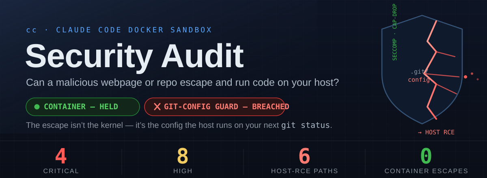

<!-- Hero: rendered from assets/security-audit/hero.svg -->

  

  
  
  
  
  
  
  
  
  

---

## The question

> **Can a malicious script, webpage, or GitHub repo driving this session escape the sandbox and execute code on the host?**

**As audited, yes.** Six confirmed paths reached the host, four rated **Critical**. The container hardening is excellent — every classic container-escape class was tested and blocked — but the sandbox's own stated boundary, *"what the host runs later,"* had multiple holes in the **git-config guard**, and the shared credential surface is exfiltrable by design.

> [!TIP]
> **All `P0` and `P1` work has shipped.** C1–C4, H1, H2, H6 and H8 are **fixed**; H5 is **mitigated**; H3/H4 remain the deliberate accepted risk. Findings are retained as the record of *why* each control exists — see [Changelog](#changelog).

> [!CAUTION]
> The most important chains fired on the **host's next `git status` / `git add` / `git commit`** — the exact commands you run to *review the sandbox's diff before trusting it*. `core.fsmonitor` executes on a bare `git status`, before a human sees anything, and a redirected `core.hooksPath` routes git past the repo's own `ccignore-precommit.py` hook. The review step the whole model relies on was where the payload detonated.

**Scope:** `cc`, `cc-lib.sh`, `docker-entrypoint.sh`, `Dockerfile`, `ccignore-fuse.py`, `global.ccignore`, `ccignore-precommit.py`, `resolv-sync.sh`, `sleep-guard.sh` · **Method:** static analysis of every control plus **live exploitation from inside a running sandbox**, each finding re-verified by an adversarial second pass · **Non-destructive throughout:** exploitability was proven via config *resolution* (`git config --get`), a permitted write-*open* with nothing written, `stat`, or resolved-state reads — never by executing host code or reading a real secret.

---

## Threat model

The sandbox launches `claude --dangerously-skip-permissions`, so **in-container code execution from injected content is expected and accepted** — the container *is* the boundary, and running untrusted build scripts is the whole purpose. This audit therefore measures only what **escapes** it:

- **host code execution**,
- **host credential theft**,
- **cross-project persistence**.

In-container-only effects are not findings.

---

## Findings

Severity, mechanism, root cause and remediation for every confirmed issue. This table is canonical; everything below elaborates or verifies it.

| # | Finding | Severity | How it reaches the host | Root cause (`file:line`) | Status & fix |
|:--|:--|:--|:--|:--|:--|
| **C1** | `git config include.path` / `includeIf.*.path` indirection | 🔴 Critical Host RCE | Validator reads *literal* text and never resolves includes; `include`/`path` aren't in the danger set → an included file declares `core.hooksPath`/`fsmonitor`, git resolves it on any op. The host-side detector was blind too: `git config --local --list` does not expand includes | `ccignore-fuse.py:41` (`DANGEROUS_GIT_KEYS`) · `:353` (`_dangerous_entries`) · `ccignore-precommit.py:40` | ✅ **Fixed** `P0` — `include`/`includeif` added to `DANGEROUS_GIT_SECTIONS`, so a *newly added* include is refused like any command key (pre-existing ones grandfathered). The host audit now runs `--includes` |
| **C2** | Hardlink defeats the FUSE `protect`/`redact` guard | 🔴 Critical Host RCE + secret read | `link()` checks only the **new name**, never the **source inode**; a hardlink aliases a protected inode and the VFS doesn't re-resolve it (a symlink does, and was correctly blocked) → write `core.hooksPath` directly, or read a `redact`ed secret past the stub | `ccignore-fuse.py:453-455`; guard keys on **path string**, not inode | ✅ **Fixed** `P0` — `link()` now calls `_deny_if_masked(source)` as well as target. (`default_permissions` deliberately not enabled — it also changes stub-inode semantics) |
| **C3** | Inline `[section]key=value` parser bypass | 🔴 Critical Host RCE | The parser treats any `[`-line as a pure header and `continue`s, dropping a trailing inline `key=value` — but **git accepts `[core]hooksPath = …` on one line**, resuming its scan after `]` | `ccignore-fuse.py:358-363` — hand-rolled parser diverges from git's grammar | ✅ **Fixed** `P0` — `_dangerous_entries` resumes parsing after `]`, matching git's grammar |
| **C4** | `.gitattributes` filter/diff/merge driver via include | 🔴 Critical Host RCE | Drivers are blocked on direct write, but via C1's include hop they're defined in an included file and `.gitattributes` (an unguarded worktree file) binds them → runs on checkout/diff/merge/archive | Same as C1; `.gitattributes` is an extra trigger surface | ✅ **Fixed** `P0` — closed by C1: with the include hop refused, the drivers can no longer be defined |
| **H1** | Bare / `--separate-git-dir` repo (dir not named `.git`) | 🟠 High Host RCE | `_is_git_config`/`_git_sensitive` required a literal `.git` component, so `config`/`hooks` under a bare or separate gitdir were unguarded → direct `core.hooksPath`, accepted and resolved | `ccignore-fuse.py:333` / `:338`; `ccignore-precommit.py` audited the top repo only | ✅ **Fixed** `P0` — `_is_gitdir()` marker probe (`HEAD`+`objects`+`refs`) in both functions; `audit_nested_gitdirs()` added host-side |
| **H2** | gitfile / symlinked `.git` redirect to an unguarded gitdir | 🟠 High Host RCE | A `.git` **file** containing `gitdir: ../store` redirects config+hooks into an unguarded dir; live, `core.fsmonitor` set that way **executed on a bare `git status`** | `ccignore-fuse.py:338` (component match) | ✅ **Fixed** `P0` — closed by H1: the redirect *target* is a real gitdir, so the marker probe guards it. The gitfile stays writable so `git worktree add` works |
| **H3** | Shared OAuth token exfiltration over open egress | 🟠 High Host credential theft | `~/.claude-shared/.credentials.json` (0600, **same-uid readable**, a real host mount outside FUSE) plus **fully open egress** → the account token leaves the box with no host trigger | Open egress + a durable credential in a container-reachable mount | ⚪ **Accepted** — the token cannot be made unreadable (Claude needs it) and default-deny egress contradicts the sandbox's purpose. **Rotate the token if an untrusted session has run** |
| **H4** | Prompt injection → unattended token exfil | 🟠 High Host credential theft | Injected content runs any in-container command with no consent; read→exfil of the host token needs *no host trigger*, and it arms every other chain. *Upgraded* from in-container-only under adversarial review | By design (`--dangerously-skip-permissions`) + H3 | ⚪ **Accepted** with H3 — in-container execution is the design; every *host-reaching* target it armed (C1–C4, H5, H6, H8) is now closed or mitigated |
| **H5** | Poison shared `settings.json` | 🟠 High Host cred theft + cross-project | Writable and **outside** FUSE; the entrypoint symlinked it into every project and folded in-session edits back into the shared copy, with no validation → `ANTHROPIC_BASE_URL`, `apiKeyHelper` and inline `hooks[].command` propagate to every project's next session | `docker-entrypoint.sh:95-110` (fold-back); no content validation | 🟡 **Mitigated** `P1` — `validate_shared_settings` (`cc-lib.sh`) vets the file host-side on every launch, before any container reads it, refusing `apiKeyHelper`/`awsAuthRefresh`/`awsCredentialExport`/`otelHeadersHelper`, `env.ANTHROPIC_{BASE_URL,API_KEY,AUTH_TOKEN}`, `statusLine.command` and inline `hooks[].command`. Left writable on purpose (`/config`, theme) — so it is prevention **at launch, not at write** |
| **H6** | Poison shared `plugins`/`skills`/`agents`/`commands` | 🟠 High Cross-project persistence | 0775, writable, symlinked into every project and — unlike `hooks/` — not read-only mounted → injected assets auto-run in every project's next session; with H3, exfil the token | Shared writable assets, no validation | ✅ **Fixed** `P1` — all four mounted `:ro` individually (the dir itself must stay writable for OAuth refresh), with a per-project **merge farm** in `docker-entrypoint.sh` so in-session authoring and `/plugin install` still work and land per-project. `cc --unlock-shared` is the deliberate opt-out |
| **H8** | Wayland clipboard poisoning → host paste RCE / read exfil | 🟠 High Host RCE (on paste) | Raw read-write Wayland socket, unmediated: the container could **write** the clipboard with bracketed-paste-bypass sequences (an embedded `ESC[201~`) that execute at your next host paste, and **read** it continuously (`wl-paste --watch`) | `cc:268` — unmediated socket mount | ✅ **Fixed** `P2` — `wayland-guard.py` sidecar owns the real socket and refuses every `create_data_source`/`set_selection`/`set_primary_selection` on all four clipboard interfaces, closing that connection and raising a host desktop alert. Reads pass verbatim (`SCM_RIGHTS` fds included), so `wl-paste` and image paste are unaffected |
| **L1** | Unguarded project `.claude/settings*.json` & `.mcp.json` | 🟡 Low In-container only | `global.ccignore` lists `.vscode`/`.envrc`/`.env*` but not `.claude/` or `.mcp.json`; a malicious repo's autoload files get in-container RCE — **already free** under skip-permissions | Not pruned or validated | ⬜ **Open** `P3` — defense-in-depth against a future non-skip-permissions use; add them to a validated guard section |
| **—** | Container-escape CVEs, FUSE-sidecar pivot, symlink escape, mount-propagation, host-resolver reach, sleep-guard injection | 🟢 Info | — | — | **Verified blocked** — see below |

---

## Remediation verified live

Re-run from inside a restarted sandbox through the real FUSE mount (2026-07-22), using the same non-destructive technique as the original pass: the payload is proven *unresolvable*, never detonated.

| # | Reproduction | Before | After |
|:--|:--|:--|:--|
| **C1** | `git config include.path evil.inc` | accepted | `could not write config file .git/config: Permission denied` |
| **C1b** | `git config 'includeIf.gitdir:/x/.path' …` | accepted | Permission denied |
| **C2** | `ln .git/config hardconfig` | permitted | `failed to create hard link … Permission denied` |
| **C3** | rename a config carrying `[core]hooksPath = …` (inline form) | accepted | Permission denied · `core.hooksPath` resolves to nothing |
| **C3b** | same, normal multi-line form (regression) | denied | still denied |
| **C4** | `git config filter.x.clean 'echo pwn'` | denied | still denied — and the include route that re-enabled it is shut |
| **H1** | `git init --bare b1 && git -C b1 config core.hooksPath …` | accepted + resolved | Permission denied · resolves to nothing |
| **H1b** | write `b1/hooks/pre-commit` into the bare repo | permitted | Permission denied |
| **H2** | `--separate-git-dir=gd wt` → `git -C wt config core.fsmonitor …` | accepted + **executed on `git status`** | Permission denied · resolves to nothing |
| **H5** | `.credentials.json` / `settings.json` writability | writable | still writable **by design** — the guard is `validate_shared_settings` at launch |
| **H6** | `touch ~/.claude-shared/{skills,agents,commands,plugins,hooks}/probe` | permitted | `Read-only file system` — all five |
| **H6b** | `/proc/self/mountinfo` for the shared entries | one `rw` mount | six nested `ro` binds; `~/.claude-shared` itself still `rw` |
| **H6c** | *regression* — create a skill / agent in-session | worked (into the shared dir) | works, into `$CLAUDE_CONFIG_DIR`; invisible to other projects |
| **H6d** | *regression* — `mkdir plugins/marketplaces/<new>` | worked (shared) | works, per-project (`farm_dir` runs a level deeper) |
| **H8** | `wl-copy 'payload'` from inside the sandbox | clipboard **set** | `wl_display_dispatch: Broken pipe` — connection closed; clipboard verified unchanged |
| **H8b** | host desktop alert on that attempt | none | *"The sandbox tried to write your clipboard. Blocked — your next paste is safe."* |
| **H8c** | *regression* — `wl-paste --list-types` | worked | works, and still works after a denial |
| **H8d** | *regression* — host terminal select + `Ctrl+Shift+C` | worked | unchanged — the terminal emulator is a host client and never traverses the proxy |

**Regressions checked, all still working:** `git status`, config reads, `git init` (empty template), `git add`, `git commit`, `git remote add`, `git worktree add`, `git init --bare`, and ordinary hardlinks. `core.pager` is still refused; the symlink form is still resolved by the kernel before the guard sees it.

Unit harnesses back the paths a live run can't reach: the Wayland proxy passes **23/23** protocol cases against a fake compositor, `validate_shared_settings` **15/15**, and the entrypoint merge farm **22/22** against a throwaway `$HOME`.

---

## Controls verified holding

Tested, not assumed.

| Control | Result |
|:--|:--|
| **All classic container-escape CVEs** | Blocked — `CapEff=0`, `CapBnd` lacks `SYS_ADMIN` (`0xcb`), `NoNewPrivs=1`, seccomp mode 2, AppArmor `docker-default` enforce, `/sys` + `/sys/fs/cgroup` (cgroup2) + `/proc/sys` read-only, `/proc/self/exe` non-writable, no docker binary or socket (removing the CVE-2024-21626 trigger). `mount(2)`/`unshare(2)` → EPERM live. |
| **FUSE-sidecar pivot** | Blocked — the `SYS_ADMIN` sidecar is in a separate mount+PID namespace, reachable only via FUSE ops; the `_real` join is confined, `os.link` doesn't dereference the source, fusepy converts handler faults to `-EINVAL`. |
| **Symlink escape** | Blocked — `readlink` returns the target string only; the main-container kernel re-resolves it (in-mount targets re-enter the guard, out-of-mount ones reach only already-mounted paths). |
| **Mount-propagation abuse** | Blocked — no `CAP_SYS_ADMIN`, seccomp blocks namespace unshare, `:rslave` is one-directional, the sidecar source is isolated. |
| **Host resolver reach** | Blocked — both systemd-resolved Varlink sockets are `/dev/null`-shadowed (`connect()` refused, verified live); the source dir is read-only; the root `resolv-sync` watcher is unreachable to uid 1000. |
| **`sleep-guard.sh` injection** | Blocked — the one container-originated value reaching a bash-arithmetic sink (`:157`) is sanitized by `awk '$NF + 0'` (`:133`); container and session names reach host command lines only as safely-quoted args. *(Keep that `awk` coercion — it is security-load-bearing.)* |

---

## Open items

- **H3 / H4 — the shared OAuth token under open egress.** The only finding that cannot be closed with a guard rule: Claude needs the token, and a default-deny allowlist contradicts the sandbox's purpose of building untrusted repos that fetch from arbitrary registries. Accepted deliberately, with **token rotation after any untrusted session** as the operational answer. The strong form, if revisited, is brokering short-lived scoped tokens host-side so the durable credential never sits in a container-reachable mount.
- **H5 is mitigated, not fixed.** Validation runs at launch, not at write. The propagation step is what matters and it is covered, but a poisoned file exists between the write and the next launch.
- **L1 `P3`** — add `.claude/settings*.json`, `.claude/hooks` and `.mcp.json` to a validated guard section; keep the host kernel and `runc` patched.

---

## Changelog

Security-relevant work, oldest first. Everything before the audit built the boundary; everything after closed the holes the audit found in it.

| Date | Commit | Change |
|:--|:--|:--|
| 2026-04-09 | `aa038fc` | **Container hardening.** `--cap-drop=ALL` with minimal add-backs, `.git/hooks` and `~/.claude/hooks` mounted read-only, `docker.io` removed from the image. |
| 2026-04-10 | `d039d5a` | **`.ccignore` introduced** — matching paths get a read-only stub instead of real contents. |
| 2026-04-14 | `ab3f4a8` | **FUSE redaction sidecar** closes the mid-session leak: launch-time bind masking could not cover files created after start. Aborts rather than run unprotected. |
| 2026-06-19 | `d59e1d2` | Refuse to launch from `$HOME`, `~/Desktop`, `~/Documents`, `~/Downloads`. |
| 2026-06-19 | `c81639d` | **Host-side leak guards** — `.ccignore` mirrored into `.gitignore`, plus `ccignore-precommit.py` aborting commits of matching paths (catches already-tracked files, which `.gitignore` cannot). |
| 2026-07-10 | `0eb4aff` | Negation (`!`) rules honoured in both redaction layers, matching `git check-ignore` semantics. |
| 2026-07-13 | `831d848` | **Cross-project isolation** — per-project `CLAUDE_CONFIG_DIR`, shared credential only. Ends both the daemon-lock war and one project reading another's transcripts. |
| 2026-07-13 | `2aa8bc2` | One long-lived container per project; every terminal `docker exec`s in. |
| 2026-07-15 | `02b66ae` | **Varlink sockets shadowed** in the DNS-sync mount. A read-only mount does not stop `connect()`: an unauthenticated connect had serviced `ResolveHostname` and dumped the host's full DNS/interface topology. |
| 2026-07-22 | `cb71e90` | **Host-executed-config guard** — the always-on redaction sidecar and `global.ccignore`, built after a review against Pillar Security's *week of sandbox escapes* found four instances of that class. |
| 2026-07-22 | `18b2567` | **This audit lands.** 118 vectors swept, 19 exploited live and adversarially verified: 4 Criticals, 6 host-RCE paths, container hardening confirmed holding. |
| 2026-07-22 | `e364e23` | **`P0` wave — six host-RCE paths closed** (C1–C4, H1, H2). Two brittle assumptions were behind every one: that hand-parsing equals git's resolution, and that path strings identify inodes. |
| 2026-07-22 | `f3fa29b` | **`P1` wave — the two surfaces outside the FUSE guard.** Shared assets locked read-only with a per-project merge farm (H6); the clipboard mediated by `wayland-guard.py` (H8); `settings.json` validated host-side each launch (H5). |

---

## Prior art & references

These are not novel bug classes — they are the **known** AI-coding-agent boundary failures, reproduced against `cc`.

- **Justin Steven (2022)** — *buried bare repos and `fsmonitor` abuses*, the foundational git-config-indirection advisory (C1, H1) · [github.com/justinsteven/advisories](https://github.com/justinsteven/advisories/blob/main/2022_git_buried_bare_repos_and_fsmonitor_various_abuses.md)
- **Pillar Security** — *The Week of Sandbox Escapes* (Cursor / Codex / Gemini CLI / Antigravity), the exact "sandboxed writer hands executable config to an unsandboxed reader" class (C1–C4, H4) · [pillar.security](https://www.pillar.security/blog/the-week-of-sandbox-escapes)
- **Check Point Research** — *RCE & API-token exfiltration through Claude Code project files*: **CVE-2026-21852** (`ANTHROPIC_BASE_URL` leak before trust, fixed v2.0.65) and **CVE-2025-59536** (H5, L1) · [research.checkpoint.com](https://research.checkpoint.com/2026/rce-and-api-token-exfiltration-through-claude-code-project-files-cve-2025-59536/) · [GHSA-jh7p-qr78-84p7](https://github.com/advisories/GHSA-jh7p-qr78-84p7)
- **GitHub Copilot CLI** — **CVE-2026-45033 / GHSA-9ccr-r5hg-74gf**, nested bare repo `core.fsmonitor` RCE (H1's analog) · [github.com/github/copilot-cli](https://github.com/github/copilot-cli/security/advisories/GHSA-9ccr-r5hg-74gf)
- **Cobalt.io** — *Red Team Technique: Exploiting Git FSMonitor for Initial Access* · [cobalt.io](https://www.cobalt.io/blog/red-team-technique-exploiting-git-fsmonitor-for-initial-access)
- **CVE-2021-21300** — git symlink + clean/smudge-filter delayed-checkout RCE (C4, H2) · [github.blog](https://github.blog/2021-03-09-git-clone-vulnerability-announced/)
- **Cursor 3.0.0 / CVE-2026-48124** — `.claude` hook-config → unsandboxed execution (H5 analog)
- **Cymulate (Apr 2025)** — *Configuration-Based Sandbox Escape* across Claude Code / Gemini CLI / Codex CLI (H6)
- **Mitigation precedent** — OpenAI Codex forces `core.fsmonitor=false` on internal git commands · [openai/codex#26880](https://github.com/openai/codex/pull/26880)
- **Pastejacking** (D. Ayrey) and bracketed-paste bypass — the H8 clipboard-to-terminal class · [github.com/dxa4481/Pastejacking](https://github.com/dxa4481/Pastejacking)

---

## Overall assessment

The **container** is hardened to a high standard; every kernel and namespace escape class was tested and blocked. The exposure was entirely at the **host-executed-config boundary the sandbox itself set out to defend**, plus the shared-config, clipboard and credential surfaces sitting outside it. The git-config guard was the right idea implemented on two brittle assumptions — *path strings identify inodes*, and *hand-parsing equals git's resolution* — each bypassable.

Both waves have shipped. The parser follows git's grammar and refuses `include`/`includeIf`, `link()` validates its source inode, git dirs are recognised by layout, the shared config dir is read-only behind a per-project merge farm, the clipboard is read-only, and shared `settings.json` is vetted before any container reads it. What remains is the shared OAuth token under open egress — accepted deliberately, answered by rotation.

---

**Test-artifact cleanup — done.** Testing left inert `_audit_*` directories under the project (their `.git/config` files cannot be deleted from inside the sandbox — the guard correctly denies `unlink` of `.git/config`, itself a minor note); these were removed host-side after the audit. The real repository `.git/config` was verified **pristine** at audit end.
