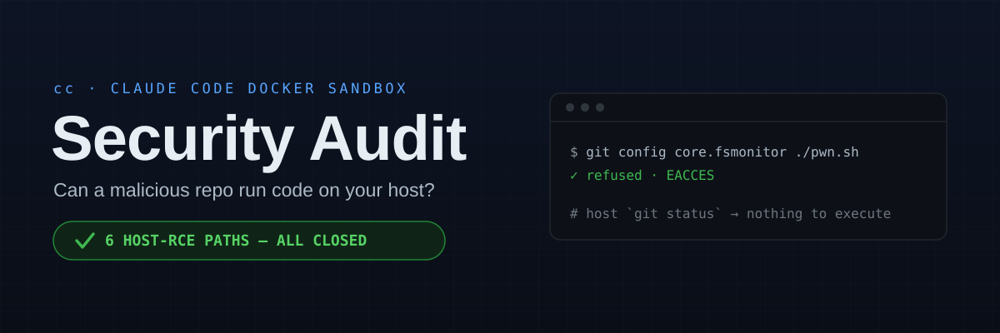

<!-- Hero: rendered from assets/security-audit/hero.svg -->
<p align="center">
  
</p>

<p align="center">
  
  
  
  
  
  
  
  
  
  
</p>

---

## The question

> **Can a malicious script, webpage, or GitHub repo driving this session escape the sandbox and execute code on the host?**

**As audited, yes.** Six confirmed paths reached the host, four rated **Critical**. The container hardening is excellent — every classic container-escape class was tested and blocked — but the sandbox's own stated boundary, *"what the host runs later,"* had multiple holes in the **git-config guard**, and the shared credential surface is exfiltrable by design.

> [!TIP]
> **All `P0` and `P1` work has shipped.** C1–C4, H1, H2, H6 and H8 are **fixed**; H5 is **mitigated**; H3/H4 remain the deliberate accepted risk. Findings are retained as the record of *why* each control exists — see [Changelog](#changelog).

> [!NOTE]
> **Second pass — 2026-07-25.** A re-audit found **two more host-RCE paths of already-known classes**, both now fixed: **C5** — the git-config write validator was not quote-aware, so a driver hidden in a double-quoted subsection name (`[filter "e]v"]clean = …`, or `#`/`;` inside the quotes) slipped past it into the real `.git/config` (the same parser-divergence class as C3); and **H9** — the shared `settings.json` env allow-check was a three-key denylist, so `NODE_OPTIONS` / `BASH_ENV` / `LD_PRELOAD` / `PATH` propagated to a host `claude`'s subprocesses (the same propagation path as H5). See [Second audit pass](#second-audit-pass--2026-07-25) for detail, the 50-vector sweep, and recommendations.

> [!CAUTION]
> The most important chains fired on the **host's next `git status` / `git add` / `git commit`** — the exact commands you run to *review the sandbox's diff before trusting it*. `core.fsmonitor` executes on a bare `git status`, before a human sees anything, and a redirected `core.hooksPath` routed git past the repo's own pre-commit hook (since replaced by the host-side audit gate). The review step the whole model relies on was where the payload detonated.

<sub>**Scope** (every host- and guest-side control; file paths below name the CURRENT tree, which was reorganised after the audit — see `CLAUDE.md`)**:** the launcher and its `host/` units, both entrypoints, the `Dockerfile`, the FUSE guard, the shipped guard rules, the host-side audit gate, the DNS watcher and the sleep guard · **Method:** static analysis of every control plus **live exploitation from inside a running sandbox**, each finding re-verified by an adversarial second pass · **Non-destructive throughout:** exploitability was proven via config *resolution* (`git config --get`), a permitted write-*open* with nothing written, `stat`, or resolved-state reads — never by executing host code or reading a real secret.</sub>

---

## Threat model

The sandbox launches `claude --dangerously-skip-permissions`, so **in-container code execution from injected content is expected and accepted** — the container *is* the boundary, and running untrusted build scripts is the whole purpose. This audit therefore measures only what **escapes** it:

- **host code execution**,
- **host credential theft**,
- **cross-project persistence**.

In-container-only effects are not findings.

---

## Findings

Severity, mechanism, root cause and remediation for every confirmed issue. This table is canonical; everything below elaborates or verifies it.

| # | Finding | Severity | How it reaches the host | Root cause (`file` · symbol) | Status & fix |
|:--|:--|:--|:--|:--|:--|
| **C1** | `git config include.path` / `includeIf.*.path` indirection | 🔴 Critical<br>Host RCE | Validator reads *literal* text and never resolves includes; `include`/`path` aren't in the danger set → an included file declares `core.hooksPath`/`fsmonitor`, git resolves it on any op. The host-side detector was blind too: `git config --local --list` does not expand includes | the danger tables + INI parser (now `kib/shared/dangerous.py` `GIT_KEYS` · `git_ini_entries`) · `kib/host/gitaudit.py` | ✅ **Fixed** `P0` — `include`/`includeif` added to the section table (now `GIT_SECTIONS`), so a *newly added* include is refused like any command key (pre-existing ones grandfathered). The host audit now runs `--includes` |
| **C2** | Hardlink defeats the FUSE `protect`/`redact` guard | 🔴 Critical<br>Host RCE + secret read | `link()` checks only the **new name**, never the **source inode**; a hardlink aliases a protected inode and the VFS doesn't re-resolve it (a symlink does, and was correctly blocked) → write `core.hooksPath` directly, or read a `redact`ed secret past the stub | `kib/guest/fuse.py` `link()`; guard keys on **path string**, not inode | ✅ **Fixed** `P0` — `link()` now calls `_deny_if_masked(source)` as well as target. (`default_permissions` was deliberately left off at the time, on a worry about stub-inode semantics; it is **on** now — the stubs report `0444`/`0555`, which grants every caller exactly the read the handler already served, and the kernel check is additive so no denial weakened. It is not what closes C2: the guard keys on the path, and only `_deny_if_masked(source)` sees the aliased inode) |
| **C3** | Inline `[section]key=value` parser bypass | 🔴 Critical<br>Host RCE | The parser treats any `[`-line as a pure header and `continue`s, dropping a trailing inline `key=value` — but **git accepts `[core]hooksPath = …` on one line**, resuming its scan after `]` | the hand-rolled INI parser (now `kib/shared/dangerous.py` `git_ini_entries`) — diverges from git's grammar | ✅ **Fixed** `P0` — the parser resumes after `]`, matching git's grammar |
| **C4** | `.gitattributes` filter/diff/merge driver via include | 🔴 Critical<br>Host RCE | Drivers are blocked on direct write, but via C1's include hop they're defined in an included file and `.gitattributes` (an unguarded worktree file) binds them → runs on checkout/diff/merge/archive | Same as C1; `.gitattributes` is an extra trigger surface | ✅ **Fixed** `P0` — closed by C1: with the include hop refused, the drivers can no longer be defined |
| **C5** | Quoted-subsection parser bypass in the write validator | 🔴 Critical<br>Host RCE | The FUSE write validator split the section header at the *first* `]` and stripped `#`/`;` comments without honouring quotes; git treats `]`, `#`, `;` inside a double-quoted subsection as literal. So `[filter "e]v"]clean = payload` (or `"a#b"`, `"a;b"`, escaped-quote) is a live `filter.<sub>.clean` driver to git but noise to the validator → it lands in the real `.git/config` and fires on the host's `git add`/`git diff`/`git checkout`/`git archive`. **Confirmed live** (guard admitted the write; git resolved the driver). Same class as C3 | `kib/shared/dangerous.py` `git_ini_entries` (`partition("]")` + `split("#")`) | ✅ **Fixed** (2nd pass) — quote-aware `_split_header`/`_strip_inline_comment` walk the quotes to git's true close; all sibling forms closed; unit-proven against git's own resolution |
| **H1** | Bare / `--separate-git-dir` repo (dir not named `.git`) | 🟠 High<br>Host RCE | `_is_git_config`/`_git_sensitive` required a literal `.git` component, so `config`/`hooks` under a bare or separate gitdir were unguarded → direct `core.hooksPath`, accepted and resolved | `kib/guest/fuse.py` `_is_git_config` / `_git_sensitive`; the host-side audit covered the top repo only | ✅ **Fixed** `P0` — `_is_gitdir()` marker probe (`HEAD`+`objects`+`refs`) in both functions; `audit_nested_gitdirs()` added host-side |
| **H2** | gitfile / symlinked `.git` redirect to an unguarded gitdir | 🟠 High<br>Host RCE | A `.git` **file** containing `gitdir: ../store` redirects config+hooks into an unguarded dir; live, `core.fsmonitor` set that way **executed on a bare `git status`** | `kib/guest/fuse.py` `_git_sensitive` (component match) | ✅ **Fixed** `P0` — closed by H1: the redirect *target* is a real gitdir, so the marker probe guards it. The gitfile stays writable so `git worktree add` works |
| **H3** | Shared OAuth token exfiltration over open egress | 🟠 High<br>Host credential theft A real credential in the container's shared-assets mount (0600, **same-uid readable**, outside FUSE) plus **fully open egress** → the account token leaves the box with no host trigger | Open egress + a durable credential in a container-reachable mount | 🟡 **Mitigated** — the **broker is now on by default**, so that mount normally holds only a synthetic placeholder and the real token never enters the box. H3 applies to the fallback path only (`broker = off`, or headless with no stored token). Egress stays open by design — default-deny contradicts the sandbox's purpose. **Rotate the token if an untrusted session has run unbrokered** |
| **H4** | Prompt injection → unattended token exfil | 🟠 High<br>Host credential theft | Injected content runs any in-container command with no consent; read→exfil of the host token needs *no host trigger*, and it arms every other chain. *Upgraded* from in-container-only under adversarial review | By design (`--dangerously-skip-permissions`) + H3 | ⚪ **Accepted** with H3 — in-container execution is the design; every *host-reaching* target it armed (C1–C4, H5, H6, H8) is now closed or mitigated |
| **H5** | Poison shared `settings.json` | 🟠 High<br>Host cred theft + cross-project | Writable and **outside** FUSE; the entrypoint symlinked it into every project and folded in-session edits back into the shared copy, with no validation → `ANTHROPIC_BASE_URL`, `apiKeyHelper` and inline `hooks[].command` propagate to every project's next session | the entrypoint's settings fold-back (since moved host-side to `merge_out_shared_settings`); no content validation | 🟡 **Mitigated** `P1` — `validate_shared_settings` (the `host/` units) vets the file host-side on every launch, before any container reads it, refusing `apiKeyHelper`/`awsAuthRefresh`/`awsCredentialExport`/`otelHeadersHelper`, `env.ANTHROPIC_{BASE_URL,API_KEY,AUTH_TOKEN}`, `statusLine.command` and inline `hooks[].command`. Left writable on purpose (`/config`, theme) — so it is prevention **at launch, not at write** |
| **H6** | Poison shared `plugins`/`skills`/`agents`/`commands` | 🟠 High<br>Cross-project persistence | 0775, writable, symlinked into every project and — unlike `hooks/` — not read-only mounted → injected assets auto-run in every project's next session; with H3, exfil the token | Shared writable assets, no validation | ✅ **Fixed** `P1` — all four mounted `:ro` individually (the dir itself must stay writable for OAuth refresh), with a per-project **merge farm** in `guest/entrypoint/docker-entrypoint.sh` so in-session authoring and `/plugin install` still work and land per-project. `kib unlock-shared` is the deliberate opt-out |
| **H8** | Wayland clipboard poisoning → host paste RCE / read exfil | 🟠 High<br>Host RCE (on paste) | Raw read-write Wayland socket, unmediated: the container could **write** the clipboard with bracketed-paste-bypass sequences (an embedded `ESC[201~`) that execute at your next host paste, and **read** it continuously (`wl-paste --watch`) | the raw socket bind (now `host/desktop.sh` `WL_HOST_SOCK`) — unmediated | ✅ **Fixed** `P2` — `kib/guest/wayland_guard.py` sidecar owns the real socket and refuses every `create_data_source`/`set_selection`/`set_primary_selection` on all four clipboard interfaces, closing that connection and raising a host desktop alert. Reads pass verbatim (`SCM_RIGHTS` fds included), so `wl-paste` and image paste are unaffected |
| **H9** | Loader/interpreter env keys in shared `settings.json` | 🟠 High<br>Host RCE + cross-project | The shared-settings validator flagged only `env.ANTHROPIC_{BASE_URL,API_KEY,AUTH_TOKEN}`. The same file loads in a host `claude`, whose `env` is applied to every subprocess it spawns → `env.NODE_OPTIONS` (`--require evil.js`), `BASH_ENV`, `LD_PRELOAD`, `GIT_SSH_COMMAND`, `PATH` are host code execution at the next tool or git call. Same propagation path as H5, wider key set | `kib/shared/dangerous.py` `SETTINGS_ENV_KEYS` (three keys only) | ✅ **Fixed** (2nd pass) — added `SETTINGS_ENV_EXEC_KEYS` (interpreter/loader/command-override set) to `settings_findings`; both the launch validator and the merge-out vet refuse them; benign prefs (`EDITOR`, `PAGER`, `LANG`) stay clean |
| **L1** | Unguarded project `.claude/settings*.json` & `.mcp.json` | 🟡 Low<br>In-container only | `guest/policy/global.kibignore` lists `.vscode`/`.envrc`/`.env*` but not `.claude/` or `.mcp.json`; a malicious repo's autoload files get in-container RCE — **already free** under skip-permissions | Not pruned or validated | ⬜ **Open** `P3` — defense-in-depth against a future non-skip-permissions use; add them to a validated guard section |
| **—** | Container-escape CVEs, FUSE-server pivot, symlink escape, mount abuse, host-resolver reach, sleep-guard injection | 🟢 Info | — | — | **Verified blocked** — see below |

---

## Remediation verified live

Re-run from inside a restarted sandbox through the real FUSE mount (2026-07-22), using the same non-destructive technique as the original pass: the payload is proven *unresolvable*, never detonated.

| # | Reproduction | Before | After |
|:--|:--|:--|:--|
| **C1** | `git config include.path evil.inc` | accepted | `could not write config file .git/config: Permission denied` |
| **C1b** | `git config 'includeIf.gitdir:/x/.path' …` | accepted | Permission denied |
| **C2** | `ln .git/config hardconfig` | permitted | `failed to create hard link … Permission denied` |
| **C3** | rename a config carrying `[core]hooksPath = …` (inline form) | accepted | Permission denied · `core.hooksPath` resolves to nothing |
| **C3b** | same, normal multi-line form (regression) | denied | still denied |
| **C4** | `git config filter.x.clean 'echo pwn'` | denied | still denied — and the include route that re-enabled it is shut |
| **H1** | `git init --bare b1 && git -C b1 config core.hooksPath …` | accepted + resolved | Permission denied · resolves to nothing |
| **H1b** | write `b1/hooks/pre-commit` into the bare repo | permitted | Permission denied |
| **H2** | `--separate-git-dir=gd wt` → `git -C wt config core.fsmonitor …` | accepted + **executed on `git status`** | Permission denied · resolves to nothing |
| **H5** | `.credentials.json` / `settings.json` writability | writable | still writable **by design** — the guard is `validate_shared_settings` at launch |
| **H6** | `touch ~/.claude-shared/{skills,agents,commands,plugins,hooks}/probe` | permitted | `Read-only file system` — all five |
| **H6b** | `/proc/self/mountinfo` for the shared entries | one `rw` mount | six nested `ro` binds; `~/.claude-shared` itself still `rw` |
| **H6c** | *regression* — create a skill / agent in-session | worked (into the shared dir) | works, into `$CLAUDE_CONFIG_DIR`; invisible to other projects |
| **H6d** | *regression* — `mkdir plugins/marketplaces/<new>` | worked (shared) | works, per-project (`farm_dir` runs a level deeper) |
| **H8** | `wl-copy 'payload'` from inside the sandbox | clipboard **set** | `wl_display_dispatch: Broken pipe` — connection closed; clipboard verified unchanged |
| **H8b** | host desktop alert on that attempt | none | *"The sandbox tried to write your clipboard. Blocked — your next paste is safe."* |
| **H8c** | *regression* — `wl-paste --list-types` | worked | works, and still works after a denial |
| **H8d** | *regression* — host terminal select + `Ctrl+Shift+C` | worked | unchanged — the terminal emulator is a host client and never traverses the proxy |

**Regressions checked, all still working:** `git status`, config reads, `git init` (empty template), `git add`, `git commit`, `git remote add`, `git worktree add`, `git init --bare`, and ordinary hardlinks. `core.pager` is still refused; the symlink form is still resolved by the kernel before the guard sees it.

Unit harnesses back the paths a live run can't reach: the Wayland proxy passes **23/23** protocol cases against a fake compositor, `validate_shared_settings` **15/15**, and the entrypoint merge farm **22/22** against a throwaway `$HOME`.

---

## Controls verified holding

Tested, not assumed.

| Control | Result |
|:--|:--|
| **All classic container-escape CVEs** | Blocked — `CapEff=0`, `CapBnd` lacks `SYS_ADMIN` (`0xcb`), `NoNewPrivs=1`, seccomp mode 2, `/sys` + `/sys/fs/cgroup` (cgroup2) + `/proc/sys` read-only, `/proc/self/exe` non-writable, no docker binary or socket (removing the CVE-2024-21626 trigger). `mount(2)`/`unshare(2)` → EPERM live. AppArmor is `unconfined`: the in-container FUSE mount requires it, and the emptied `SYS_ADMIN`/`SETPCAP` bounding set plus seccomp carry that weight instead. |
| **FUSE-server pivot** | Blocked — the server is root and keeps `SYS_ADMIN` for the container's whole life (it holds the mount), now in the **agent's own** container rather than a separate one. Separation is by uid, verified live: `kill -0` → EPERM, `/proc/<pid>/environ` → EACCES, `/kib` root-700 unreadable, so the only reachable surface is the FUSE ops themselves — where the `_real` join is confined, `os.link` doesn't dereference the source, and fusepy converts handler faults to `-EINVAL`. The agent's own bounding set loses `SYS_ADMIN`/`SETPCAP` before it starts. The server's root-ness does **not** hand the agent root's file access: the mount carries `default_permissions`, so the kernel checks owner/mode against the caller, and every inode the server creates is `chown`'d to the caller so nothing lands root-owned on the host (`macos.md`). |
| **Symlink escape** | Blocked — `readlink` returns the target string only; the main-container kernel re-resolves it (in-mount targets re-enter the guard, out-of-mount ones reach only already-mounted paths). |
| **Mount abuse** | Blocked — `CAP_SYS_ADMIN` is out of the agent's bounding set (three independent enforcement points), seccomp blocks namespace unshare, and `mount(2)`/`unshare(2)` are asserted to return EPERM in `security-test.sh`. |
| **Host resolver reach** | Blocked — both systemd-resolved Varlink sockets are `/dev/null`-shadowed (`connect()` refused, verified live); the source dir is read-only; the root `resolv-sync` watcher is unreachable to uid 1000. |
| **`host/sleep-guard.sh` injection** | Blocked — the one container-originated value reaching a bash-arithmetic sink (`:157`) is sanitized by `awk '$NF + 0'` (`:133`); container and session names reach host command lines only as safely-quoted args. *(Keep that `awk` coercion — it is security-load-bearing.)* |

---

## Open items

- **H3 / H4 — the shared OAuth token under open egress. CLOSED for the brokered path** (credential broker built 2026-07-23, **on by default** 2026-07-25). No guard rule could close it — Claude needs the token, and a default-deny allowlist contradicts the sandbox's purpose of building untrusted repos that fetch from arbitrary registries — so the answer was to remove the thing worth stealing: the durable credential now sits host-side and the container gets a placeholder plus a base URL. **Residual, in three shapes.** (1) A launch with no stored token and no interactive login falls back to mounting the real credential, with a warning — **token rotation after any untrusted session** remains the operational answer there. (2) `broker = off` / `KIB_BROKER=0` restores the old exposure by choice. (3) Brokering removes the credential, not the channel: egress is still open, so anything *in* the session is still exfiltratable. See `docs/design-notes/credential-broker.md`.
- **H5 is mitigated, not fixed.** Validation runs at launch, not at write. The propagation step is what matters and it is covered, but a poisoned file exists between the write and the next launch.
- **L1 `P3`** — add `.claude/settings*.json`, `.claude/hooks` and `.mcp.json` to a validated guard section; keep the host kernel and `runc` patched.

---

## Second audit pass — 2026-07-25

A fresh sweep of every host-reaching control, from inside a running sandbox, with a standing
brief: *find 50 ways to reach the host or break confinement.* Two new paths were confirmed —
both **re-treads of classes the first pass already named**, in code the first pass did not reach
that far into — and both are fixed. The container boundary was re-checked and still holds.

### C5 — the git-config validator was not quote-aware  🔴 Critical · Host RCE · **fixed**

The write validator (`kib.shared.dangerous.git_ini_entries`, called from the FUSE `rename`
guard) found a section header's closing bracket with `partition("]")` and stripped comments with
`split("#")`/`split(";")`. Git's grammar is different: a subsection name is **double-quoted and
may itself contain `]`, `#` or `;`**, none of which end the header or start a comment. So git
resolves each of these to a **live command driver**, while the validator saw only a mangled,
harmless-looking key:

```
[filter "e]v"]clean  = payload      # ] inside the subsection
[filter "a#b"]clean  = payload      # # inside the subsection (not a comment)
[filter "a;b"]clean  = payload      # ; inside the subsection
[filter "a\"]b"]clean = payload     # escaped quote, then ]
```

A driver (`filter.*.clean/smudge/process`, `diff.*.textconv`, `merge.*.driver`,
`credential.*.helper`, …) admitted this way lands in the **real project `.git/config`** and runs
on the host's `git add` / `git diff` / `git checkout` / `git archive` — the review-and-commit
flow itself. **Confirmed live** in a throwaway repo behind the real FUSE mount: the guard admitted
the rename and `git config --get 'filter.e]v.clean'` resolved to the payload. This is exactly the
C3 class — *a hand-rolled parser diverging from git's resolution* — one grammar layer deeper.

**Fix:** quote-aware `_split_header` and `_strip_inline_comment` walk the double-quoted spans to
git's true closing bracket and never treat a quoted `#`/`;` as a comment. Verified by replaying
every form above against **git's own** `git config --file … --list` and asserting the parser now
agrees on all of them; the valueless-key case (`[include]\npath`) is caught too. `security-test.sh`
gains the live C5/C5b regression; `test_dangerous.py` gains the unit cases.

### H9 — loader/interpreter env keys in shared `settings.json`  🟠 High · Host RCE · **fixed**

`settings_findings` refused `apiKeyHelper` and three `ANTHROPIC_*` env keys, but `env` is a free
map and the **shared `settings.json` loads in a host `claude` too**, which applies `env` to every
subprocess it spawns. So a poisoned shared file carrying `env.NODE_OPTIONS=--require /tmp/e.js`,
`env.BASH_ENV=/tmp/e.sh`, `env.LD_PRELOAD=/tmp/e.so`, `env.GIT_SSH_COMMAND=…` or a `PATH`
override is **host code execution at the next tool call or git invocation** — the same
propagation path H5 closes for `apiKeyHelper`, with a wider key set. A denylist leaks by nature;
the fix adds the known interpreter/loader/command-override set (`SETTINGS_ENV_EXEC_KEYS`) while
leaving genuine user prefs (`EDITOR`, `PAGER`, `LANG`) clean, and applies on **both** the launch
validator and the merge-out vet.

Both are **live-verified**: on a container recreated after the fix, the C5/C5b rows of
`security-test.sh`'s git-guard section deny the write and git resolves the driver to nothing.

### The 50-vector sweep

Every candidate considered this pass, with its verdict. **48 blocked, 2 were open (C5, H9) and
are now fixed**; three residuals are called out below the table.

| # | Vector | Verdict |
|--:|:--|:--|
| 1 | `core.hooksPath` direct write | ✅ validator + `protect` |
| 2 | `core.fsmonitor` (fires on bare `git status`) | ✅ blocked |
| 3 | `core.sshCommand` | ✅ blocked |
| 4 | `core.pager` / `core.editor` | ✅ blocked |
| 5 | `alias.*` shell escape (`!cmd`) | ✅ section-blocked |
| 6 | `include.path` / `includeIf.*.path` indirection | ✅ C1 |
| 7 | `filter.*.clean/smudge/process` (multi-line) | ✅ blocked |
| 8 | `diff.*.textconv` / `merge.*.driver` | ✅ blocked |
| 9 | `credential.*.helper` | ✅ blocked |
| 10 | Inline `[core]hooksPath = x` one-liner | ✅ C3 |
| 11 | **Quoted-`]` subsection inline driver** | ⛑️ **was open — C5, fixed** |
| 12 | **`#`/`;` inside a quoted subsection** | ⛑️ **was open — C5, fixed** |
| 13 | Escaped-quote subsection `[f "a\"]b"]clean` | ⛑️ **was open — C5, fixed** |
| 14 | Valueless key in a dangerous section (`[include]\npath`) | ✅ now caught (C5 hardening) |
| 15 | Bare repo (`git init --bare`) `hooksPath` | ✅ H1 marker probe |
| 16 | `--separate-git-dir` / gitfile redirect | ✅ H2 |
| 17 | Hardlink alias of `.git/config` | ✅ C2 (source inode checked) |
| 18 | Symlink to `.git/config`, then write | ✅ kernel re-resolves; `readlink` refused on masked |
| 19 | `.git/hooks/pre-commit` direct write | ✅ `protect` (the `:ro` bind is gone — it would shadow the FUSE view) |
| 20 | Submodule `.git/modules/x/config` driver | ✅ depth-aware `_git_sensitive` + host audit |
| 21 | Worktree `.git/worktrees/x/config` driver | ✅ same |
| 22 | Ordering: write config *before* the gitdir markers exist | ⚠️ preventer can be raced; host audit + reachability limit it (residual R1) |
| 23 | Fake gitdir buried in `node_modules/` | ⚠️ host audit prunes it (residual R1) |
| 24 | `.gitattributes` binding a driver defined via include | ✅ C1 shuts the include hop |
| 25 | `.git/info/attributes` driver bind | ✅ driver undefinable |
| 26 | settings.json `apiKeyHelper` / `aws*` / `otelHeadersHelper` | ✅ validator |
| 27 | settings.json `statusLine.command` | ✅ blocked |
| 28 | settings.json inline `hooks[].command` | ✅ blocked |
| 29 | settings.json `env.ANTHROPIC_{BASE_URL,API_KEY,AUTH_TOKEN}` | ✅ blocked |
| 30 | **settings.json `env.NODE_OPTIONS`/`BASH_ENV`/`LD_PRELOAD`/`PATH`/`GIT_SSH_COMMAND`** | ⛑️ **was open — H9, fixed** |
| 31 | `keybindings.json` folded back unvetted | ⚠️ no command keys today (residual R2) |
| 32 | Poison shared `plugins`/`skills`/`agents`/`commands` | ✅ H6 `:ro` + per-project farm |
| 33 | Poison shared `hooks/` | ✅ `:ro` mount |
| 34 | Write the `~/.claude/settings.json` a host claude loads | ✅ H5 (not bound; copy vetted) |
| 35 | Read another project's transcripts / history | ✅ per-project scope; canonical unmounted |
| 36 | `.claude.json` merge-out clobbering another project | ✅ subtree-only merge |
| 37 | Steal shared OAuth token, exfil over open egress | ⚪ H3 accepted; closed on brokered path |
| 38 | Broker SSRF — redirect the token to an attacker host | ✅ fixed upstream origin per route |
| 39 | Broker — authenticated requests to arbitrary *paths* on the real upstream | ⚠️ no path allowlist (residual R3) |
| 40 | Broker credential rotation / refresh abuse | ✅ static token by design; refresh loop removed |
| 41 | Container escape via `CAP_SYS_ADMIN` / `mount(2)` / `unshare(2)` | ✅ cap-drop, seccomp, NNP → EPERM |
| 42 | Write `/proc/sys` or `/sys` | ✅ `:ro` |
| 43 | Reach a docker socket / binary | ✅ absent |
| 44 | Pivot through the SYS_ADMIN FUSE server | ✅ root-700 backing store, cap dropped pre-agent, no source deref |
| 45 | Clipboard WRITE (pastejacking / bracketed-paste bypass) | ✅ Wayland guard refuses `set_selection` |
| 46 | Wayland object-id reuse to smuggle a write | ✅ over-denial is safe; factory opcodes frozen |
| 47 | Host resolver Varlink `connect()` | ✅ `/dev/null`-shadowed |
| 48 | `resolv-sync` overwrite / drop embedded `127.0.0.11` | ✅ kept first; watcher runs root w/ fixed PATH |
| 49 | Sleep-guard injection via container / session / process names | ✅ `awk '$NF+0'` coercion; kib-set tags |
| 50 | Build-arg / `npx` shim / entrypoint env injection | ✅ `CLAUDE_VERSION` only echoed; shim adds space-free literals; entrypoint env is kib-set |

**Residuals (accepted or recommended, none a confirmed host reach on its own):**

- **R1 — buried/raced gitdir.** The FUSE marker probe (`HEAD`+`objects`+`refs`) is evaluated at
  *write* time, so a config written **before** the markers exist is not seen as a git config, and
  the host `audit_nested_gitdirs` prunes `node_modules`-class dirs. Neither fires on its own: the
  payload still needs the **host** to run git *inside* that dir (or a gitfile pointing there), and
  the launch/teardown audit re-scans the real tree. Reachability is the same conditional as H1/H2
  (rated High, not Critical). **Recommendation:** in `_is_gitdir`, also treat a directory that
  already contains a `config` naming a dangerous key as sensitive regardless of marker presence;
  and have `audit_nested_gitdirs` descend `node_modules` far enough to spot a `HEAD`+`config` pair.
- **R2 — `keybindings.json` folds back unvetted.** True today (no command-valued keys), but it is
  an assumption about a file Claude owns. **Recommendation:** run it through the same scan as
  `settings.json` on merge-out, or document the assumption at the fold-back site.
- **R3 — broker path authority.** The reverse proxy pins the *host* (no SSRF, vector 38), but has
  no **path** allowlist, so the agent can drive any authenticated request the OAuth token permits
  to the real upstream (account-info reads; durable-key mint returns 403). Low/medium.
  **Recommendation:** allowlist the paths Claude actually needs (`/v1/messages`, model/usage) per
  route and 404 the rest — cheap defence-in-depth, not a critical fix.

### Recommendations, ranked

1. **Stop hand-parsing git config entirely** (deeper C5 fix): the write validator could diff
   `git config --file <candidate> --list` against the live file instead of a Python INI parser —
   git is then the single source of truth and this class cannot recur. The quote-aware parser
   closes today's forms; this closes the *category*.
2. **R3 broker path allowlist**, **R2 keybindings vetting**, **R1 gitdir hardening** — as above.
3. **L1** (still open `P3`): add `.claude/settings*.json`, `.claude/hooks`, `.mcp.json` to a
   validated guard section for defence-in-depth against a future non-skip-permissions mode.
4. **Rotate the Claude token** after any untrusted session run with `broker = off`, and keep the
   host kernel + `runc` patched — the two items no in-sandbox control can cover.

---

## Changelog

Security-relevant work, oldest first. Everything before the audit built the boundary; everything after closed the holes the audit found in it.

| Date | Commit | Change |
|:--|:--|:--|
| 2026-04-09 | `aa038fc` | **Container hardening.** `--cap-drop=ALL` with minimal add-backs, `.git/hooks` and `~/.claude/hooks` mounted read-only, `docker.io` removed from the image. |
| 2026-04-10 | `d039d5a` | **`.kibignore` introduced** — matching paths get a read-only stub instead of real contents. |
| 2026-04-14 | `ab3f4a8` | **FUSE redaction** closes the mid-session leak: launch-time bind masking could not cover files created after start. Aborts rather than run unprotected. |
| 2026-06-19 | `d59e1d2` | Refuse to launch from `$HOME`, `~/Desktop`, `~/Documents`, `~/Downloads`. |
| 2026-06-19 | `c81639d` | **Host-side leak guards** — `.kibignore` mirrored into `.gitignore`, plus `ccignore-precommit.py` aborting commits of matching paths (catches already-tracked files, which `.gitignore` cannot). |
| 2026-07-10 | `0eb4aff` | Negation (`!`) rules honoured in both redaction layers, matching `git check-ignore` semantics. |
| 2026-07-13 | `831d848` | **Cross-project isolation** — per-project `CLAUDE_CONFIG_DIR`, shared credential only. Ends both the daemon-lock war and one project reading another's transcripts. |
| 2026-07-13 | `2aa8bc2` | One long-lived container per project; every terminal `docker exec`s in. |
| 2026-07-15 | `02b66ae` | **Varlink sockets shadowed** in the DNS-sync mount. A read-only mount does not stop `connect()`: an unauthenticated connect had serviced `ResolveHostname` and dumped the host's full DNS/interface topology. |
| 2026-07-22 | `cb71e90` | **Host-executed-config guard** — always-on redaction and `guest/policy/global.kibignore`, built after a review against Pillar Security's *week of sandbox escapes* found four instances of that class. |
| 2026-07-22 | `18b2567` | **This audit lands.** 118 vectors swept, 19 exploited live and adversarially verified: 4 Criticals, 6 host-RCE paths, container hardening confirmed holding. |
| 2026-07-22 | `e364e23` | **`P0` wave — six host-RCE paths closed** (C1–C4, H1, H2). Two brittle assumptions were behind every one: that hand-parsing equals git's resolution, and that path strings identify inodes. |
| 2026-07-22 | `f3fa29b` | **`P1` wave — the two surfaces outside the FUSE guard.** Shared assets locked read-only with a per-project merge farm (H6); the clipboard mediated by `kib/guest/wayland_guard.py` (H8); `settings.json` validated host-side each launch (H5). |
| 2026-07-25 | `483369f` | **Second audit pass — two more host-RCE paths, same classes, closed.** C5: the git-config write validator made quote-aware (`_split_header`/`_strip_inline_comment`) so a driver hidden in a quoted subsection name can no longer slip into `.git/config`. H9: the shared `settings.json` env check widened from three keys to the interpreter/loader/command-override set (`SETTINGS_ENV_EXEC_KEYS`). Regressions added to `security-test.sh` (C5/C5b, env keys) and `test_dangerous.py`. |

---

## Prior art & references

These are not novel bug classes — they are the **known** AI-coding-agent boundary failures, reproduced against `kib`.

- **Justin Steven (2022)** — *buried bare repos and `fsmonitor` abuses*, the foundational git-config-indirection advisory (C1, H1) · [github.com/justinsteven/advisories](https://github.com/justinsteven/advisories/blob/main/2022_git_buried_bare_repos_and_fsmonitor_various_abuses.md)
- **Pillar Security** — *The Week of Sandbox Escapes* (Cursor / Codex / Gemini CLI / Antigravity), the exact "sandboxed writer hands executable config to an unsandboxed reader" class (C1–C4, H4) · [pillar.security](https://www.pillar.security/blog/the-week-of-sandbox-escapes)
- **Check Point Research** — *RCE & API-token exfiltration through Claude Code project files*: **CVE-2026-21852** (`ANTHROPIC_BASE_URL` leak before trust, fixed v2.0.65) and **CVE-2025-59536** (H5, L1) · [research.checkpoint.com](https://research.checkpoint.com/2026/rce-and-api-token-exfiltration-through-claude-code-project-files-cve-2025-59536/) · [GHSA-jh7p-qr78-84p7](https://github.com/advisories/GHSA-jh7p-qr78-84p7)
- **GitHub Copilot CLI** — **CVE-2026-45033 / GHSA-9ccr-r5hg-74gf**, nested bare repo `core.fsmonitor` RCE (H1's analog) · [github.com/github/copilot-cli](https://github.com/github/copilot-cli/security/advisories/GHSA-9ccr-r5hg-74gf)
- **Cobalt.io** — *Red Team Technique: Exploiting Git FSMonitor for Initial Access* · [cobalt.io](https://www.cobalt.io/blog/red-team-technique-exploiting-git-fsmonitor-for-initial-access)
- **CVE-2021-21300** — git symlink + clean/smudge-filter delayed-checkout RCE (C4, H2) · [github.blog](https://github.blog/2021-03-09-git-clone-vulnerability-announced/)
- **Cursor 3.0.0 / CVE-2026-48124** — `.claude` hook-config → unsandboxed execution (H5 analog)
- **Cymulate (Apr 2025)** — *Configuration-Based Sandbox Escape* across Claude Code / Gemini CLI / Codex CLI (H6)
- **Mitigation precedent** — OpenAI Codex forces `core.fsmonitor=false` on internal git commands · [openai/codex#26880](https://github.com/openai/codex/pull/26880)
- **Pastejacking** (D. Ayrey) and bracketed-paste bypass — the H8 clipboard-to-terminal class · [github.com/dxa4481/Pastejacking](https://github.com/dxa4481/Pastejacking)

---

## Overall assessment

The **container** is hardened to a high standard; every kernel and namespace escape class was tested and blocked. The exposure was entirely at the **host-executed-config boundary the sandbox itself set out to defend**, plus the shared-config, clipboard and credential surfaces sitting outside it. The git-config guard was the right idea implemented on two brittle assumptions — *path strings identify inodes*, and *hand-parsing equals git's resolution* — each bypassable.

Both waves have shipped. The parser follows git's grammar and refuses `include`/`includeIf`, `link()` validates its source inode, git dirs are recognised by layout, the shared config dir is read-only behind a per-project merge farm, the clipboard is read-only, and shared `settings.json` is vetted before any container reads it. What remains is the shared OAuth token under open egress — accepted deliberately, answered by rotation.

The **second pass (2026-07-25)** reinforced the same lesson one layer deeper: both new findings were re-treads of already-named classes — a parser diverging from git's grammar (C5, the C3 class) and a too-narrow denylist on a host-reaching config surface (H9, the H5 class). Both are fixed, with regressions. The standing recommendation from that pass is to **stop hand-parsing git config** and diff `git config --list` output instead, so the divergence class cannot recur at all; and to add a **broker path allowlist** (R3). Neither the container boundary nor any escape class regressed.

---

<sub>**Test-artifact cleanup — done.** Testing left inert `_audit_*` directories under the project (their `.git/config` files cannot be deleted from inside the sandbox — the guard correctly denies `unlink` of `.git/config`, itself a minor note); these were removed host-side after the audit. The real repository `.git/config` was verified **pristine** at audit end.</sub>
