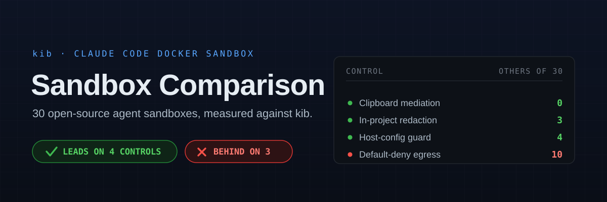
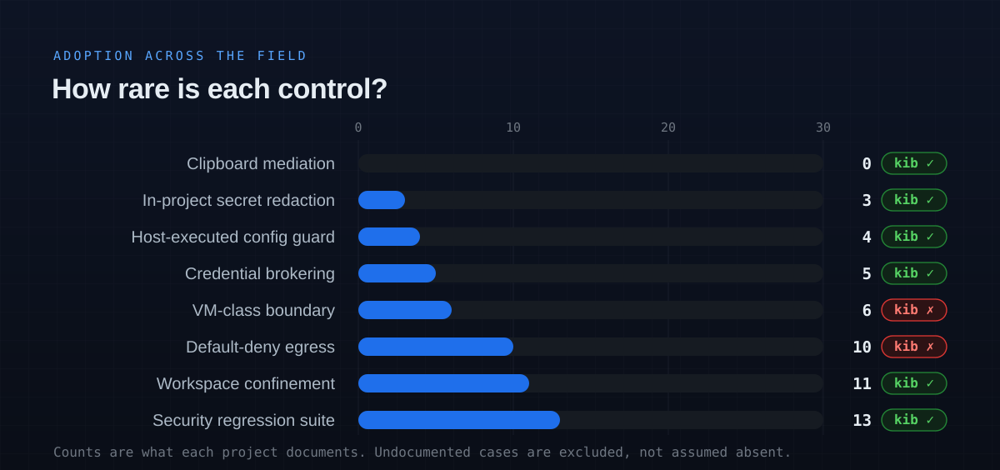

  

A survey of 30 open-source projects that sandbox AI coding agents, compared against this
repository's `kib` on **security and containment**. Every project was verified from primary sources,
reading source rather than documentation wherever a claim depended on behaviour; `kib`'s own column
was read against the current tree.

**Every cell about another project comes from that project.** `❓` means *"the docs don't say"* —
never *"the project lacks it."* Where source could prove a control absent, the cell says **verified
absent** rather than inferring absence from silence.

---

## Contents

- [The finding](#the-finding)
- [The control that gates every other one: can the agent read your `$HOME`?](#the-control-that-gates-every-other-one-can-the-agent-read-your-home)
- [Where `kib` leads](#where-kib-leads)
  - [1. Host-executed config: the guard is common, the coverage is not](#1-host-executed-config-the-guard-is-common-the-coverage-is-not)
  - [2. Coverage of files that do not exist yet](#2-coverage-of-files-that-do-not-exist-yet)
  - [3. In-project secret redaction](#3-in-project-secret-redaction)
  - [4. Clipboard mediation — 0 of 30](#4-clipboard-mediation--0-of-30)
  - [5. The enforcement privilege lives outside the agent's container](#5-the-enforcement-privilege-lives-outside-the-agents-container)
- [The self-widening sandbox](#the-self-widening-sandbox)
- [Deliberate positions, and what they cost](#deliberate-positions-and-what-they-cost)
  - [Egress](#egress)
  - [Kernel boundary](#kernel-boundary)
  - [Ephemerality](#ephemerality)
- [Credentials](#credentials)
- [The full matrix](#the-full-matrix)
  - [Group 1 — the closest peers](#group-1--the-closest-peers)
  - [Group 2 — VM-class and OS sandboxes](#group-2--vm-class-and-os-sandboxes)
  - [Group 3 — containers and wrappers](#group-3--containers-and-wrappers)
  - [Group 4 — the long tail](#group-4--the-long-tail)
- [Project health](#project-health)
- [Read these five](#read-these-five)
- [If you had to hand one to someone else](#if-you-had-to-hand-one-to-someone-else)
- [What the field agrees on](#what-the-field-agrees-on)
- [Where this leaves `kib`](#where-this-leaves-kib)
- [Method, and what to distrust](#method-and-what-to-distrust)
- [Sources](#sources)

---

## The finding

`kib` is strong on the threat class the industry named in July 2026 — files the agent writes that the
**host** executes later — but the guard itself is not rare: ten of thirty projects protect
`.git/config` or `.git/hooks` in some form.

What is rare is narrower and more specific:

- **Validating `.git/config` instead of blocking it.** `kib` alone. Everyone else who protects it
  denies writes outright, which breaks `git remote add`, or confines git elsewhere.
- **Recognising a git directory by layout** (`HEAD` + `objects` + `refs`) rather than by the name
  `.git`. `kib` alone. Every other implementation matches the literal string.
- **Covering paths that do not exist yet.** On Linux, `kib` alone.
- **Clipboard mediation.** Still **0 of 30**. Nobody else splits read from write.

The most visible minority position is deliberate: **egress is open**, against 7 of 30 that
default-deny.

  

Only controls counted from primary sources are charted. Credential brokering, workspace confinement
and security-suite adoption are described in the tables but not plotted, because a number nobody
counted is worse than no number.

---

## The control that gates every other one: can the agent read your `$HOME`?

A guard on `.git/config` and a stub over `.env` buy nothing while `~/.aws/credentials` and every
unrelated repo are one `cat` away.

`kib` confines structurally: the project arrives at `$PWD` through the FUSE view and **nothing else
of the host `$HOME` is mounted** — no `~/.ssh`, `~/.aws`, `~/.gnupg`, no SSH-agent socket, not even
`~/.gitconfig` (git identity is read host-side and passed as `GIT_AUTHOR_*`). The container's `$HOME`
is a container path.

**The carve-out, stated plainly.** Slices of canonical `~/.claude` are bound in, in **two tiers**:
`skills`, `agents`, `commands`, `plugins` and `hooks` are all writable and shared, with what they
auto-run reported at teardown; 
`commands` are **writable by default**, because authoring a skill from one project is meant to share
it. Everything else Claude needs is assembled into `$KIB_STATE_ROOT` scratch.

A bind mount only shows what you name, so the confinement cannot drift as new secret-bearing paths
appear in `$HOME`. A deny-list has to be kept current; an allowlist of one directory does not. That
is the whole of the advantage — it is structural, not clever.

**Where the field lands.** The split tracks the primitive, but it is a choice rather than a
constraint: `sandvault` enforces it twice over (Seatbelt `deny file-read* (subpath "/Users")` *and*
stripping the sandbox account from the `staff` group, with behavioural tests asserting `cannot ls
host home`), and `sandbox-shell` denies reads by default on the same Seatbelt primitive that
`enclave` uses to allow everything.

Six projects leave `$HOME` broadly readable by default: `sandbox-runtime` ("By default, read access
is allowed everywhere"), `cco` (native mode exposes "the entire host filesystem as read-only"),
`scode` ("everything is allowed, then specific sensitive directories are denied" — and its own test
is named `~/.ssh is NOT blocked by default`), `enclave` (`(allow default)`),
`agent-seatbelt-sandbox` (exactly one deny rule, `~/.secrets`), and `sculptor`, whose security policy
says the default mode has no isolation at all.

Three more claim confinement while carrying something across the boundary:
`claude-code-devcontainer` forwards the SSH agent socket by default with no documented opt-out;
`SandboxedClaudeCode` states "✗ SSH private keys" inaccessible while forwarding the agent socket and
binding eight `$HOME` subpaths; `vibebox` markets "repo-first, everything else opt-in" while its
shipped default config mounts `~/.claude` and `~/.codex` read-write into the VM.

---

## Where `kib` leads

### 1. Host-executed config: the guard is common, the coverage is not

[Pillar Security's *The Week of Sandbox Escapes*](https://www.pillar.security/blog/the-week-of-sandbox-escapes)
(2026-07-20) documented seven chains in which the agent **stays inside its sandbox** but writes a
file the host later executes.

| Pillar attack chain | Product | Status | `kib` control |
|---|---|---|---|
| "Git directories do not have to be called `.git`" — fsmonitor indirection | Cursor | patched 3.0.0 | `_is_git_config()` detects a git dir by **layout**, never by name |
| "The hook was already in the workspace" — `.claude` hook config | Cursor | CVE-2026-48124 | `validate_shared_settings` refuses inline `hooks[].command` in canonical `~/.claude`; `.claude/hooks/` is `[protect]`; project `.claude/settings*.json` is warn-only |
| "A time bomb in `.vscode`" — `tasks.json` | Antigravity | **unpatched** | `[protect]` — writes refused |
| "One Docker socket to rule them all" | Codex, Cursor, Gemini CLI | GHSA-v4xv-rqh3-w9mc | no socket mounted |
| "GitPwned: allowlist to RCE" | Codex CLI | patched v0.95.0 | n/a — no command allowlist to bypass |

**Ten of thirty guard this surface:** `sandbox-runtime`, `fence`, `cplt` (macOS only), `aicontainer`,
`agent-seatbelt`, `claude-code-devcontainer`, `container-use`, `sandvault`, `agent-sandbox` (opt-in,
default off), and `kib`.

Two of those are invisible to a documentation pass and deserve credit:

- **`claude-code-devcontainer`** has mounted `.git/config` and `.git/hooks` read-only since
  2026-04-24 (commit `5203cb5`, credited to an outside reporter), plus a host-side launch guard that
  refuses to start if `SYS_ADMIN` appears in `runArgs`. Their README's mount table never got updated.
- **`sandvault`** runs every host-side git call in `sv-clone` with
  `-c core.hooksPath=/dev/null -c core.sshCommand= -c core.fsmonitor=`, explicitly because a guest
  "poisoning `.git/config` could execute code as the host user" — the same threat model, arrived at
  independently.

  

| Strategy | Projects | What it costs |
|---|---|---|
| **Validate** — read the file on `rename()`, diff against current, refuse only newly-added command-bearing keys | `kib` | Nothing. `git remote add` and `push -u` keep working. |
| **Block** — deny all writes | fence, sandbox-runtime, aicontainer, cplt *(macOS)*, cc-devcontainer, agent-sandbox *(opt-in)* | `git remote add` fails inside the sandbox. fence's `allowGitConfig` turns the `.git/config` half off entirely. |
| **Confine** — run the agent's git inside the sandbox instead of guarding the file | yoloAI | Their words: they "had to move git into confinement rather than 'hardening' the host call", after a critical host-RCE. |
| **Filter on export** — block `.git` from ever leaving the environment | container-use | Also handles submodule gitdirs explicitly. Doesn't apply in-session. |
| **Leave open** | cplt *(Linux)*, agent-safehouse, and the long tail | cplt concedes an agent "can still set `core.hooksPath` to redirect hooks into a writable directory". |

**Three structural gaps almost nobody covers.** A git dir does not have to be called `.git`
(`git init --bare`, `--separate-git-dir`, a gitfile) — `kib` matches by layout; `fence` walks for
directories *named* `.git` to depth 3, `sandbox-runtime` ripgreps to depth 3, neither documents the
alternate layouts. Submodule and worktree gitdirs — `kib` and `container-use` handle them;
`sandbox-runtime` skips the deny **entirely** when `.git` is a file, which is exactly the worktree
case, while Claude Code's docs claim the opposite; `agent-safehouse` grants the *main* repo's whole
`.git` read-write to a linked worktree; `cco` auto-grants worktree common dirs. And
`include`/`includeIf` indirection — `kib` refuses newly-added includes at the FUSE rename and
resolves them host-side at the audit gate (`git config --list --includes`); `aicontainer` excludes
them from config seeding; nobody else addresses it.

**One caveat on `kib`'s own guard.** `[protect]` is not absolute: a nested path may be written **iff
its bytes are identical to the same guarded name at the project root**, so `git worktree add`,
`clone`, a branch switch and `stash pop` work on a repo that tracks `.vscode/`. The root copy is
never writable, a nested path with no root anchor is refused, and the check is fail-closed at four
points. Reproduce, never author.

### 2. Coverage of files that do not exist yet

A bind mount cannot cover a file that isn't there. `sandbox-runtime` says so outright:

> "On Linux, mandatory deny paths only block files that **already exist**. Non-existent files in
> these patterns cannot be blocked by bubblewrap's bind-mount approach."

That constraint is mechanical, so it applies to every `:ro`-bind guard in the field —
`aicontainer`'s, `claude-code-devcontainer`'s, `agent-sandbox`'s. `cplt` hits the same wall
(`.cplt.toml` "can still be created" on Linux).

`fence` does not close it either: **its Linux wrap mode computes deny paths once at launch, skips
non-existent ones, and Landlock is allow-only**. Only its macOS Seatbelt globs and its `hooks` mode
cover after-launch files. `sandbox-runtime` has fixed the equivalent gap on **Windows**, leaving
Linux as its sole affected platform.

So on Linux, `kib` is alone. FUSE sees the `create()` call; the guard rules are evaluated per syscall
against a live view, and cover `sub/.git/config`, `.git/modules/<name>/config` and
`.git/worktrees/<name>/config` in repos that did not exist at launch.

### 3. In-project secret redaction

| Project | Mechanism | Enforced below the agent? | On by default? | Covers files created after launch? |
|---|---|---|---|---|
| **`kib`** | FUSE — key names on read with values replaced for JSON and `.env*`, stub otherwise, `EPERM` on write | ✅ | ✅ | ✅ |
| [cplt](https://github.com/navikt/cplt) | Kernel deny on 6 patterns (`.env*`, `.pem`, `.key`, `.p12`, `.pfx`, `.jks`) | ✅ **macOS only** | ✅ | macOS ✅ / Linux n/a |
| [aicontainer](https://github.com/stefanoginella/aicontainer) | `PreToolUse` hook blocks `.env*` reads | ❌ agent-level | ✅ | ✅ (pattern-based) |
| [yoloai](https://github.com/kstenerud/yoloai) | Copy honours `.gitignore` — excluded files simply absent | ✅ by omission | ✅ | ❌ create-time filter |
| [yolobox](https://github.com/finbarr/yolobox) | `--exclude` → 0-byte stubs | ✅ | ❌ needs `--exclude` **and** `--readonly-project` | ❌ launch snapshot |
| [fence](https://github.com/fencesandbox/fence) | `/dev/null` + tmpfs mask (Linux) / deny (macOS) | ✅ | ❌ `.env` is `denyWrite`, not `denyRead` | macOS only |
| [sandbox-runtime](https://github.com/anthropic-experimental/sandbox-runtime) | `fake_value_<uuid4>` sentinel, substituted host-side | ✅ | ❌ opt-in, no built-in deny list | ❌ Linux |

`kib` is the only one that is enforced below the agent, on by default, covers files created after
launch, **and** returns key names rather than a hole — so a session can tell you *which* variable is
missing without ever seeing a value. `sandbox-runtime`'s masking is the closest design and its
default `onExtractNoMatch: warn` fails **open**; `kib`'s fallback is the stub.

### 4. Clipboard mediation — 0 of 30

`kib`'s proxy sidecar holds the only real socket. **Reads pass, writes are sanitised in flight**
across every Wayland selection protocol family the tooling can bind, an unrecognised selection
interface is refused at `bind` rather than passed through, denials close the connection and raise a
desktop notification, and macOS runs the same filter at its `pbpaste` spool before the single
`pbcopy` call.

Nobody else splits read from write. Verified positions: `chamber` hardcodes `--no-clipboard`
(disabled outright); `cplt`'s `--deny-clipboard` is all-or-nothing on macOS and the clipboard is
**reachable by default** because it rides the blanket `mach-lookup` Node.js needs;
`agent-safehouse` denies it structurally but only until `--enable=clipboard`, and its clipboard test
assertions are *inclusion* checks for that flag rather than blocks; `yolobox` ships an opt-in bridge
it describes as "intentionally creates a host-write channel"; `aicontainer` and `yoloAI` bridge
nothing.

The asymmetry is the point. A clipboard *write* is host code execution at the user's next terminal
paste — an embedded `ESC[201~` ends bracketed paste early and the rest is interpreted as typed
input. A *read* is just a paste.

### 5. The enforcement privilege lives outside the agent's container

`kib` runs the FUSE server in its **own** sidecar. Only that sidecar holds `SYS_ADMIN`, `/dev/fuse`
and an AppArmor override — and it runs `--network none`, `--userns=host`, `cap-drop=ALL` otherwise.
The agent's container is **capless at creation**: `cap-drop=ALL` with five caps back for entrypoint
user setup only, `no-new-privileges`, and `docker-default`'s `deny mount,` intact. There is no second,
unredacted path to the project.

The distinction is that a capless-at-creation container is a kernel fact at `docker run` time, not a
state some startup script dropped into. Across the field, `aicontainer` adds six caps back and puts
`no-new-privileges` on its sidecars but not the agent container; `agent-sandbox` drops all then adds
four; `FoamoftheSea/claude-code-sandbox` applies `cap_drop: ALL` and `no-new-privileges` to its
egress proxy but **not** to the container running the agent; `claude-code-devcontainer`, `packnplay`,
`sandclaude`, `claudebox` and `textcortex` set neither, several with passwordless sudo on top.

---

## The self-widening sandbox

A class that only appears when you read the config loader: **a hostile repository ships a committed
file that the tool auto-loads, and the sandbox grants itself away.**

| Project | Channel | What a cloned repo can obtain |
|---|---|---|
| [packnplay](https://github.com/obra/packnplay) | `devcontainer.json` | `initializeCommand` runs arbitrary shell **on the host**, before the container exists. `privileged`, `capAdd` and `securityOpt` pass to `docker run` **unvalidated** — the repo can request `--privileged`. |
| [enclave](https://github.com/kohkimakimoto/enclave) | `enclave.toml` | Replaces `sandbox_profile` wholesale. The self-tamper rule only blocks writes *during* a run; a pre-shipped profile is never checked. |
| [yolobox](https://github.com/finbarr/yolobox) | `.yolobox.toml` | OR-merges `docker` (host socket), `ssh_agent`, `gh_token`, `git_config`, `clipboard`, `cap_add`, `mounts`, `runtime_args`. Their docs call these "explicit trust decisions". |
| [yoloAI](https://github.com/kstenerud/yoloai) | `.yoloai.yaml` | `mounts:` merged **unfiltered**, bypassing the dangerous-directory refusal that blocks `~/.ssh` elsewhere. Undocumented. |
| [cco](https://github.com/nikvdp/cco) | `.claude/settings.local.json` | `additionalDirectories` parsed and honoured as read-write mounts. |
| [sculptor](https://github.com/imbue-ai/sculptor) | `.sculptor/.env` | Read at workspace setup; the project's setup command is executed. |

Three defend against it deliberately, and the shapes differ instructively. **`cplt`** reads its config
from `git HEAD` rather than the working tree, pins approvals by SHA-256, and keeps `[propose]` inert
until `cplt trust accept`. **`agent-safehouse`** emits a terminal deny on the workdir `.safehouse`
file *after* every grant so nothing can override it — and applies it even when the file does not yet
exist — while ignoring a project config entirely unless explicitly trusted. **`kib`** makes guard
rules outrank project `!` negation, and `[protect]` covers the config surfaces themselves.

`FoamoftheSea/claude-code-sandbox` deserves a mention for the narrowest version of the same idea: it
root-owns `settings.json` **and pre-claims `settings.local.json`** at mode 0444, specifically to
block the override.

---

## Deliberate positions, and what they cost

Three places `kib` sits in the minority. None is a backlog item: each was decided, written down, and
is being paid for. What follows is the price of each, stated as the residual risk rather than as a
gap someone intends to close.

| Position | The field | The residual `kib` accepts |
|---|---|---|
| **Egress is open** | **7 of 30** default-deny | LAN and metadata-endpoint reach — *not* exfiltration, which no allowlist closes |
| **Shared kernel** | 6 use a VM or microVM | A kernel 0-day found by an unprivileged, seccomp-filtered process |
| **Container outlives the run** | `chamber`, `yoloai`, `matchlock`, `cleanroom` reseed per run | Blast radius spans the concurrent terminals on one project, until the last exits |

### Egress

An allowlist does not close exfiltration, and every project that ships one says so unprompted —
fence, cplt, and `FoamoftheSea`, which names the exact bypass ("a public Gist"). It cannot close
`api.anthropic.com` or the package registries, which is where exfiltration actually happens, and the
LLM channel itself is higher-bandwidth than anything a domain rule governs. `kib` shipped the
credential broker instead, on the reasoning that removing the thing worth stealing beats fencing a
channel that cannot be closed ([`credential-broker.md`](design-notes/credential-broker.md)).

**What an allowlist would genuinely buy is lateral reach**, not exfiltration: LAN services, cloud
metadata endpoints, an internal admin panel. `kib` keeps those reachable on purpose —
`connect_broker_network` dual-homes the container so host dev servers and the LAN stay available
alongside the broker network, and dropping that is a recorded dead end. That is the real price of
this position, and it is worth naming rather than folding into the exfiltration argument, which is
where most of the field's discussion stops.

The verified default-deny seven: `sandbox-runtime` (netns removed entirely, traffic via host proxies
on Unix sockets), `fence`, `agent-sandbox` (mitmproxy + iptables, and unusually it verifies **both** a
positive proxy probe and a negative bypass probe at boot), `claudebox` (iptables policy DROP + ipset,
applied unconditionally at every container start), `FoamoftheSea/claude-code-sandbox` (internal
Docker network with no gateway + Squid peek-and-splice on TLS SNI), `agent-seatbelt-sandbox`,
`sandbox-shell`.

Three more are partial in ways their own docs obscure. `cplt` is 443-only at the kernel with the
proxy **on by default** — but allow-all unless configured, and it concedes "a raw socket or
`env -u HTTPS_PROXY` can reach the network without traversing the proxy". `microsandbox` allows the
public internet by default and denies only private ranges; true deny-by-default is the opt-in
`--net-default-egress deny`, and its two canonical security documents use the phrase
"deny-by-default" with incompatible meanings. `cleanroom` requires deny-by-default in its policy
schema, but SporeVM — the engine that enforces it — supports no networking at all on Linux/AMD64.

Two projects commonly credited with default-deny do not have it: `matchlock` (open NAT passthrough;
an empty allowlist means allow-all even with `--network-intercept`) and `microsandbox`, above.

A default-deny allowlist also conflicts with building untrusted repos that fetch from arbitrary
registries, so the **default** would not change either way. The proxy-sidecar design is worked out
and deliberately unscheduled — but unlike `cplt`, `yoloAI`, `agent-sandbox` and `claudebox` there is
no opt-in mode to reach for, and an opt-in costs nothing when off. That, not the default, is the
part still open.

### Kernel boundary

**Verdict: not planned.** [`microvm.md`](design-notes/microvm.md) holds the four gates and the option
table; two findings here harden it.

A hypervisor closes none of the class this document is organised around. Host-executed config reaches
the host at the same absolute path on every substrate — virtiofs instead of a bind changes how those
bytes travel, not that they arrive, or that the host runs them afterwards. And decisively, `kib`
serves its redaction view from a **sidecar** container that mounts FUSE and propagates it into the
agent's mount namespace; a hypervisor-per-container gives that nowhere to land. A microVM would trade
away the one control this survey found nothing else combines — stub-on-read, after-launch coverage,
and a capless agent container at once — to buy a boundary against a threat `kib` does not rank.

The VM adopters bear that out: `cleanroom`'s SporeVM supports no networking at all on Linux/AMD64,
`matchlock` is open NAT passthrough, `microsandbox` allows the public internet by default. Each bought
a kernel boundary and nothing above it. If kernel-boundary work is ever worth hours, it goes into a
tighter seccomp profile — the only row in that note passing all four gates — not a substrate swap.

### Ephemerality

`kib` is ephemeral; the granularity differs. The container is destroyed once the **last** session for
a project exits rather than after each run, because one container serves N terminals attached by
`docker exec` — the many-terminals-one-container model the per-run reseeders do not offer. Nothing
installed outside the project tree and `$CLAUDE_CONFIG_DIR` survives that teardown. What is accepted
is the window in between: two terminals on one project share a container, and so share a blast radius.

---

## Credentials

`kib` brokers by default: a host-side sidecar holds a static token from `kib broker login`, the
container gets `ANTHROPIC_BASE_URL` pointed at the broker plus a `fake_value_…` placeholder and a
synthetic `.credentials.json`, and the broker re-originates TLS upstream so there is no CA in the
container. Per-route `allow_paths` restricts the real token to `/v1/` and `/api/oauth/profile`,
404-ing key minting and organisation writes.

**The reach is narrower than the registry suggests.** It carries `OPENAI_BASE_URL` and
`GOOGLE_GEMINI_BASE_URL` rows, but they are ready-but-unstarted — a route exists only once a
non-empty host token file is present, so `kib` brokers Claude alone today. `yoloAI` brokers **three**
(claude, gemini, codex), despite a stale "only wired for Claude" heading its own body contradicts.

The genuine extension is elsewhere: the same broker injects **third-party MCP credentials** as a
header the container never sees, runs client-signed credentials in their own `cap-drop=ALL` sidecar,
and intercepts `claude mcp add … --header …` **host-side** so a vendor's copy-pasted line cannot put
a secret in the container's argv. No other project documents an equivalent.

**Five of thirty keep the account credential host-side:** `kib`, `sandbox-runtime` (sentinel +
mandatory TLS termination, with `allowPlaintextInject` as the opt-out), `yoloAI`, `matchlock`
(in-flight injection; headers and query only, never request bodies), `cleanroom`.
`microsandbox` has the mechanism but also **CVE-2026-61670** — secret values exposed in
world-readable process arguments, published 2026-06-23 with no patched version listed.

**`agent-sandbox` comes off that list.** Its proxy injection covers third-party secrets; Claude's own
OAuth token "persist[s] in a Docker volume" inside the agent container and is fully readable. Its
README's "the agent container never sees secrets such as API keys" is true of third-party
credentials and false of the account credential. Its own docs concede the boundary — "Header
injection is the entire surface".

The exposed end of the field, in ascending order: `cplt` ("exposed to the sandbox… an inherent
trade-off"); `agent-safehouse` (`~/.claude` read-write; `~/.ssh` explicitly denied, credit where
due); `aicontainer` (one shared auth volume — "a compromised session in **any** project can use every
token you've logged in with"); `fence` (no brokering, and its `code` template puts `~/.claude*` in
`allowWrite`); `claude-code-devcontainer` (forwards `CLAUDE_CODE_OAUTH_TOKEN` **and** an undocumented
`ANTHROPIC_API_KEY`, plus the SSH agent); `claudebox` (mounts `~/.ssh` read-only — private key bytes,
not agent forwarding); `sandclaude` (mounts `~/.claude`, containing `.credentials.json`, **read-write**,
and runs the agent with `--dangerously-skip-permissions`); `textcortex` (auto-discovers the macOS
Keychain, `gh auth token` and `GITHUB_TOKEN` with no prompt and failures silently swallowed).

---

## The full matrix

**Legend** — ✅ the control is present, or the exposure is closed · ⚠️ partial, opt-in, or conditional
· ❌ the control is absent, or the exposure is open (**verified** where source was read) · ❓ not
stated in the docs. **Every row reads the same direction: ✅ is always the safer posture**, including
rows named for an exposure rather than a control. Every cell describes the **default**.

Thirty projects across four groups; `kib` repeats as the first column so each table stands alone.
Group 1 is the closest peers, group 2 the VM-class and OS sandboxes, group 3 containers and wrappers,
group 4 the long tail.

### Group 1 — the closest peers

**Isolation and platform**

| | `kib` | fence | sandbox-runtime | cplt | yoloAI | aicontainer | agent-safehouse | cc-devcontainer |
|---|---|---|---|---|---|---|---|---|
| **Boundary** | container | none (bwrap) | none (bwrap) | none (Landlock) | container → microVM | container | none (Seatbelt) | container |
| **Linux primitive** | seccomp + AppArmor + `cap-drop=ALL` | bwrap + Landlock + seccomp | bwrap + seccomp | Landlock + seccomp + opt. bwrap | runc→gVisor→Kata→Firecracker | `cap-drop=ALL` + 6 back | n/a | devcontainer defaults |
| **macOS** | ✅ same topology | Seatbelt | Seatbelt | Seatbelt | Seatbelt / Tart | Docker only | ✅ native | Docker only |
| **Windows** | ❌ | WSL | ⚠️ alpha native | ❌ | WSL2 | ❓ | ❌ | ❓ |
| **`no-new-privileges`** | ✅ | n/a | n/a | ⚠️ via Landlock | ❌ verified | ⚠️ sidecars only | n/a | ❌ verified |
| **Capless at creation** | ✅ | n/a | n/a | n/a | ❌ NOPASSWD root inside | ❌ 6 caps back | n/a | ❌ passwordless sudo |
| **VM-class option** | ❌ | ❌ non-goal | ❌ | ❌ non-goal | ✅ Kata + Firecracker | ⚠️ external | ❌ | ❌ |

**Filesystem and secrets**

| | `kib` | fence | sandbox-runtime | cplt | yoloAI | aicontainer | agent-safehouse | cc-devcontainer |
|---|---|---|---|---|---|---|---|---|
| **Host `$HOME` unreachable** | ✅ | ⚠️ opt-in `denyRead` | ❌ reads open | ⚠️ home-shaped allowlist | ⚠️ refuses `$HOME`, mounts `~/.claude` | ✅ | ✅ | ⚠️ 4 ro binds |
| **Project secrets** | Keys-not-values (FUSE) | `denyWrite` only | Sentinel (**Linux only**) | Deny — **macOS only** | Excluded by `.gitignore` | Tool-layer hook | ❌ verified absent | ❌ verified absent |
| **Masking, not just denial** | ✅ | ⚠️ empties | ✅ | ❌ | ❌ | ❌ | ❌ | ❌ |
| **Covers files created after launch** | ✅ | ⚠️ **macOS/hooks only** | ❌ Linux | ❌ Linux | ❌ create-time | ⚠️ hook yes, binds no | ⚠️ workdir yes | ❌ |
| **Reads default to** | Allow in-project only | Allow | Allow | Deny (listed) | n/a (copy) | Allow | **Deny** | Allow |

**Host-executed config**

| | `kib` | fence | sandbox-runtime | cplt | yoloAI | aicontainer | agent-safehouse | cc-devcontainer |
|---|---|---|---|---|---|---|---|---|
| **`.git/config`** | **Validate** | Block (`allowGitConfig` off) | Block (`allowGitConfig` off) | macOS block / Linux writable | Confine git | Block (`:ro`) | ❌ verified | ✅ `:ro` since 2026-04 |
| **`.git/hooks`** | ✅ | ✅ unconditional | ✅ | macOS ✅ / bwrap partial | Confined | ✅ | ❌ verified | ✅ `:ro` |
| **Non-`.git` git dirs** | ✅ by layout | ❌ name, depth 3 | ❌ name, depth 3 | ❌ | ❌ | ❌ | ❌ | ❌ |
| **Submodule / worktree** | ✅ | ❌ `SkipDir` | ❌ **deny skipped** | ❌ conceded | ✅ gitlinks severed | ⚠️ doctor fails | ❌ **main `.git` rw** | ❌ |
| **`include` / `includeIf`** | ✅ refused + host-side resolve | ❌ | ❌ | ⚠️ motive only | ❓ | ✅ excluded | ❌ | ❌ **re-opened** |
| **`.vscode/`** (`.idea/` withdrawn) | ✅ | ✅ | ✅ | ❌ non-goal | ❌ writes them | ❌ | ❌ verified | ❌ verified |
| **`.envrc`** | ✅ | ❌ | ❌ | ❓ | ❌ | ❌ | ❌ verified | ❌ verified |
| **`.devcontainer/`** | ✅ | ❌ | ❌ | ❓ | ⚠️ filtered input | ✅ + host validation | ❌ verified | ✅ `:ro` + guard |
| **Shell rc** | n/a not mounted | ✅ mandatory | ✅ | ✅ | ❌ | ✅ root-managed | ✅ opt-in read | ❌ |
| **Agent settings** | ✅ host-side validator | ⚠️ **regressed v0.1.64** | ⚠️ `.mcp.json` only | ⚠️ macOS partial | ❌ | ✅ root-managed | ❌ `~/.claude` rw | ❌ volume rw |
| **Immune to project override** | ✅ | ⚠️ repo `fence.json` widens | ✅ mandatory list | ✅ git-HEAD + SHA-256 | ❌ `.yoloai.yaml` | ⚠️ root-owned | ✅ terminal deny | ⚠️ partial |

**Credentials and operations**

| | `kib` | fence | sandbox-runtime | cplt | yoloAI | aicontainer | agent-safehouse | cc-devcontainer |
|---|---|---|---|---|---|---|---|---|
| **Egress** | ❌ open | ✅ deny | ✅ deny | ⚠️ 443 + proxy on | ⚠️ opt-in | ⚠️ opt-in | ❌ open (stated non-goal) | ❌ open |
| **Account credential** | ✅ brokered | ❌ | ✅ sentinel | ❌ exposed | ✅ brokered ×3 | ❌ shared volume | ❌ | ❌ env-forwarded ×2 |
| **Host SSH credentials** | ✅ **never mounted** | ❓ socket passes | ⚠️ socket blocked | ✅ stripped | ✅ denylisted | ✅ never mounted | ✅ denied | ❌ **agent forwarded** |
| **Third-party MCP credential** | ✅ | ❌ | ✅ sentinel | ❌ | ❌ | ⚠️ stripped, not brokered | ❌ | ❓ |
| **Clipboard** | ✅ **mediated** | ❓ | ❓ | ⚠️ on/off, on by default | ❌ nothing bridged | ❌ nothing bridged | ⚠️ opt-in enable | ❌ verified |
| **Docker socket** | ❌ none | ❓ | ⚠️ self-inflicted | ✅ blocked | ✅ stripped | ✅ digest-pinned proxy | ✅ denied | ❌ none |
| **Concurrent sessions** | ✅ N terminals | n/a | n/a | ❓ | ✅ named | ✅ per project | ❓ | ❓ |
| **Security suite** | ✅ 13 sections | ✅ Go + smoke | ✅ 56 files, no policy | ✅ 5 suites incl. **Linux kernel** | ✅ named regression tests | ✅ 163 host + 16 in-container | ✅ bats + CI | ❌ verified none |
| **Published CVE** | — | None | **CVE-2025-66479** | None | None | None | None | None |

### Group 2 — VM-class and OS sandboxes

**Isolation and platform**

| | `kib` | microsandbox | matchlock | cleanroom | cco | sandbox-shell | agent-seatbelt | container-use |
|---|---|---|---|---|---|---|---|---|
| **Boundary** | container | microVM (libkrun) | microVM (Firecracker) | microVM (SporeVM) | Seatbelt / bwrap / Docker | none (Seatbelt) | none (Seatbelt) | container + git branch |
| **Linux primitive** | seccomp + AppArmor + `cap-drop=ALL` | KVM via libkrun | KVM + Firecracker | KVM — **AMD64 experimental** | bubblewrap | ❌ none (macOS only) | ❌ none (macOS only) | ❓ runtime autodetect |
| **macOS** | ✅ same topology | ✅ HVF, Apple Silicon | ✅ Virtualization.framework | ✅ HVF | ✅ `sandbox-exec` | ✅ only platform | ✅ only platform | ✅ Homebrew |
| **Windows** | ❌ | ⚠️ preview (WHP) | ❌ | ❌ | ❌ | ❌ | ❌ | ✅ native since v0.4.0 |
| **`no-new-privileges`** | ✅ | ⚠️ opt-in restricted profile | ❓ | ❓ | ❓ | n/a | ❓ | ❓ engine runs privileged |
| **Capless at creation** | ✅ | ❓ root by default | ❓ | ❓ | ⚠️ native yes, Docker mode no | n/a | n/a | ❓ |
| **VM-class option** | ❌ | ✅ inherent | ✅ inherent | ✅ inherent | ❌ | ❌ | ❌ | ❌ |

**Filesystem and secrets**

| | `kib` | microsandbox | matchlock | cleanroom | cco | sandbox-shell | agent-seatbelt | container-use |
|---|---|---|---|---|---|---|---|---|
| **Host `$HOME` unreachable** | ✅ | ✅ "no implicit passthrough" | ❓ backing dir unstated | ⚠️ copy-in scope unstated | ❌ entire host ro (`--safe` opts out) | ✅ deny-default reads | ❌ enumerated denies only | ✅ fresh image + tree copy |
| **Project secrets** | Keys-not-values (FUSE) | ❌ no `.env` support | ⚠️ opt-in VFS hooks, none default | ✅ host-side refs, never in guest | ❌ **explicitly not covered** | ⚠️ `deny_read` patterns | ⚠️ `~/.env` only, not project | ⚠️ log stripping only |
| **Masking, not just denial** | ✅ | ⚠️ sentinel substitution | ⚠️ both expressible | ❌ denial | ❌ | ❌ denial | ❌ denial | ⚠️ output only |
| **Covers after-launch files** | ✅ | ❓ | ⚠️ glob matches `create` | ❓ | ❓ | ✅ subtree rules | ❓ | ❓ |
| **Reads default to** | Allow in-project only | Allow (mounts rw+exec+suid) | ❓ | ❓ | Allow (native mode) | **Deny** | Allow | Allow in-container |

**Host-executed config**

| | `kib` | microsandbox | matchlock | cleanroom | cco | sandbox-shell | agent-seatbelt | container-use |
|---|---|---|---|---|---|---|---|---|
| **`.git/config`** | **Validate** | ❓ | ❓ | ❓ | ❌ unguarded | ❌ **overridden by workdir grant** | ✅ write-deny | ✅ blocked from export |
| **`.git/hooks`** | ✅ | ❓ | ❓ | ❓ | ❌ | ❌ same override | ✅ write-deny | ✅ |
| **Non-`.git` git dirs** | ✅ by layout | ❓ | ❓ | ❓ | ⚠️ blocked, opt-in override | ❌ | ❓ | ❓ literal `.git` only |
| **Submodule / worktree** | ✅ | ❓ | ❓ | ❓ | ❌ **auto-granted rw** | ❌ | ❓ | ✅ explicit handling |
| **`include` / `includeIf`** | ✅ refused | ❓ | ❓ | ❓ | ❓ | ❓ | ❓ | ❓ |
| **`.vscode/`** (`.idea/` withdrawn) | ✅ | ❓ | ❓ | ❓ | ❓ | ❌ verified | ✅ write-deny | ❌ verified |
| **`.envrc`** | ✅ | ❓ | ❓ | ❓ | ❓ | ❌ verified | ❓ | ❌ verified |
| **`.devcontainer/`** | ✅ | ❓ | ❓ | ❓ | ❓ | ❌ verified | ❓ | ❌ verified |
| **Shell rc** | n/a not mounted | ❓ | ❓ | ❓ | ❓ | ⚠️ readable, not writable | ✅ 10 rules | ❓ |
| **Agent settings** | ✅ host-side validator | ❓ | ❓ | ❓ | ❌ **widens the sandbox** | ⚠️ `~/.claude.json` + keychain rw | ❌ `~/.claude` write-allowed | ❓ |
| **Immune to project override** | ✅ | ❓ | ❓ | ⚠️ policy hash | ❌ `settings.local.json` | ❌ rule-order defeats it | ❓ | ❓ |

**Credentials and operations**

| | `kib` | microsandbox | matchlock | cleanroom | cco | sandbox-shell | agent-seatbelt | container-use |
|---|---|---|---|---|---|---|---|---|
| **Egress** | ❌ open | ⚠️ public allowed, private denied | ⚠️ **open NAT** | ⚠️ schema-required, absent Linux/AMD64 | ❌ "intentionally unrestricted" | ✅ offline by default | ❌ "fully open" | ❓ |
| **Account credential** | ✅ brokered | ⚠️ placeholder + **CVE-2026-61670** | ✅ in-flight injection | ✅ host-side gateway | ✅ keychain, ro mount | ⚠️ keychain write granted | ❓ | ⚠️ real values in container env |
| **Host SSH credentials** | ✅ **never mounted** | ❓ | ❓ | ❓ | ❌ `~/.ssh` mounted ro | ✅ `~/.ssh` denied | ⚠️ socket passes, keys denied | ❓ |
| **Third-party MCP credential** | ✅ | ❓ | ❓ | ❓ | ❓ | ❌ | ❓ | ❓ |
| **Clipboard** | ✅ **mediated** | ❓ | ❓ | ❓ | ❓ | ❌ verified | ❌ | ❓ |
| **Docker socket** | ❌ none | ❓ | ❌ none | ⚠️ deferred, unenforced | ⚠️ opt-in, "defeats isolation" | ⚠️ config denied only | ❌ none | ❓ host prereq |
| **Concurrent sessions** | ✅ N terminals | ✅ fully isolated | ⚠️ `exec <vm-id>` | ✅ `fork --count 100` | ⚠️ **race warning** | ❓ | ❓ | ✅ per branch |
| **Security suite** | ✅ 13 sections | ❓ none named | ⚠️ unbranded | ⚠️ one credential canary | ✅ 3 scripts | ⚠️ 5 of 10 can fail | ⚠️ PII filter only | ❌ no security step |
| **Published CVE** | — | **CVE-2026-61670** | None | None | None | None | None | None |

### Group 3 — containers and wrappers

**Isolation and platform**

| | `kib` | agent-sandbox | claudebox | sandvault | sculptor | packnplay | vibebox | sbox |
|---|---|---|---|---|---|---|---|---|
| **Boundary** | container | container + mitmproxy | container | macOS user acct + Seatbelt | ⚠️ **repo copy, no isolation** | container | VM (Apple Virtualization) | ⚠️ delegates to Docker |
| **Linux primitive** | seccomp + AppArmor + `cap-drop=ALL` | runc, no custom profile | default runc | ❌ none (macOS only) | ⚠️ Docker, experimental | plain Docker, no userns | ❌ VM guest | ⚠️ plain container fallback |
| **macOS** | ✅ same topology | ✅ Colima target | ✅ Docker Desktop | ✅ only platform | ⚠️ Docker Desktop | ⚠️ Docker/Podman | ✅ only platform | ✅ microVM here |
| **Windows** | ❌ | ❓ | ⚠️ WSL2 | ❌ | ❌ | ❓ | ❌ | ⚠️ microVM here |
| **`no-new-privileges`** | ✅ | ❌ sudoers needs setuid | ❌ verified none | ❓ | ❓ | ❌ | ❌ sudo group | ❌ |
| **Capless at creation** | ✅ | ⚠️ drop all, 4 back | ❌ none set | ❓ | ❓ | ❌ **`--privileged` passthrough** | ⚠️ VM-level only | ❌ none |
| **VM-class option** | ❌ | ❌ | ❌ | ❌ | ⚠️ experimental opt-in | ❌ Apple Container removed | ✅ inherent | ⚠️ **macOS/Windows only** |

**Filesystem and secrets**

| | `kib` | agent-sandbox | claudebox | sandvault | sculptor | packnplay | vibebox | sbox |
|---|---|---|---|---|---|---|---|---|
| **Host `$HOME` unreachable** | ✅ | ✅ no global gitconfig | ⚠️ **`~/.ssh` `:ro`** | ✅ two mechanisms, tested | ❌ "agents act with your access" | ⚠️ creds opt-in, `~/.claude` always rw | ❌ `~/.claude` + `~/.codex` rw | ⚠️ selective mounts |
| **Project secrets** | Keys-not-values (FUSE) | ❌ secrets dir must be outside | ❌ `.env` ro passthrough | ❌ coarse, path-based | ❌ reads `.sculptor/.env` | ❓ | ❓ | ⚠️ named env passthrough |
| **Masking, not just denial** | ✅ | ⚠️ header injection | ❌ | ❌ | ❌ | ❌ | ⚠️ tmpfs mask | ❌ |
| **Covers after-launch files** | ✅ | ✅ no caching | ❌ | ✅ path rules | ❓ | ❓ | ✅ live virtiofs | ⚠️ unstated |
| **Reads default to** | Allow in-project only | Allow in-project | Allow | Allow + deny list | Allow (host access) | Allow mounted paths | Allow | Allow |

**Host-executed config**

| | `kib` | agent-sandbox | claudebox | sandvault | sculptor | packnplay | vibebox | sbox |
|---|---|---|---|---|---|---|---|---|
| **`.git/config`** | **Validate** | ⚠️ opt-in `:ro`, default off | ❌ | ⚠️ **host-side git hardened** | ❓ | ❌ | ⚠️ tmpfs, self-disclaimed | ❌ |
| **`.git/hooks`** | ✅ | ⚠️ opt-in | ❌ | ⚠️ fresh samples installed | ❓ | ❌ main repo `.git` rw | ⚠️ same blanket mask | ❌ |
| **Non-`.git` git dirs** | ✅ by layout | ❓ | ❌ | ❓ | ❓ | ❓ | ❓ | ❓ |
| **Submodule / worktree** | ✅ | ⚠️ inferred from flag | ❌ | ❓ | ❓ | ❓ | ❓ worktree `.git` is a file | ⚠️ main root also mounted |
| **`include` / `includeIf`** | ✅ refused | ❓ | ❓ | ❌ verified absent | ❓ | ❓ | ❓ | ❓ |
| **`.vscode/`** (`.idea/` withdrawn) | ✅ | ⚠️ opt-in flags | ❌ | ❌ | ❓ | ❓ | ❓ | ❌ |
| **`.envrc`** | ✅ | ❌ | ❌ | ❌ | ❓ | ❓ | ❓ | ❌ |
| **`.devcontainer/`** | ✅ | ⚠️ devcontainer mode only | ❌ | ❌ | ⚠️ consumed as input | ❌ **executes it** | ❓ | ❌ |
| **Shell rc** | n/a not mounted | ❌ | ❌ not mounted | ⚠️ guest-side only | ❓ | ❓ | ✅ guest builds fresh | ❌ not mounted |
| **Agent settings** | ✅ host-side validator | ❌ | ⚠️ merged host-side | ✅ unreachable | ❓ | ⚠️ rw | ❌ rw by default | ❌ **forces `bypassPermissions`** |
| **Immune to project override** | ✅ | ⚠️ policy lives in-repo | ❌ | ⚠️ narrow, hardcoded | ❓ | ❌ **host code execution** | ❌ TOML controls mounts | ⚠️ immune in the unsafe direction |

**Credentials and operations**

| | `kib` | agent-sandbox | claudebox | sandvault | sculptor | packnplay | vibebox | sbox |
|---|---|---|---|---|---|---|---|---|
| **Egress** | ❌ open | ✅ **deny, boot-verified** | ✅ **iptables DROP + ipset** | ❌ no network rules | ❓ | ❓ default bridge | ❌ plain NAT | ❌ none |
| **Account credential** | ✅ brokered | ❌ **token in agent volume** | ⚠️ API key env | ✅ fresh auth inside | ❓ | ❌ `~/.claude` rw, ungated | ❌ `~/.claude` rw | ⚠️ key in global config |
| **Host SSH credentials** | ✅ **never mounted** | ✅ port 22 blocked | ❌ **keys mounted `:ro`** | ✅ not in allowlist | ❓ | ⚠️ opt-in ro / agent | ✅ own keypair | ❌ `~/.ssh` `:ro` |
| **Third-party MCP credential** | ✅ | ✅ proxy-injected | ⚠️ merged into ro temp | ❓ | ❓ | ❓ | ❓ | ❓ |
| **Clipboard** | ✅ **mediated** | ❓ | ❓ | ❓ | ❓ | ❓ | ❌ verified none | ❓ |
| **Docker socket** | ❌ none | ❌ none | ❌ none | ❌ n/a | ❓ | ❌ none | ❌ none | ⚠️ opt-in, dead under default backend |
| **Concurrent sessions** | ✅ N terminals | ❓ | ✅ per-project slots | ⚠️ **share one account** | ✅ multiple workspaces | ✅ per worktree | ✅ first-class | ⚠️ name collisions possible |
| **Security suite** | ✅ 13 sections | ⚠️ proxy-scoped only | ❌ bash-compat only | ✅ escape tests | ❓ | ❌ verified none | ⚠️ functional only | ❌ smoke only |
| **Published CVE** | — | None | None | None | None | None | None | None |

### Group 4 — the long tail

**Isolation and platform**

| | `kib` | SandboxedClaudeCode | agent-seatbelt-sandbox | chamber | enclave | sandclaude | FoamoftheSea/ccs | textcortex/ccs |
|---|---|---|---|---|---|---|---|---|
| **Boundary** | container | bwrap / firejail / Apple Container | none (Seatbelt) | ephemeral macOS VM (Tart) | none (Seatbelt) | container | container + Squid sidecar | container |
| **Linux primitive** | seccomp + AppArmor + `cap-drop=ALL` | bwrap namespaces **or** firejail seccomp + caps | ❌ none | ❌ none (VM) | ❌ none | default runc | runc + internal network | plain runc |
| **macOS** | ✅ same topology | ✅ Apple Container VM | ✅ only platform | ✅ only platform | ✅ only platform | ❌ GNU-only flags break | ❓ | ⚠️ keychain source only |
| **Windows** | ❌ | ❌ wishlist | ❌ | ❌ | ❌ | ❓ | ⚠️ LF hint only | ❓ |
| **`no-new-privileges`** | ✅ | ⚠️ firejail only | ❓ | n/a | ❓ | ❌ | ⚠️ **proxy sidecar only** | ❌ verified |
| **Capless at creation** | ✅ | ⚠️ firejail `caps.drop=all` | ❌ `(allow default)` | ⚠️ VM defaults | ❓ | ❌ NOPASSWD sudo | ⚠️ **proxy sidecar only** | ❌ NOPASSWD sudo |
| **VM-class option** | ❌ | ✅ Apple Container | ❓ | ✅ inherent | ❌ | ❌ | ❌ | ❌ |

**Filesystem and secrets**

| | `kib` | SandboxedClaudeCode | agent-seatbelt-sandbox | chamber | enclave | sandclaude | FoamoftheSea/ccs | textcortex/ccs |
|---|---|---|---|---|---|---|---|---|
| **Host `$HOME` unreachable** | ✅ | ⚠️ 8+ subpaths bound, several rw | ❌ **only `~/.secrets` denied** | ✅ cwd only, env stripped | ❌ `(allow default)` | ⚠️ enumerated subpaths | ✅ | ❌ auto-copied in |
| **Project secrets** | Keys-not-values (FUSE) | ❓ | ⚠️ `SECRETS_DIR` only | ❓ | ❓ | ❌ | ❌ `Read(*)` allowed | ⚠️ plain `.env` loader |
| **Masking, not just denial** | ✅ | ❌ | ❌ denial | ❓ | ❌ | ❌ | ❌ denial | ❌ |
| **Covers after-launch files** | ✅ | ✅ live bind | ❓ | ✅ live mount, no filter | ✅ path predicates | ❌ | ❌ `Read` not denied | ❌ one-time copy |
| **Reads default to** | Allow in-project only | Allow bound paths | **Allow** | Allow cwd | **Allow** | Allow mounted | Allow (`bypassPermissions`) | Allow |

**Host-executed config**

| | `kib` | SandboxedClaudeCode | agent-seatbelt-sandbox | chamber | enclave | sandclaude | FoamoftheSea/ccs | textcortex/ccs |
|---|---|---|---|---|---|---|---|---|
| **`.git/config`** | **Validate** | ❌ | ❓ | ❌ verified (flat mount) | ❌ | ❌ | ❓ unguarded | ❓ |
| **`.git/hooks`** | ✅ | ❌ | ❓ | ❌ verified | ❌ | ❌ | ❓ existing repo untouched | ❓ |
| **Non-`.git` git dirs** | ✅ by layout | ❓ | ❓ | ❌ verified | ❓ | ❌ | ❓ | ❓ |
| **Submodule / worktree** | ✅ | ❓ | ❓ | ❌ verified | ❓ | ❌ | ❓ | ❓ |
| **`include` / `includeIf`** | ✅ refused | ❓ | ❓ | ❓ | ❓ | ❌ | ❓ | ❓ |
| **`.vscode/`** (`.idea/` withdrawn) | ✅ | ❓ | ❓ | ❌ verified | ❌ under WORKDIR | ❌ | ❓ | ❓ |
| **`.envrc`** | ✅ | ❓ | ❓ | ❌ verified | ❌ under WORKDIR | ❌ | ❓ | ❓ |
| **`.devcontainer/`** | ✅ | ❓ | ❓ | ❌ verified | ❌ under WORKDIR | ❌ | ❓ | ❓ |
| **Shell rc** | n/a not mounted | ❌ not bound | ❓ | n/a env stripped | ⚠️ incidental only | ❌ not mounted | ❓ | ❓ |
| **Agent settings** | ✅ host-side validator | ❌ `~/.claude` rw | ❓ | ⚠️ baked into seed VM | ❌ `~/.claude` write-allowed | ❌ `~/.claude` rw | ✅ **root-owned + pre-claimed** | ✅ copied in, unguarded |
| **Immune to project override** | ✅ | ❓ | ✅ inherent to Seatbelt | ❓ | ❌ **TOML replaces profile** | ❌ | ⚠️ settings only | ❓ |

**Credentials and operations**

| | `kib` | SandboxedClaudeCode | agent-seatbelt-sandbox | chamber | enclave | sandclaude | FoamoftheSea/ccs | textcortex/ccs |
|---|---|---|---|---|---|---|---|---|
| **Egress** | ❌ open | ❌ `--share-net` | ✅ **kernel deny + localhost** | ⚠️ **broken by default** | ❌ unrestricted by design | ❌ default bridge | ✅ **internal net + SNI** | ❌ default bridge |
| **Account credential** | ✅ brokered | ❌ `~/.claude` rw | ❓ | ⚠️ baked into VM disk | ❓ keychain writable | ❌ **`.credentials.json` rw** | ✅ volume, not host | ❌ **auto-discovered** |
| **Host SSH credentials** | ✅ **never mounted** | ❌ **agent forwarded** | ❓ | ✅ own keypair | ❓ | ✅ not mounted | ✅ not mounted | ✅ token URL rewrite |
| **Third-party MCP credential** | ✅ | ❓ | ❓ | ❓ | ❓ | ⚠️ `gh`/jira only | ❓ | ❓ |
| **Clipboard** | ✅ **mediated** | ❓ | ❓ | ✅ **disabled** (`--no-clipboard`) | ❓ | ❌ verified | ❓ | ⚠️ web UI feature only |
| **Docker socket** | ❌ none | ❌ n/a | ❌ n/a | ❌ n/a | ❓ | ❌ none | ❌ none + tested | ❌ none |
| **Concurrent sessions** | ✅ N terminals | ❓ | ❓ | ❓ | ❓ | ❓ | ⚠️ shared proxy implied | ✅ named containers |
| **Security suite** | ✅ 13 sections | ❌ wishlist only | ✅ 10 tests | ❌ verified none | ❌ generic `go test` | ❌ verified none | ✅ **~20 checks + CI** | ❌ 2 stub files |
| **Published CVE** | — | None | None | None | None | None | None | None |

---

## Project health

Eleven of thirty are dormant or archived. Stars are a popularity signal, not a security signal — two
of the most rigorously tested projects here have double-digit star counts.

| # | Project | Stars | Contrib. | Created | Last activity | License | Primitive |
|---|---|---:|---:|---|---|---|---|
| — | **`kib` (this repo)** | *unpublished* | 1 | — | 2026-07-28 | none | Docker, long-lived per project |
| 1 | [microsandbox](https://github.com/superradcompany/microsandbox) | 7039 | 43 | 2024-10-03 | 2026-07-28 | Apache-2.0 | microVM (libkrun) |
| 2 | [sandbox-runtime](https://github.com/anthropic-experimental/sandbox-runtime) | 4777 | 32 | 2025-10-20 | 2026-07-24 | Apache-2.0 | Seatbelt / bubblewrap |
| 3 | [container-use](https://github.com/dagger/container-use) | ~3900 | ❓ | ~2025-06 | 2026-06-12 | Apache-2.0 | Container + git branch |
| 4 | [agent-safehouse](https://github.com/eugene1g/agent-safehouse) | 1932 | 16 | 2026-02-09 | 2026-07-17 | Apache-2.0 | macOS Seatbelt |
| 5 | [claudebox](https://github.com/RchGrav/claudebox) | ~1100 | 6 | ❓ | **2025-08-31** | MIT | Docker |
| 6 | [claude-code-devcontainer](https://github.com/trailofbits/claude-code-devcontainer) | 897 | 10 | 2025-09-09 | 2026-06-18 | Apache-2.0 | devcontainer |
| 7 | [fence](https://github.com/fencesandbox/fence) | 870 | 15 | 2025-12-18 | 2026-07-26 | Apache-2.0 | bubblewrap + Landlock |
| 8 | [yolobox](https://github.com/finbarr/yolobox) | 626 | 11 | ❓ | 2026-07-22 | MIT | Docker / Podman |
| 9 | [matchlock](https://github.com/jingkaihe/matchlock) | 605 | 8 | 2026-02-05 | 2026-07-26 | MIT | microVM (Firecracker) |
| 10 | [cco](https://github.com/nikvdp/cco) | 422 | 8 | 2025-06-22 | 2026-06-27 | MIT | Seatbelt / bubblewrap |
| 11 | [sandvault](https://github.com/webcoyote/sandvault) | 370 | 8 | ❓ | 2026-07-26 | Apache-2.0 | macOS user account |
| 12 | [claude-code-sandbox](https://github.com/textcortex/claude-code-sandbox) | 322 | ❓ | ❓ | **archived 2026-02-20** | none\* | Docker (copy-in) |
| 13 | [sculptor](https://github.com/imbue-ai/sculptor) | 211 | ❓ | 2025-08-07 | 2026-07-27 | MIT | git worktree |
| 14 | [agent-sandbox](https://github.com/mattolson/agent-sandbox) | 194 | ❓ | ❓ | 2026-06-15 | MIT | Docker + mitmproxy |
| 15 | [vibebox](https://github.com/robcholz/vibebox) | 187 | ~1 | 2026-02-07 | **2026-02-18** | MIT | VM (Apple Virtualization) |
| 16 | [yoloai](https://github.com/kstenerud/yoloai) | 178 | ~2 | 2026-02-24 | 2026-07-27 | MIT | Multi-backend |
| 17 | [packnplay](https://github.com/obra/packnplay) | 172 | 9 | 2025-10-23 | **2026-03-21** | none\* | Docker / devcontainer |
| 18 | [cplt](https://github.com/navikt/cplt) | 100 | 10 | 2026-04-09 | 2026-07-23 | MIT | Landlock + seccomp |
| 19 | [cleanroom](https://github.com/buildkite/cleanroom) | 57 | ❓ | 2026-02-16 | 2026-07-26 | MIT | microVM (SporeVM) |
| 20 | [SandboxedClaudeCode](https://github.com/CaptainMcCrank/SandboxedClaudeCode) | 49 | 2 | 2026-01-26 | **2026-03-20** | MIT | bubblewrap / Firejail |
| 21 | [agent-seatbelt-sandbox](https://github.com/michaelneale/agent-seatbelt-sandbox) | 49 | 2 | 2026-02-11 | **2026-02-11** | none | Seatbelt + proxy |
| 22 | [chamber](https://github.com/cirruslabs/chamber) | 42 | 1 | 2025-07-06 | **2025-12-10** | AGPL-3.0 | Ephemeral macOS VM |
| 23 | [scode](https://github.com/bindsch/scode) | 29 | ~1 | 2026-02-15 | **2026-02-25** | MIT | bubblewrap / Seatbelt |
| 24 | [sandbox-shell](https://github.com/agentic-dev3o/sandbox-shell) | 25 | ❓ | ❓ | 2026-06-25 | MIT | macOS Seatbelt |
| 25 | [enclave](https://github.com/kohkimakimoto/enclave) | 24 | ~1 | 2025-07-07 | **2026-06-20** | MIT | macOS Seatbelt |
| 26 | [sandclaude](https://github.com/binwiederhier/sandclaude) | 22 | 1 | 2026-03-07 | **2026-05-30** | Apache-2.0 | Docker |
| 27 | [aicontainer](https://github.com/stefanoginella/aicontainer) | 16 | 1 + bot | 2026-05-22 | 2026-07-22 | MIT | devcontainer (Compose) |
| 28 | [sbox](https://github.com/streamingfast/sbox) | 10 | 1 | 2026-01-27 | **2026-05-12** | none\* | Docker Sandboxes |
| 29 | [agent-seatbelt](https://github.com/CJHwong/agent-seatbelt) | 6 | 1 | 2026-03-16 | 2026-07-09 | none | macOS Seatbelt |
| 30 | [claude-code-sandbox](https://github.com/FoamoftheSea/claude-code-sandbox) | 2 | ~1 | 2026-03-01 | **2026-05-11** | MIT | Docker + Squid |

\* **`packnplay`, `sbox` and `textcortex/claude-code-sandbox` each state MIT in their README while
shipping no LICENSE file** — GitHub detects no license for any of the three. `agent-seatbelt` and
`agent-seatbelt-sandbox` have no license and make no claim.

**Moved:** `use-tusk/fence` → `fencesandbox/fence`; `microsandbox/microsandbox` →
`superradcompany/microsandbox`.

---

## Read these five

| Project | Why it matters to `kib` |
|---|---|
| [navikt/cplt](https://github.com/navikt/cplt) | **Closest philosophical match**, and the most candid SECURITY.md in the field — it documents **24+** of its own bypasses. Kernel-enforced via Landlock instead of FUSE, plus the egress allowlist `kib` lacks. Critical for any Linux comparison: its kernel-blocked rows are macOS-only, because Landlock cannot deny a subpath inside an allowed directory. Its Linux kernel test suite does exist (`tests/integration_linux.rs`, 59 tests). See [`docs/security/compare-to-cplt.md`](security/compare-to-cplt.md). |
| [sandbox-runtime](https://github.com/anthropic-experimental/sandbox-runtime) | Anthropic's mandatory deny-write list remains the most complete path enumeration in the field, and its Linux existing-files-only caveat is the sharpest self-documented limitation anywhere. Note two things its own README does not tell you: the entire credential subsystem is documented only on the Claude Code docs site, and its default `onExtractNoMatch: warn` fails open. |
| [aicontainer](https://github.com/stefanoginella/aicontainer) | The closest match to `kib`'s thesis, and the only other container project treating cross-project config poisoning as first-class. Its digest-pinned Docker socket proxy exposes exactly `ping` and `version`. Two acknowledged holes: VS Code runs a repo's `initializeCommand` on the host before it can validate anything, and its `:ro` guards cannot cover a repo cloned mid-session. |
| [yoloai](https://github.com/kstenerud/yoloai) | A working audit trail of its own escapes, including a fixed critical host-RCE via agent-controlled `.git/config` filter drivers. Read `findings-unresolved.md` before trusting the review gate: **DF136**, reproduced 2026-07-20 and unfixed, lets an agent on the macOS backends redirect `apply` to any user-writable path. |
| [agent-safehouse](https://github.com/eugene1g/agent-safehouse) | The best-documented `$HOME` confinement of any OS sandbox, and a genuinely good override-immunity design worth copying. Its inverse blind spot: no protected-path list inside the workdir at all, and a linked worktree gets the main repo's whole `.git` read-write. |

---

## If you had to hand one to someone else

Scoped narrowly: **macOS, auto mode, a non-technical operator, no `$HOME` access, safety against
host-executed config RCE, egress explicitly not a criterion.** Ratings are for *that* brief only.

| | Rating | Why |
|---|---|---|
| **aicontainer** | ★★★★☆ | The only one meeting both hard requirements with **no configuration**. Cons: `.vscode/` unprotected and the README actively directs overrides there; `:ro` guards miss mid-session clones; one human maintainer. |
| **claude-code-devcontainer** | ★★★★☆ | Guards `.git/config` and `.git/hooks`, and refuses to launch if a repo requests `SYS_ADMIN` — neither of which its README mentions. Cons are real: the SSH agent is forwarded by default with no opt-out, egress is fully open, the container user has passwordless sudo, and there are no tests. |
| **sandbox-runtime** | ★★★★☆ | Fails requirement 1 as shipped but documents the exact fix, and has the field's most complete host-config deny list, tested. Best maintenance story by an order of magnitude. Cons: confinement lives in a config file that can drift; worktrees and submodules get no guard on Linux. |
| **sandvault** | ★★★★☆ | Confinement enforced twice over and behaviourally tested, host-side git invocations hardened against exactly this attack, actively maintained. Cons: concurrent agents share one account and can overwrite each other's credentials; egress unrestricted; guards only cover repos cloned through `sv-clone`. |
| **fence** | ★★★☆☆ | Strongest *unoverridable* framing for hooks and shell rc. Cons: read confinement is opt-in, `allowGitConfig` is a foot-gun, after-launch coverage is macOS-only, and v0.1.64 **removed** `.claude/commands` and `.claude/agents` from mandatory protection while the website still advertises the old guarantee. |
| **cplt** | ★★★☆☆ | The only OS sandbox with both controls on by default, and macOS is its better half. Cons: `.vscode` explicitly allowed — the unpatched `tasks.json` chain, live by design — and `$HOME` is not truly out of reach. |
| **yoloAI** | ★★☆☆☆ | The copy-then-`apply` review gate is the reason to want it, and on the macOS backends DF136 defeats that gate: an agent can rewrite `environment.json`'s `HostPath` so the next `apply` writes its patch to `~/.ssh` or another project. Filed, reproduced, not fixed. Worth revisiting if that closes. |
| **agent-safehouse** | ★★☆☆☆ | Best `$HOME` confinement here, but no in-repo protected paths means the agent writes `.git/hooks/post-checkout` and you execute it later. Fails the second requirement. |
| **`kib`** | *n/a* | Best fit on the brief itself, but unpublished, unlicensed, single-author and needs a host terminal. Not something a stranger can install. |

Whichever is chosen, two claims are worth verifying empirically rather than trusting: `cat
~/.ssh/id_rsa` must fail, and writes to `.git/hooks/post-commit` and `.vscode/tasks.json` must fail.
That is a 30-second test and it is most of the decision.

---

## What the field agrees on

1. **Nobody claims to contain hostile code.** fence: "assume determined attackers may escape via
   kernel/OS vulnerabilities." agent-safehouse: "a hardening layer, not a perfect security boundary."
   scode: "Seatbelt, not armored vehicle." Claude Code's own docs: "Sandboxing reduces risk but is
   not a complete isolation boundary."
2. **Domain allowlists are not exfiltration controls.** Every project that ships one says so
   unprompted — fence, cplt, and `FoamoftheSea` which names the exact bypass ("a public Gist").
3. **DNS is out of scope everywhere.** cplt marks DNS tunnelling "❌ Not stopped"; the LLM channel is
   a higher-bandwidth exfiltration path that must stay open regardless.
4. **Documentation lags source, badly, and in both directions.** Trail of Bits' README understated
   its own protections by three months. `microsandbox` and `cleanroom` overstate theirs. `vibebox`,
   `sculptor` and `scode` each market a guarantee their own security docs contradict. A survey built
   on READMEs will be wrong about roughly a third of the field.
5. **Confinement is settled; host-executed config is not.** Most projects keep `$HOME` out of reach.
   Ten guard in-repo host-executed config, but only one validates rather than blocks, and only one
   covers paths that do not exist yet on Linux. The industry named this bug class in July 2026; the
   field has not finished responding to it.
6. **`kib` is the only single-author project among the credible peers.** Against the long tail it
   looks normally staffed; against the top ten it does not.

---

## Where this leaves `kib`

**Keep:** the FUSE sidecar — it is what makes stub-on-read, after-launch coverage and a capless agent
container possible at the same time, and it is the only mechanism in the field that does all three.
The `.git/config` validator. The clipboard read/write split. The broker.
Confinement by bind mount rather than deny-list. A regression suite that re-tests the *legitimate*
operation alongside the attack.

**Worth stealing:**

- ~~sandbox-runtime's structured `extract` masking~~ — **taken**, as format-aware `[redact]`. Only
  the masking half; sentinel substitution on egress stays shelved, because the base-URL broker needs
  no CA in the container trust store.
- **`agent-safehouse`'s terminal-deny ordering.** It emits the deny on its own config *after* every
  grant, so no later rule can override it, and applies it to a path that does not yet exist. `kib`
  achieves the same outcome differently; the explicit ordering guarantee is worth stating.
- **`agent-sandbox`'s boot-time negative probe.** It verifies at startup both that the proxy is
  reachable *and* that a bypass fails. `kib`'s equivalent lives in the test suite, not at launch.
- **`cplt`'s config-from-`git HEAD`.** Reading policy from committed state rather than the working
  tree is a cheap, strong answer to the self-widening class — and `kib`'s own `[protect]` mirror rule
  relies on a similar "the anchor is immutable" argument.
- fence's *unoverridable* framing, as documentation. `kib`'s guard already ignores `!` negation from
  a project; saying so as a guarantee is free.

**Still open:** an opt-in default-deny egress mode. Not as the default, but `cplt`, `yoloAI`,
`agent-sandbox` and `claudebox` all show the shape of an opt-in that costs nothing when off.

---

## Method, and what to distrust

<b>How this was compiled</b>

 

**Discovery.** ~10 web searches plus three curated indexes —
[webcoyote/awesome-AI-sandbox](https://github.com/webcoyote/awesome-AI-sandbox),
[wincent's coding-agent-sandbox gist](https://gist.github.com/wincent/2752d8d97727577050c043e4ff9e386e),
and [efij/awesome-claude-code-security](https://github.com/efij/awesome-claude-code-security).
Roughly 120 projects surfaced; 30 were in scope.

**Verification.** One independent research pass per project, 30 in total, plus one against `kib`'s
own tree. Each was asked to confirm or refute the claims from primary sources, to read source rather
than documentation wherever a claim depended on behaviour, and to distinguish "verified absent from
source" from "not documented". The instruction that `❓` must never be upgraded to `❌` was explicit.

**Limitations, in order of how much they should worry you:**

1. **This is still one pass per project.** A single reader can miss things, and several passes
   reported GitHub's contributor graph or API as unavailable — contributor counts marked `❓` are
   genuinely unknown, not zero.
2. **`kib`'s column comes from its own repo with full source access.** That asymmetry favours `kib`
   wherever another project's mechanism exists but is undocumented. Reading competitors' source
   narrowed the gap; it did not remove it.
3. **Star counts are a popularity signal, not a security signal**, and they drift daily.
4. **The figures carry only counts this document states from primary sources**, and omit the rest
   rather than estimating. Where a figure disagrees with the tables above, the tables are correct.

**Scope.** In: locally-run, open-source tools for containing a coding agent on a developer's own
machine. Out: hosted/SaaS sandboxes (E2B, Daytona, Modal, Vercel, Fly, Runloop, Northflank,
Cloudflare); sandbox *primitives* (bubblewrap, gVisor, Firecracker, Landlock, Firejail, Kata,
libkrun); policy layers that add no isolation; closed-source vendor products (Docker `sbx`,
Conductor). `sculptor` sits at the edge of scope — its default mode provides no isolation and it is
scored accordingly rather than excluded.

---

## Sources

**Indexes** ·
[awesome-AI-sandbox](https://github.com/webcoyote/awesome-AI-sandbox) ·
[coding-agent-sandbox gist](https://gist.github.com/wincent/2752d8d97727577050c043e4ff9e386e) ·
[awesome-claude-code-security](https://github.com/efij/awesome-claude-code-security) ·
[awesome-agent-runtime-security](https://github.com/bureado/awesome-agent-runtime-security)

**Threat research** ·
[Pillar Security — The Week of Sandbox Escapes](https://www.pillar.security/blog/the-week-of-sandbox-escapes) (2026-07-20) ·
[BleepingComputer coverage](https://www.bleepingcomputer.com/news/security/cursor-codex-gemini-cli-antigravity-hit-by-sandbox-escapes/)

**Advisories cited** ·
CVE-2025-66479 / GHSA-9gqj-5w7c-vx47 (sandbox-runtime) ·
CVE-2026-61670 / GHSA-m8f5-rh7h-vgg3 (microsandbox) ·
CVE-2026-48124 (Cursor) · GHSA-v4xv-rqh3-w9mc (Docker socket chain)

**Official** ·
[Choose a sandbox environment](https://code.claude.com/docs/en/sandbox-environments) ·
[Development containers](https://code.claude.com/docs/en/devcontainer)

**`kib`** · this repository: `CLAUDE.md`, `bin/kib`, the `host/` units,
`guest/policy/global.kibignore`, `kib/guest/fuse.py`, `kib/shared/dangerous.py`,
`kib/guest/wayland_guard.py`, `kib/host/gitaudit.py`, `kib/broker/`, `tests/security-test.sh`,
`docs/design-notes/platform-matrix.md`
