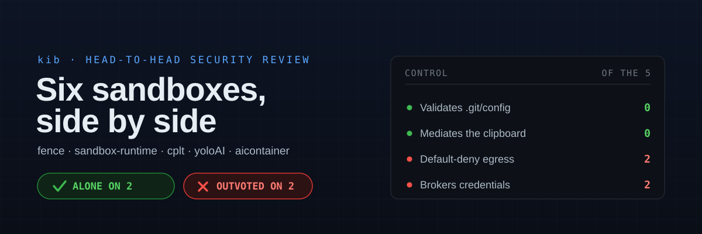
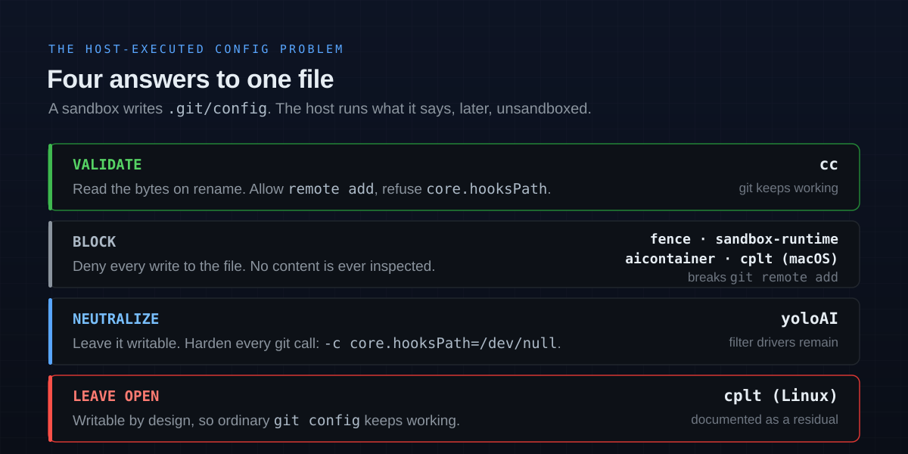

# Six sandboxes, side by side

Five actively-developed agent sandboxes, measured against `cc` on the controls that decide whether an untrusted repo can reach the host.

| | |
|---|---|
| **[fence](https://github.com/fencesandbox/fence)** | Container-free. bubblewrap + Landlock + seccomp on Linux, Seatbelt on macOS. |
| **[sandbox-runtime](https://github.com/anthropic-experimental/sandbox-runtime)** | Anthropic's own. bubblewrap + Seatbelt, the engine behind Claude Code's `/sandbox`. |
| **[cplt](https://github.com/navikt/cplt)** | Landlock-first, from the Norwegian Labour and Welfare Directorate. |
| **[yoloAI](https://github.com/kstenerud/yoloai)** | Six backends, up to Firecracker microVMs. Brokers credentials. |
| **[aicontainer](https://github.com/stefanoginella/aicontainer)** | Devcontainer + Docker socket proxy, multi-project. |
| **`cc`** | *This repo.* One Docker container per project, FUSE redaction, Wayland proxy. |

---

## The verdict

**`cc` is alone on two controls and outvoted on two.**

It is the only one of the six that reads the bytes of a host-executed config file before deciding, and the only one that mediates the clipboard rather than granting or withholding it wholesale. It is also one of only three with no egress restriction at all, and one of four that leaves a long-lived credential readable inside the box.

Everything below is what each project's own documentation and source say. Where the docs are silent, this document says so rather than guessing — and several of the most interesting findings are things a project documents *against itself*.

---

## Where `cc` stands alone

### 1. It validates `.git/config` instead of blocking it

`.git/config` is the sharpest instance of the general problem: a file the sandbox can write, that the *host* executes later, unsandboxed. `core.hooksPath`, `core.fsmonitor`, `core.sshCommand`, `alias.*` and `filter.*.clean` all name commands git will run.

| Strategy | Projects | What it costs |
|---|---|---|
| **Validate** — read the file on `rename()`, compare against current, refuse only newly-added command-bearing keys | `cc` | Nothing. `git remote add` and `push -u` keep working. |
| **Block** — deny all writes | fence, sandbox-runtime, aicontainer, cplt *(macOS)* | `git remote add` fails inside the sandbox. fence ships an `allowGitConfig` escape hatch that turns the protection off entirely. |
| **Neutralize** — leave the file writable, harden every git invocation | yoloAI | Covers `hooksPath` and `fsmonitor`. Attribute-bound `filter.*` and `diff.*.textconv` drivers must still run for diff correctness, and remain a documented residual. |
| **Leave open** — writable by design | cplt *(Linux)* | Its own SECURITY.md concedes the consequence: an agent "can still set `core.hooksPath` to redirect hooks into a writable directory". |

Two structural gaps nobody else covers:

- **A git dir does not have to be called `.git`.** `git init --bare`, `--separate-git-dir`, and a `.git` gitfile holding `gitdir: ../store` all put config and hooks somewhere else. `cc` recognises one by layout (`HEAD` + `objects` + `refs`). fence walks for directories *named* `.git` to depth 3; sandbox-runtime scans with ripgrep to depth 3; neither documents the alternate layouts.
- **`include` / `includeIf` indirection.** An included file can declare `core.hooksPath` that a validator inspecting only the main file never sees. `cc` refuses newly-added includes. No other project documents handling this — which for the four that block writes outright is moot, and for cplt on Linux is not.

One gap `cc` does *not* have, worth naming because it is severe and self-documented:

> "On Linux, mandatory deny paths only block files that **already exist**. Non-existent files in these patterns cannot be blocked by bubblewrap's bind-mount approach."
> — sandbox-runtime README

A bind-mount cannot cover a file that isn't there yet. cplt hits the same wall (`.cplt.toml` "can still be created"), and it's the specific reason `cc` uses FUSE rather than bind mounts: a FUSE filesystem sees the `create()` call.

### 2. It mediates the clipboard rather than granting it

| Project | Clipboard |
|---|---|
| `cc` | Wayland proxy sidecar holds the only real socket. **Reads pass, writes refused** on all four clipboard interfaces. Denials raise a desktop notification. |
| cplt | `--deny-clipboard` on macOS — all-or-nothing, and **reachable by default** (it rides the blanket `mach-lookup` allow that Node.js needs). Listed under "Out of scope". |
| fence | Not documented. |
| sandbox-runtime | Not documented. |
| yoloAI | Nothing bridged. Terminal escape sequences over `attach` are explicitly pass-through — "the ssh-to-untrusted-host model". |
| aicontainer | "Clipboard / browser — **No** — nothing bridged." |

The read/write asymmetry is the whole point, and it is unique here. A clipboard *write* is host code execution at the user's next terminal paste — an embedded `ESC[201~` ends bracketed paste early and the rest of the payload is interpreted as typed input. A clipboard *read* is just a paste. Four of the five sidestep this by having no display access at all; cplt has access and offers only an on/off switch.

---

## Where `cc` is behind

### 1. Egress is unrestricted

| Project | Default | Mechanism |
|---|---|---|
| sandbox-runtime | **Default-deny** | Network namespace removed entirely; all traffic via host proxies on Unix sockets. Optional TLS termination. |
| fence | **Default-deny** | netns/Seatbelt + HTTP and SOCKS5 proxies with `HTTP_PROXY` injection. |
| aicontainer | Open, with always-on metadata/link-local drops | Opt-in iptables allowlist (`sudo aic-firewall enable`). |
| yoloAI | Open | Opt-in `--network-isolated` (iptables + ipset). |
| cplt | Open on port 443 + allow-all proxy with a blocklist | Domain allowlist is opt-in; proxy-forced mode is opt-in. |
| `cc` | **Open** | None. Documented accepted risk. |

Only two of five ship default-deny. But note how thin the others' protection is even when enabled — and how candid they are about it:

- **cplt**: "**By default the proxy is not mandatory** — because `*:443` is kernel-allowed, a raw socket or `env -u HTTPS_PROXY` can reach the network without traversing the proxy."
- **yoloAI** shipped an in-container firewall the agent could simply flush, and documents the empirical proof: `sudo iptables -F OUTPUT` followed by a successful `curl`. Fixed for Docker by moving enforcement into a sidecar netns the agent has no `CAP_NET_ADMIN` to touch. Still IPv4-only — no `ip6tables` rules on any backend, filed as DF104 and "PARKED — filed, not fixed".
- **fence**: "domain filtering does not inspect content. If you allow a domain, code can exfiltrate via that domain."

`cc`'s position — that a default-deny allowlist conflicts with building untrusted repos that fetch from arbitrary registries — is a real trade-off, not an oversight. But it *is* the minority position, and unlike cplt or yoloAI there is no opt-in mode to reach for.

### 2. The credential is readable

`cc` keeps a shared OAuth token in `~/.claude-shared/.credentials.json`, same-uid readable, with open egress. That is the H3/H4 accepted risk.

Two projects do better, by the same trick:

> "Instead of placing the credential in the container, it runs a tiny per-sandbox proxy on the host (the *broker*), points the agent at it with a harmless placeholder token, and swaps in the real credential on the way to the provider."
> — yoloAI

> "A masked credential's real value is replaced inside the sandbox with a sentinel of the form `fake_value_<uuid4>`. The sandboxed process sees only the sentinel; the host-side proxy substitutes sentinel→real on egress."
> — sandbox-runtime

This is the direct answer to `cc`'s largest open risk, and it is proven shippable. Two caveats from their own docs: sandbox-runtime's masking **requires TLS termination** to work (the proxy must see request bodies), and fails closed to a broken login otherwise; and yoloAI's own unresolved-findings file says the broker is "only wired for the Claude agent" while its guide claims three — an internal contradiction the project hasn't resolved.

The other three are in `cc`'s position or worse. cplt is explicit: "the OAuth token lives in `~/.claude/.credentials.json`... **exposed to the sandbox**... This grants the sandboxed agent its own credentials — an inherent trade-off." aicontainer's tokens live in one volume shared across every project: "a compromised session in **any** project can use every token you've logged in with."

---

## The full matrix

### Isolation and platform

| | `cc` | fence | sandbox-runtime | cplt | yoloAI | aicontainer |
|---|---|---|---|---|---|---|
| **Boundary** | Docker container | None (bwrap) | None (bwrap) | None (Landlock) | Container → microVM | Docker container |
| **Linux primitive** | seccomp + AppArmor + `cap-drop=ALL` | bwrap + Landlock + seccomp (27 calls) | bwrap + seccomp (AF_UNIX, io_uring) | Landlock + seccomp + opt. bwrap | runc / gVisor / Kata / Firecracker | `cap-drop=ALL` + 6 back |
| **macOS** | ❌ | Seatbelt | Seatbelt | Seatbelt | Seatbelt / Apple Container / Tart | Docker only |
| **Windows** | ❌ | WSL | Alpha (native) | ❌ | WSL2 | ❌ |
| **`no-new-privileges`** | ✅ | n/a | n/a | n/a | ❓ | Sidecars only |
| **VM-class option** | ❌ | ❌ (explicit non-goal) | ❌ | ❌ | ✅ Kata + Firecracker | ❌ |

### Filesystem and secrets

| | `cc` | fence | sandbox-runtime | cplt | yoloAI | aicontainer |
|---|---|---|---|---|---|---|
| **Project secrets** | Stub on read (FUSE) | `/dev/null` mask — but `.env` is `denyWrite`, **not** `denyRead`, in the shipped template | Sentinel-substituted fake file (**Linux only**; macOS degrades to deny) | Deny read — **macOS kernel-enforced only** | Never copied in (honours `.gitignore`) | File is present; blocked at the tool layer by a `PreToolUse` hook |
| **Content masking, not just denial** | ✅ | Partial (empties) | ✅ | ❌ | ❌ | Host config JSON only |
| **Covers files created after launch** | ✅ | ✅ | ❌ **Linux: existing files only** | ❌ | ✅ | ✅ |
| **Reads default to** | Allow | Allow | **Allow** | Deny for listed paths | n/a (copy) | Allow |

### Host-executed config

| | `cc` | fence | sandbox-runtime | cplt | yoloAI | aicontainer |
|---|---|---|---|---|---|---|
| **`.git/config`** | Validate content | Block (opt-out) | Block | macOS block / **Linux writable** | Neutralize at call site | Block (`:ro` mount) |
| **`.git/hooks`** | ✅ | ✅ | ✅ | macOS ✅ / Linux bwrap-only | Neutralized | ✅ |
| **Non-`.git` git dirs** | ✅ structural | ❌ | ❌ | ❌ | ❌ | ❌ |
| **Submodule / worktree git dirs** | ✅ | ❌ | ❌ | ❌ documented residual | ❌ | ❌ |
| **`include` / `includeIf`** | ✅ refused | ❌ | ❌ | ❌ | ❌ | ✅ excluded from seeding |
| **`.vscode/` `.idea/`** | ✅ | ✅ | ✅ | ❌ **explicit non-goal** | ❌ | ❌ writable |
| **`.envrc` / direnv** | ✅ | ❌ | ❌ | ❌ | ❌ | ❌ |
| **`.devcontainer/`** | ✅ | ❌ | ❌ | ❌ | ✅ sanitized | ✅ + host-side validation |
| **Agent settings (`hooks[].command`)** | ✅ host-side validator | Partial (`.claude/commands`, `agents`) | ✅ dir list | macOS partial; `settings.json` writable by design | ❌ | ✅ root-managed |

### Operations

| | `cc` | fence | sandbox-runtime | cplt | yoloAI | aicontainer |
|---|---|---|---|---|---|---|
| **Model** | Long-lived container per project | Per-invocation | Per-invocation | Per-invocation | Named sandbox per task | Per-project Compose stack |
| **Concurrent sessions** | ✅ `flock` refcount | n/a | n/a | n/a | ✅ (plan doc contradicts) | Implicit via Compose |
| **Security regression suite** | ✅ 61 assertions, 8 sections | ✅ Go + `smoke_test.sh` | ✅ ~40 files, no declared policy | ✅ 4 tiers — **kernel tests macOS-only** | Targeted tests, no named suite | ✅ ~60 cases, host-side only |
| **Published CVE** | — | None | **CVE-2025-66479** | None | None | None |

---

## Reading each project in one paragraph

**[sandbox-runtime](https://github.com/anthropic-experimental/sandbox-runtime)** — 4,733★, 31 contributors, Apache-2.0. The only genuinely multi-maintainer project here, and the most capable on egress and credentials. Also the only one with a published CVE: **CVE-2025-66479**, a fail-open where an empty allowlist meant *allow all* instead of *deny all*. A second bypass — a SOCKS5 hostname null-byte injection (`evil.com\x00.google.com`) — was patched with no CVE and no release note. Labelled "Beta Research Preview". Its own Linux caveat (deny paths cover only files that already exist) is the sharpest limitation in this whole comparison.

**[fence](https://github.com/fencesandbox/fence)** — 864★, 15 contributors, Apache-2.0, Go, ~7 months old but 142 of ~167 commits from one author. The best-documented threat model of the six, and unusually honest about scope: *"It is not designed to be a strong isolation boundary against actively malicious code that is attempting to escape."* Explicitly defers to Firecracker/gVisor/Kata for real containment. Note the shipped `code` template puts `~/.claude*` in `allowWrite` while `.env` is only `denyWrite` — readable.

**[cplt](https://github.com/navikt/cplt)** — 98★, 10 contributors, MIT, Rust, ~3 months old, 254 of ~288 commits from one author. A public-sector project with the most candid SECURITY.md in the set — it documents eight of its own bypasses, including that its `gh`/`git` guards are PATH shims defeated by `\git` or an absolute path, and default to *off*. **The critical caveat for any Linux comparison:** its headline "🔒 Kernel-blocked" rows are macOS-only. Landlock cannot deny a subpath inside an allowed directory, so on Linux `.env` reads and `.git/hooks` writes inside the project are not kernel-enforced at all. Its README and `known-impacts.md` also disagree on whether `.env` writes are blocked.

**[yoloAI](https://github.com/kstenerud/yoloai)** — 170★, 3 contributors, MIT, Go, ~5 months, 1,379 of ~1,394 commits from one author. The most ambitious isolation range (runc → gVisor → Kata → Firecracker) and the only credential broker on by default. Its design docs are a working audit trail, including an empirically-confirmed escape of its own network isolation and a CRITICAL-severity host-RCE finding via agent-controlled `.git/config` filter drivers — found, fixed, and written up. Beware: `docs/contributors/design/` is full of documents explicitly marked as proposals, not shipped behaviour.

**[aicontainer](https://github.com/stefanoginella/aicontainer)** — 16★, 2 contributors, MIT, Shell, ~2 months. The youngest and smallest, but the Docker socket proxy is a control nobody else here has: the agent gets `ping` and `version` and nothing else, digest-pinned. Its git-config seeding uses a closed allowlist whose comment names exactly the right enemies — *"Deliberately absent: include/includeIf, credential.\*, url.\*, alias.\*, core.sshCommand, core.hooksPath..."*. Its acknowledged hole is that VS Code parses a repo's `devcontainer.json` and runs `initializeCommand` on the host before `aic` can validate anything.

---

## What the field agrees on

Reading six threat models together, the consensus is more interesting than any single row:

1. **Nobody claims to contain hostile code.** fence: *"assume determined attackers may escape via kernel/OS vulnerabilities."* yoloAI's threat model names the errant agent as primary and the rogue agent as secondary. Claude Code's own docs: *"Sandboxing reduces risk but is not a complete isolation boundary."*
2. **Domain allowlists are not exfiltration controls.** Every project that ships one says so unprompted. Allowing `github.com` means you can push to any repository.
3. **DNS is out of scope everywhere.** Unfiltered in every project, on the reasoning that the LLM channel itself is a higher-bandwidth exfil path that must stay open regardless.
4. **The host-executed config surface is now standard.** All six protect shell rc files, `.git/hooks` and at least some IDE directories. Two years ago this was nobody's problem; the Nov 2025 Cursor/Codex escapes made it everyone's.
5. **Almost nobody has more than one maintainer.** Five of six — including `cc` — are effectively single-author. sandbox-runtime is the exception.

---

## Where this leaves `cc`

**Keep:** the FUSE approach, which is what makes stub-on-read and after-launch coverage possible — both bind-mount designs here have a documented hole `cc` doesn't. The `.git/config` validator. The clipboard proxy's read/write split. The regression suite that re-tests the *legitimate* operation alongside the attack.

**Worth stealing:** credential brokering. Two projects ship it, the mechanism is simple (host-side proxy, placeholder token, substitution on egress), and it closes `cc`'s single largest accepted risk. sandbox-runtime's structured `extract` mode — regex out just the credential span so a JSON file still parses — is the refinement worth copying.

**Worth considering:** an opt-in default-deny egress mode. Not as the default — that conflicts with building untrusted repos — but cplt, yoloAI and aicontainer all show the shape of an opt-in that costs nothing when off.

**Honest gap:** `cc` is Linux-only. Four of the five run on macOS.

---

<b>Method and limitations</b>

**How this was built.** Five independent research passes, one per project, each instructed to quote verbatim from primary sources with URLs and to write "NOT DOCUMENTED" rather than infer. Sources were READMEs, SECURITY.md files, `docs/` trees, and — where a claim mattered — actual source files (`dangerous.go`, `sandbox-utils.ts`, `post-create.py`, `runtime.go`). Project health came from the GitHub REST API. Verified 2026-07-22.

**Symbols.** ✅ documented present · ❌ documented absent, or verified absent from the docs and the source file the docs designate · ❓ the docs don't say. ❓ is not a synonym for ❌.

**Limitations, in order of how much they could mislead you:**

1. **Documentation is not code.** Except where noted, this compares what projects *document*. A project may implement a control it never wrote down — that lands here as ❌ or ❓ and is unfair to it. GitHub's code-search API requires auth and was unavailable, so absence claims rest on the docs plus targeted source reads, not exhaustive repo grep.
2. **`cc`'s column comes from its own repo**, where the author has full source access. That asymmetry favours `cc` on any row where another project's mechanism exists but is undocumented.
3. **Version skew.** All five are under active development; three shipped commits the week this was written. sandbox-runtime released v0.0.66 five days prior.
4. **Two projects contradict themselves** and both contradictions are flagged inline rather than resolved: cplt on `.env` write-blocking, yoloAI on which agents are brokered.
5. **`cc` is not published.** No stars, no external contributors, no third-party review. Every other project here has been looked at by someone who didn't write it.

<b>Sources</b>

- fence — [README](https://github.com/fencesandbox/fence), [security-model.md](https://github.com/fencesandbox/fence/blob/main/docs/security-model.md), [linux-security-features.md](https://github.com/fencesandbox/fence/blob/main/docs/linux-security-features.md), [dangerous.go](https://github.com/fencesandbox/fence/blob/main/internal/sandbox/dangerous.go)
- sandbox-runtime — [README](https://github.com/anthropic-experimental/sandbox-runtime), [GHSA-9gqj-5w7c-vx47](https://github.com/anthropic-experimental/sandbox-runtime/security/advisories/GHSA-9gqj-5w7c-vx47), [Claude Code sandboxing docs](https://code.claude.com/docs/en/sandboxing)
- cplt — [SECURITY.md](https://github.com/navikt/cplt/blob/main/SECURITY.md), [README](https://github.com/navikt/cplt), [known-impacts.md](https://github.com/navikt/cplt/blob/main/docs/known-impacts.md)
- yoloAI — [README](https://github.com/kstenerud/yoloai), [GUIDE.md](https://github.com/kstenerud/yoloai/blob/main/docs/GUIDE.md), [findings-unresolved.md](https://github.com/kstenerud/yoloai/blob/main/docs/contributors/design/findings-unresolved.md)
- aicontainer — [README](https://github.com/stefanoginella/aicontainer), [CHANGELOG.md](https://github.com/stefanoginella/aicontainer/blob/main/CHANGELOG.md), [post-create.py](https://github.com/stefanoginella/aicontainer/blob/main/template/post-create.py)
- `cc` — this repository: `CLAUDE.md`, `cc`, the `host/` units, `kib/guest/fuse.py`, `kib/guest/wayland_guard.py`, `security-test.sh`

